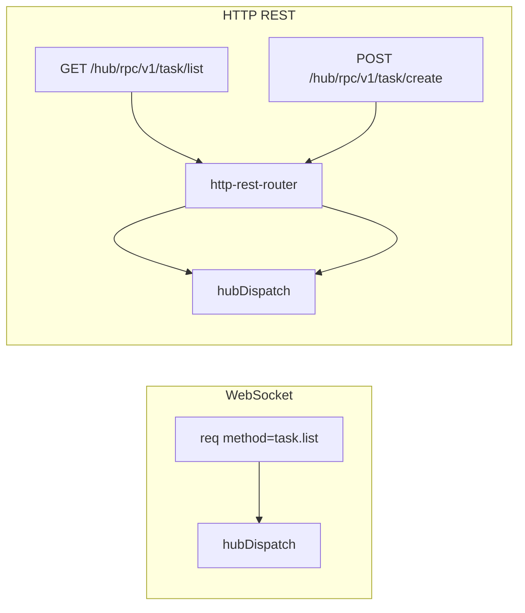

# Hub RPC HTTP RESTful 端点

## 开发环境


| 项        | 值                                                                |
| -------- | ---------------------------------------------------------------- |
| Worktree | `/home/feng/.cursor/worktrees/freeanima__SSH__feng-vm_/hub-rest` |
| 分支       | `cursor/hub-rpc-rest-http`（基于 `main` @ ec265a01）                 |
| 主仓       | `/home/feng/workspace/freeanima`                                 |
| 收尾       | commit 后用户 `/worktree-cherry-pick` 带回主仓                          |


---

## 目标

将 HTTP 传输从「单端点 POST + envelope + `method` 字段」改为 **RESTful 路径**，使只读请求可走 GET（可被 HTTP 缓存），且每个 Hub method 在 HTTP 层 **有且仅有一种动词**。

**用户示例（SSOT 形态）**：

```http
GET  /hub/rpc/v1/task/list?subject_kind=user&list_id=1
POST /hub/rpc/v1/task/create
GET  /hub/rpc/v1/task/get/1?subject_kind=user
```

**范围外**：IndexedDB 离线、SW 缓存策略、ETag/304（后续 PR）、WS 协议变更。

---

## 分层：HTTP REST vs WS RPC


| 传输            | 路径                       | 协议                                 | method 标识                    |
| ------------- | ------------------------ | ---------------------------------- | ---------------------------- |
| **WebSocket** | `/hub/rpc/v1`            | HubRPC envelope（`req`/`res`/`evt`） | `method: "task.list"` 字符串    |
| **HTTP**      | `/hub/rpc/v1/{segments}` | RESTful GET/POST                   | **URL path**（dots → slashes） |


WS **不变**；仅 HTTP 客户端与服务端 adapter 重构。




---

## 路径映射规则

### 1. 基础路径

Hub method `domain.action`（或 `domain.sub.action`）→ path：

```
task.list          → /hub/rpc/v1/task/list
tasklist.create    → /hub/rpc/v1/tasklist/create
conversation.messages → /hub/rpc/v1/conversation/messages
status.get         → /hub/rpc/v1/status/get
config.getSection  → /hub/rpc/v1/config/getSection
```

规则：`**.` → `/**`，保留 camelCase（`patchTitle`、`getSection` 不 kebab-case）。

### 2. HTTP 动词（每 method 唯一）


| 类型       | HTTP     | 判定                                         |
| -------- | -------- | ------------------------------------------ |
| 只读       | **GET**  | `dualTransportMeta(true)`                  |
| 写入       | **POST** | `dualTransportMeta(false)`                 |
| 敏感只读（例外） | **POST** | 显式 override：`vault.get`、`vault.crypto.get` |


**互斥 enforcement**：对只读 method 发 POST → **405**；对写 method 发 GET → **405**。

### 3. 参数绑定


| 场景       | Path                       | Query                        | Body                         |
| -------- | -------------------------- | ---------------------------- | ---------------------------- |
| 列表/搜索/状态 | `/hub/rpc/v1/task/list`    | 全部 input 字段（flatten）         | —                            |
| 按 id 读取  | `/hub/rpc/v1/task/get/1`   | 除 `id` 外字段（如 `subject_kind`） | —                            |
| 创建       | `/hub/rpc/v1/task/create`  | —                            | JSON = input payload         |
| 更新/删除/动作 | `/hub/rpc/v1/task/patch/1` | —                            | JSON = input 去掉 path 中的 `id` |


**Path 参数 `:id` 规则**（自动推导，registry 可 override）：

- method 以 `.get` 结尾且 input 含 `id: number` → `**/…/get/:id**`
- 写操作且 input 含 `id: number` → `**/…/{action}/:id**`（如 `task.patch/1`、`task.delete/1`、`task.complete/1`）
- 复合 key（如 `conversation.messages` 的 `conversation_id`）→ `**/…/messages/:conversation_id**`（registry 显式 `pathParams`）

**Query 编码**：标量 → string；boolean → `true`/`false`；数组 → 重复 key 或 comma-separated（与现有 schema 对齐，优先重复 key）。

### 4. HTTP 响应（REST 化）

HTTP 层 **不再返回 HubRPC `res` envelope**；直接返回 handler output JSON：

```json
// GET /hub/rpc/v1/task/list
{ "items": [ ... ] }

// POST /hub/rpc/v1/task/create
{ "item": { ... } }
```

错误：

```json
// HTTP 4xx/5xx
{ "error": { "code": "hub_rpc_error", "message": "..." } }
```

客户端 `callViaHttp` 解析 plain JSON，不再 `parseHubRpcEnvelope`。

---

## 契约层：hub-contract 扩展

`[src/shared/hub-contract/method-def.ts](src/shared/hub-contract/method-def.ts)`：

```typescript
export type HttpRouteMeta = {
  verb: "GET" | "POST";
  /** 相对 /hub/rpc/v1/ 的路径；默认 method.replaceAll('.', '/') */
  path?: string;
  /** path 中的具名参数，按顺序；默认推导 */
  pathParams?: readonly string[];
};

export type HubMethodMeta = {
  transports: readonly TransportKind[];
  defaultByProfile: Record<HubClientProfile, TransportKind>;
  fallback?: boolean;
  http?: HttpRouteMeta; // 含 http 传输时必填
};
```

`dualTransportMeta(readOnly, overrides?)` 默认：

```typescript
{
  verb: readOnly ? "GET" : "POST",
  path: methodName.replaceAll(".", "/"),
  pathParams: inferPathParams(methodName, inputSchema),
}
```

**Registry 启动 assert**：

- `transports` 含 `http` → `http` 必填
- GET method 必须为 readOnly（或 documented POST exception）
- path 不重复（`/hub/rpc/v1/` 下唯一 `(verb, pathPattern)`）

**敏感例外**（`[vault.ts](src/shared/hub-contract/registry/vault.ts)`）：

```typescript
"vault.get": dualTransportMeta(true, {
  http: { verb: "POST", path: "vault/get/:id", pathParams: ["id"] },
})
```

---

## 服务端实现

### 新模块 `[src/platform/hub/http-rest-router.ts](src/platform/hub/http-rest-router.ts)`

- 启动时从 `METHOD_REGISTRY` 构建路由表：`Map<"GET"|"POST", RadixRouter>`
- `matchHttpHubRoute(req)` → `{ hubMethod, pathValues, query/body }`
- 合并 path + query/body → Zod input parse → `hubDispatch`
- 返回 plain JSON Response + `Cache-Control: private, no-cache`

### 改造 `[src/platform/hub/http-rpc.ts](src/platform/hub/http-rpc.ts)`

- **删除** 旧 POST envelope handler（或保留一版 deprecated 返回 410，可选）
- 导出 `handleHttpHubRestRequest(req, deps)` 统一入口

### 改造 `[src/platform/sap/bun-route.ts](src/platform/sap/bun-route.ts)`

```typescript
if (url.pathname.startsWith("/hub/rpc/v1")) {
  if (req.method === "GET" || req.method === "POST") {
    return handleHttpHubRestRequest(req, deps);
  }
  // WS upgrade ...
}
```

`/hub/rpc/v1` 精确 match（无 subpath）且非 WS → **400/404**（不再接受旧 envelope POST）。

---

## 客户端实现

### 新模块 `[src/shared/hub-rpc/http-rest.ts](src/shared/hub-rpc/http-rest.ts)`

- `buildHubRestUrl(origin, method, payload)` → URL + init（GET query / POST body）
- `parseHubRestPathParams(method, payload)` 
- 从 registry 读 `http` meta

### 改造 `[src/shared/hub-client/client.ts](src/shared/hub-client/client.ts)`

`callViaHttp`：

```typescript
const route = getHubMethodDef(method).meta.http!;
const { url, init } = buildHubRestRequest(httpOrigin, method, payload, authToken);
const res = await fetch(url, init);
return parseHubRestResponse(res); // plain JSON → output schema parse
```

WS→HTTP fallback（只读）：走 **GET REST**，不是旧 POST envelope。

---

## 迁移示例


| Hub method              | HTTP                                                                   |
| ----------------------- | ---------------------------------------------------------------------- |
| `task.list`             | `GET /hub/rpc/v1/task/list?subject_kind=user&...`                      |
| `task.search`           | `GET /hub/rpc/v1/task/search?query=xxx&subject_kind=user`              |
| `task.create`           | `POST /hub/rpc/v1/task/create` `{ subject_kind, title, list_id, ... }` |
| `task.patch`            | `POST /hub/rpc/v1/task/patch/42` `{ subject_kind, title?, ... }`       |
| `dream.get`             | `GET /hub/rpc/v1/dream/get/7?subject_kind=user`                        |
| `conversation.list`     | `GET /hub/rpc/v1/conversation/list?include_archived=false`             |
| `conversation.messages` | `GET /hub/rpc/v1/conversation/messages/:conversation_id?limit=50`      |
| `vault.get`             | `POST /hub/rpc/v1/vault/get/:id`（敏感例外，body 传剩余字段）                      |


全量迁移：所有 `dualTransportMeta(true|false)` method 自动生成 `http` meta；少数 compound path 在 registry 显式 override。

---

## 测试


| 文件                                          | 覆盖                                     |
| ------------------------------------------- | -------------------------------------- |
| `src/shared/hub-rpc/http-rest.test.ts`      | URL 构建、pathParams、query flatten        |
| `src/platform/hub/http-rest-router.test.ts` | 路由匹配、405 互斥、Zod 失败、dispatch            |
| `src/shared/hub-client/client.test.ts`      | GET list / POST create / path id       |
| integration                                 | `task.list` GET、`task.create` POST 端到端 |


关键断言：

- `GET /hub/rpc/v1/task/list` → 200 + `{ items }`
- `POST /hub/rpc/v1/task/list` → **405**
- `GET /hub/rpc/v1/task/create` → **405**
- 旧 `POST /hub/rpc/v1` envelope → **404/410**

---

## 文档更新

- `[docs/sap/hub-rpc.md](docs/sap/hub-rpc.md)`：HTTP REST 路径规范、参数绑定、响应格式；WS 仍 envelope
- `[.agent/rules/frontend-features.md](.agent/rules/frontend-features.md)`：**移除**「禁止 REST path」；改为「HTTP 用 registry `http` meta 生成 REST path；WS 仍 `method` 字符串」

---

## 风险


| 风险                                      | 缓解                             |
| --------------------------------------- | ------------------------------ |
| **Breaking**：旧 POST envelope 客户端失效      | CHANGELOG；410/404 明确提示         |
| Path 冲突（如 `task/get` vs `task/get/:id`） | Registry assert 唯一；router 最长匹配 |
| camelCase path 与代理/日志                   | 接受；与 method 名一致                |
| `vault.get` 敏感数据                        | POST exception + 文档            |
| CORS                                    | 确认 GET/POST + Authorization    |


---

## 验收标准

- 只读 method 仅可通过对应 **GET REST path** 调用
- 写 method 仅可通过对应 **POST REST path** 调用
- Path 映射符合 `a.b.c` → `/hub/rpc/v1/a/b/c`（+ 可选 `/:id`）
- WS HubRPC 行为不变
- `bun run check` 通过

