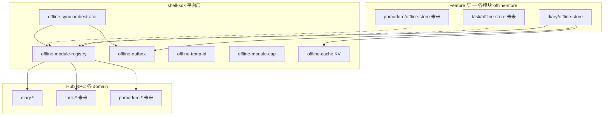
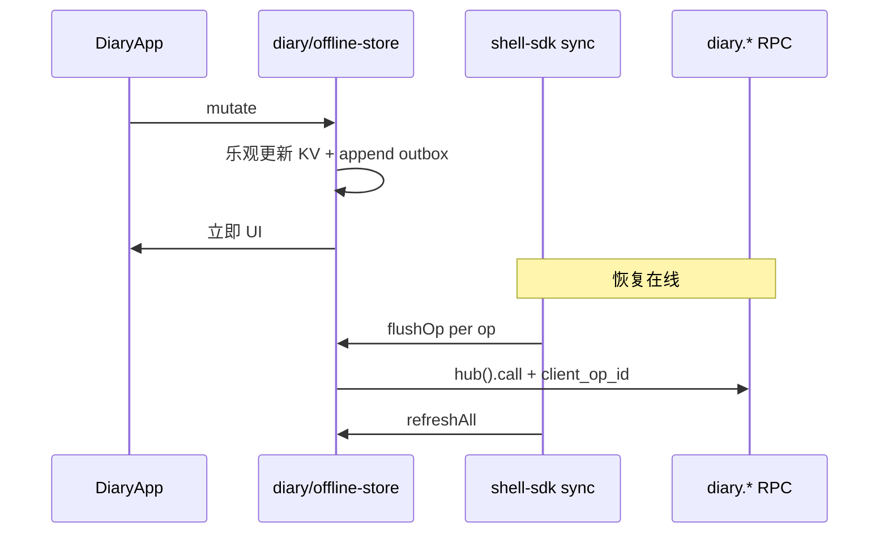

# 模块级离线 CRUD — 多模块平台 + Diary 试点

## 背景与目标

FreeAnima 各 feature 已有 **Tier 1 只读快照**（`[offline-cache.ts](src/frontend/shell-sdk/offline-cache.ts)`）。离线可写不应每个业务各造一套，而应 **先设计共用平台，再按模块接入**。


| 维度        | 决策                                                       |
| --------- | -------------------------------------------------------- |
| **架构**    | 多模块 Tier 2 平台（shell-sdk 原语 + `ModuleAdapter` 注册表）        |
| **v1 实现** | **仅 Diary** — 验证平台 API 与 Hub 幂等约定                        |
| **后续模块**  | Task（任务管理）、番茄钟（Pomodoro）、Dream 等 — **设计预留，v1 不实现**       |
| **冲突策略**  | v1 单设备；flush 后全量 refresh，以 Hub 为准                        |
| **Hub**   | 按需配合；建议各 Tier 2 写 RPC 统一支持 `client_op_id`                |
| **框架**    | 手搓 outbox，不引入 RxDB/Replicache（见 [技术选型](#技术选型成熟框架-vs-手搓)） |


### 模块分级（当前与未来）


| 层级         | 离线能力           | 模块                                           |
| ---------- | -------------- | -------------------------------------------- |
| **Tier 1** | 只读快照           | Chat、Email、Notification、Console、Vault        |
| **Tier 2** | 可写 local-first | **Diary（v1 实现）** → Task、Pomodoro、Dream（规划接入） |


---

## 多模块平台设计（前瞻）

v1 **只写 Diary adapter**，但 shell-sdk **一次设计为可扩展平台**，避免 Task/番茄钟接入时推倒重来。

### 分层




| 层                                       | 职责                                     | v1          |
| --------------------------------------- | -------------------------------------- | ----------- |
| **平台层** `shell-sdk/offline-`*           | outbox、temp id、sync 编排、模块注册、capability | **实现**      |
| **模块层** `features/<slug>/offline-store` | 领域 CRUD、乐观更新、op 合并策略、KV namespace      | **仅 Diary** |
| **Hub 层**                               | RPC + 可选 `client_op_id` 幂等             | Diary 评估/实现 |


### 模块 ID 与注册表

```ts
/** 可扩展；v1 仅注册 diary */
type OfflineModuleId = "diary" | "task" | "pomodoro" | (string & {});

type OfflineModuleAdapter = {
  moduleId: OfflineModuleId;
  /** flush 单条 outbox op；解析 temp id、调用 hub().call */
  flushOp: (op: OfflineOutboxOp, ctx: FlushContext) => Promise<FlushResult>;
  /** 该模块 outbox 清空后，全量拉取写 KV */
  refreshAll: (scope: string) => Promise<void>;
  /** 可选：flush 前合并/压缩 outbox（如 Task 排序、Diary append） */
  compactOutbox?: (ops: OfflineOutboxOp[]) => OfflineOutboxOp[];
  /** 是否需要拓扑排序（有 dependsOn 的模块） */
  ordering: "fifo" | "topological";
};

/** 各 feature 启动时 registerOfflineModule(adapter) */
const offlineModuleRegistry = new Map<OfflineModuleId, OfflineModuleAdapter>();
```

Sync orchestrator（恢复在线时）：

1. 按 `moduleId` 分组 outbox（同一 scope）
2. 对每个已注册 adapter：`compactOutbox` → 排序（fifo / topological）→ 逐条 flush
3. 某 module 失败 **不阻塞其他 module**（各 module 独立 checkpoint）
4. 成功后该 module `refreshAll`

### 统一 Outbox schema（跨模块）

```ts
type OfflineOutboxOp = {
  id: string;                    // uuid = client_op_id
  moduleId: OfflineModuleId;
  method: string;                // hub method，如 diary.create、task.patch
  payload: Record<string, unknown>;
  tempEntityId?: number;         // create 时本地负数 id
  dependsOn?: Array<{            // Task 等模块：引用未 sync 的 temp id
    tempId: number;
    field: string;               // payload 字段名，如 list_id
  }>;
  createdAt: string;
  lastError?: string;
};
```


| 模块               | ordering    | dependsOn   | op 合并特点                                        |
| ---------------- | ----------- | ----------- | ---------------------------------------------- |
| **Diary**        | fifo        | 无           | append 合并进 create/patch                        |
| **Task**（未来）     | topological | list → item | 多条 sort_order patch 合并                         |
| **Pomodoro**（未来） | fifo        | 通常无         | 计时 session start/stop/complete；可能需与 task_id 关联 |
| **Dream**（未来）    | fifo        | 无           | 类似 Diary                                       |


### IndexedDB 布局（一次定稿）

DB：`freeanima-satellite-cache`（扩展 version）


| Store    | Key    | 内容        |
| -------- | ------ | --------- |
| `kv`     | `scope | namespace |
| `outbox` | `scope | opId`     |
| `id-map` | `scope | moduleId  |


### Capability 与 UX（registry 驱动）

```ts
/** v1 仅 diary: { offlineWritable: true } */
type OfflineModuleCap = {
  offlineWritable: boolean;
  /** shell-ui banner 文案 key 或默认模板 */
  pendingLabel?: string;
};

function isOfflineWritableModule(moduleId: OfflineModuleId): boolean;
function getGlobalPendingCount(scope: string): Promise<number>;  // 跨模块 sum
```

shell-ui 根据**当前路由 moduleId** 查 cap — v1 只有 Diary 可写，Task/番茄钟仍只读。

### Hub 跨模块约定（建议）

为所有 Tier 2 **写 RPC** 逐步统一：


| 约定                      | 说明                                         |
| ----------------------- | ------------------------------------------ |
| `client_op_id?: string` | flush 重试幂等；Diary v1 先做，Task/Pomodoro 接入时复用 |
| 响应含 `item` + `id`       | create/patch 返回完整 row，便于 id-map            |
| 暂不做 batch sync          | v1 逐条 call；后续可加 `*.sync` 或平台级 push         |


---

## 技术选型：成熟框架 vs 手搓

**结论**：多模块场景仍 **手搓平台层 outbox**，不引入 RxDB/Replicache —— 每个模块的 Hub adapter 本来就要写，平台层保持薄且与 Hub RPC 对齐。


| 条件                       | 建议                                |
| ------------------------ | --------------------------------- |
| 多模块、Hub RPC、按 feature 渐进 | **手搓 + ModuleAdapter 注册表**        |
| ≥3 模块 + 多设备实时合并          | 再评估 Replicache / RxDB replication |
| PG 自动同步到端                | Electric / PowerSync（产品级）         |


平台层目标体量：shell-sdk ~400–600 行 + 单测；每增一模块 mainly 加一个 `offline-store.ts`。

---

## Diary 试点（v1 唯一实现）

Diary 作为 **第一个 ModuleAdapter**，验证：fifo outbox、append 合并、`client_op_id`、registry、连通性 UX。

### 数据流




### Diary 离线操作


| 操作    | method                    | 离线行为               |
| ----- | ------------------------- | ------------------ |
| 列表/详情 | `diary.list`, `diary.get` | cache-first（已有）    |
| 新建    | `diary.create`            | temp id + outbox   |
| 编辑    | `diary.patch`             | 本地 merge + outbox  |
| 追加    | `diary.append`            | 本地拼接；flush 时合并策略见下 |
| 删除    | `diary.delete`            | 本地移除 + outbox      |
| 搜索    | `diary.search`            | 离线 local filter    |


**append 合并（Diary compactOutbox）**

- 未 sync entry：多次 append → 单条 `diary.create`（全量 content）
- 已 sync entry：发 `diary.append` 或合并为 `diary.patch`

### Diary 代码落点


| 文件                                                                                                                                 | 变更                               |
| ---------------------------------------------------------------------------------------------------------------------------------- | -------------------------------- |
| **新建** `[shell-sdk/offline-module-registry.ts](src/frontend/shell-sdk/offline-module-registry.ts)` 等                               | 平台层（多模块 API，v1 只 register diary） |
| **新建** `[diary/.../offline-store.ts](src/features/diary/ui/spa/lib/offline-store.ts)`                                              | Diary ModuleAdapter + CRUD       |
| `[diary/.../api.ts](src/features/diary/ui/spa/lib/api.ts)`                                                                         | 委托 offline-store                 |
| `[DiaryApp.tsx](src/features/diary/ui/spa/DiaryApp.tsx)`、`[EntryEditor.tsx](src/features/diary/ui/spa/components/EntryEditor.tsx)` | pending UX                       |
| Hub（按需）                                                                                                                            | `client_op_id` 幂等                |


---

## 后续模块接入清单（设计参考，v1 不做）

新 Tier 2 模块（Task、Pomodoro 等）接入步骤固定化：

1. **Hub**：写 RPC 支持 `client_op_id`（若尚未有）
2. **实现** `features/<slug>/ui/spa/lib/offline-store.ts` — 实现 `OfflineModuleAdapter`
3. **注册** `registerOfflineModule(adapter)` + `registerOfflineModuleCap({ offlineWritable: true })`
4. **api.ts** 写路径委托 offline-store
5. **单测**：compactOutbox、dependsOn 排序（若有）、flush mock
6. **文档** remote-access 补充该模块可写例外

### 模块特征预判


| 模块           | 复杂度 | 平台能力用到                                       |
| ------------ | --- | -------------------------------------------- |
| **Diary**    | 低   | fifo、append compact                          |
| **Task**     | 高   | topological、dependsOn、多 entity type          |
| **Pomodoro** | 中   | fifo；可能与 task item 关联（可选 dependsOn）；计时状态本地优先 |
| **Dream**    | 低   | 同 Diary                                      |


番茄钟若尚未有 feature 包，接入时新建 `features/pomodoro/`，Hub method 与 entity 另立 —— **平台层无需改**，只增 adapter。

---

## 连通性 UX


| 场景               | Tier 2 模块（registry 标记 writable）       | Tier 1 |
| ---------------- | ------------------------------------- | ------ |
| offline          | 允许写；「N 项待同步」（可跨模块 sum，v1 仅 diary > 0） | 只读     |
| Hub disconnected | 允许写；flush 用传输 fallback                | 只读     |
| flush 失败         | 模块级错误 + 重试                            | —      |


---

## 风险与 v1 限制

1. 单设备；flush 后 refresh 以 Hub 为准
2. 未 sync 数据仅本机 IDB
3. `client_op_id` 幂等 — Diary 试点验证，后续模块复用
4. 清站点数据丢 outbox
5. 从未在线无快照

---

## 实施顺序

1. **平台层 shell-sdk**：registry + outbox + temp-id + sync orchestrator + cap（**API 按多模块设计，测试用 diary mock adapter**）
2. **Hub**：Diary `client_op_id` 幂等（并文档化为 Tier 2 通用约定）
3. **Diary offline-store**：首个真实 adapter + api + UI
4. **shell-ui**：registry 驱动按路由 moduleId 展示 banner
5. **文档**：平台设计 + Diary 试点 + remote-access
6. **集成验证**：Diary offline CRUD 全链路

**v1 明确不做**：Task / Pomodoro 实现、topological flush 生产代码（接口预留即可）、batch sync、多设备合并。

---

## 已定

- ~~架构~~ → **多模块平台设计，Diary 唯一实现试点**
- ~~后续~~ → Task、番茄钟等按 ModuleAdapter 清单接入
- ~~冲突~~ → 单设备 + flush 后全量 refresh
- ~~框架~~ → 手搓平台层 outbox
- flush 失败：**仅重试**

