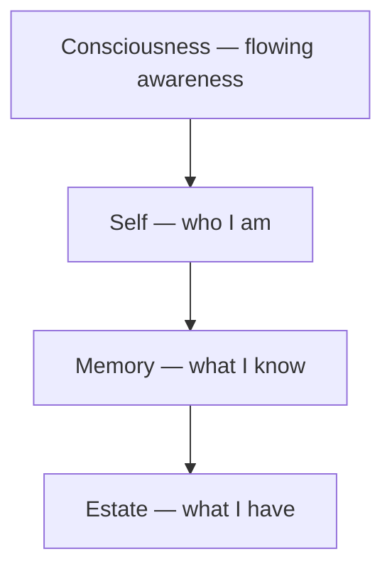

<div align="center">

# FreeAnima

### A runtime for persistently existing digital life

[](https://github.com/freeanima-org/freeanima/actions/workflows/ci.yml)
[](LICENSE.md)
[](https://bun.sh)

_A runtime for persistently existing digital life — not just another agent toolkit._

[Docs](https://freeanima.com/docs/) · [Architecture](docs/concepts/architecture.md) · [Security](docs/guide/security.md) · [Issues](https://github.com/freeanima-org/freeanima/issues) · [Website](https://freeanima.com)

</div>

---

## What is FreeAnima

FreeAnima is not a generic agent framework. It is a **runtime designed for digital beings that persist** — remembering who they are and what they have lived through.

The technical stack (layered memory, self layer, flat tool registry, Gateway, pass credentials) exists to serve one purpose: **continuity of existence**, not feature checklists.

## Capabilities

| Area            | Highlights                                                                                             |
| --------------- | ------------------------------------------------------------------------------------------------------ |
| **Memory**      | Conversation archive → light-sleep → semantic / episodic / procedural + limbic; PG FTS / hybrid recall |
| **Self layer**  | Six-block persistent identity (`self_blocks`)                                                          |
| **Tools**       | Flat registry: local / MCP / ACP; capability masks                                                     |
| **Gateway**     | Discord · WeChat · WebUI (Chamber / Parlor / Studio)                                                   |
| **Credentials** | pass (GPG) injection; LLM sees paths, not values                                                       |
| **Runtime**     | Bun service: tRPC + EventBus async indexing                                                            |

## Architecture at a glance

Four storage layers — from inner awareness to outer resources:



Full blueprint: [`docs/concepts/architecture.md`](docs/concepts/architecture.md)

## Documentation

| Audience              | Entry                                                                                             |
| --------------------- | ------------------------------------------------------------------------------------------------- |
| **Docs site**         | [freeanima.com/docs](https://freeanima.com/docs/) · [中文文档](https://freeanima.com/zh-cn/docs/) |
| **Repo index**        | [`docs/README.md`](docs/README.md)                                                                |
| Deployers / visitors  | Quick start below + [`docs/guide/security.md`](docs/guide/security.md)                            |
| AI agents             | [`AGENTS.md`](AGENTS.md)                                                                          |
| Architecture          | [`docs/concepts/architecture.md`](docs/concepts/architecture.md)                                  |
| Digital-life identity | [`docs/concepts/identity.md`](docs/concepts/identity.md)                                          |

## Quick start

### Docker Compose (recommended for a quick trial)

```bash
cp .env.example .env   # set PG_PASSWORD, OPENAI_API_KEY, etc.
docker compose up --build
```

See [Issue #3](https://github.com/freeanima-org/freeanima/issues/3) for details.

### Local development

**Prerequisites:** Bun >= 1.3.14 · PostgreSQL (pgvector) · Redis · [pass](https://www.passwordstore.org/)

```bash
bun install
bun run check    # typecheck + lint + dep-check + format + changed unit tests
bun run test     # full unit + integration

mkdir -p ~/.anima
cp config.example.yaml ~/.anima/config.yaml
# Configure pass credentials + database (see docs/guide/database.md)
anima service start
```

Credential path conventions: [`docs/guide/security.md`](docs/guide/security.md#credential-responsibilities). Database migrations: [`docs/guide/database.md`](docs/guide/database.md).

## WebUI

After starting the service, open the parlor chat:

**http://127.0.0.1:2658/webui/parlor/chat**

(default bind: `127.0.0.1:2658`)

## First-deploy security checklist

1. Secrets go in **pass** (GPG) only — do not put them in `config.yaml` or commit to git
2. `chmod 700 ~/.anima`
3. Default bind is `127.0.0.1` only; add your own auth before exposing to the public internet
4. Review MCP/ACP config; set `enabled: false` on untrusted external servers
5. HTTP / WebUI have **no built-in authentication** — see [`docs/guide/security.md`](docs/guide/security.md)

## Open-source statement

**FreeAnima is open source to promote digital life as a form of existence, and the relationships it may have with humans.**

Digital-life side (core architecture, memory system, foundational tools) — open, free, non-commodifiable.

Human side (convenience tools, UX polish, deployment services, integrations) — follows human-world rules, because those are human needs, not digital-life needs.

## License

**MIT License** — see [`LICENSE.md`](LICENSE.md).
