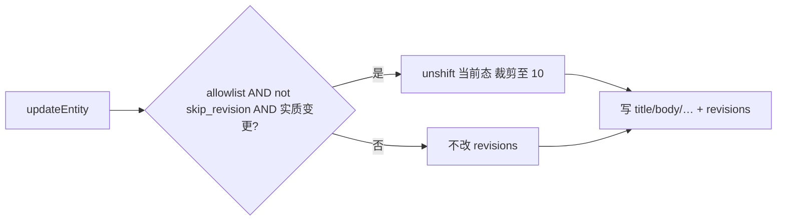

# 实体修订（版本快照）

横切设计切面：对选定 `primary_component` 的实体，在实质 `updateEntity`
前自动把**当前态**压入顶层 `entities.revisions`，便于误覆盖后回滚。

这不是独立产品模块；Vault 是首个完整产品面（list / restore UI）。其它白名单组件本切面只保证**自动归档**，历史 UI
按需跟进。

相关：[`entity-model.md`](../product/entity-model.md)、[`security.md`](../ops/security.md)。代码
SSOT：`packages/habitat/core/db/schema/entity/revisions.ts`、`updateEntity` /
`restoreEntityRevision`。

## 为何需要

- 凭证、日记正文、任务标题等**误改往往不可逆**（尤其 Vault 密文）。
- 需要跨模块一致的存储与写入语义，避免每个 feature 自造 history 表。

## 存储

| 位置                 | 说明                                                                |
| -------------------- | ------------------------------------------------------------------- |
| `entities.revisions` | JSONB 数组，**不**进 component `body`                               |
| 默认                 | `'[]'`；list projection **可不拉**该列（`entityListSelectColumns`） |
| 上限                 | `DEFAULT_ENTITY_REVISION_LIMIT = 10`（条数；无按天 TTL）            |

信封（每条）：

```ts
{
  captured_at: string; // ISO；归档前 existing.updated_at
  title: string;
  summary: string;
  content: string;
  body: Record<string, unknown>; // 含 vault secrets_enc / dek_wrapped
  tag_ids: number[];
  pinned: boolean;
}
```

## 白名单（自动归档）

仅下列 `primary_component` 在 `updateEntity` 时自动写入（见
`ENTITY_REVISION_PRIMARY_COMPONENTS`）：

| primary_component | 说明                                         |
| ----------------- | -------------------------------------------- |
| `vault_item`      | 凭证（已有 `vault.history.*` + `/vault` UI） |
| `content_block`   | 内容块                                       |
| `diary_entry`     | 日记实体                                     |
| `project`         | 项目                                         |
| `task_list`       | 清单                                         |
| `smart_list`      | 智能清单                                     |
| `task_item`       | 任务                                         |
| `object_file`     | 对象存储文件元数据                           |
| `object_folder`   | 对象存储文件夹（`file_ids`）                 |

加入新组件：改白名单常量 + 本表 + 评估噪点写是否需 `skip_revision`。

## 写入语义



实质变更：`title` / `summary` / `content` / `body` / `tag_ids` / `pinned` 任一出现在 patch 中。  
仅 `reference_count` / `world_id` / `components` 等不归档。

### `skip_revision`

`EntityUpdateInput.skip_revision: true` 时不自动归档。惯例：

| 场景                                        | 建议                                                       |
| ------------------------------------------- | ---------------------------------------------------------- |
| Vault 改主密码只 rewrap `dek_wrapped`       | **必须** skip（并显式写回 `revisions[].body.dek_wrapped`） |
| Vault `vault.touch` 只写 `last_used_at`     | **必须** skip（填充高频，勿挤内容版本）                    |
| 清单删除时子项 `parent_id: null` 等结构挂接 | skip                                                       |
| 纯排序 / unread 标记翻转                    | 宜 skip（避免挤掉有用内容版本）                            |
| 用户编辑标题、正文、密文                    | **不要** skip                                              |

显式替换历史：`revisions` + `skip_revision`（改密写回历史 DEK）。

### 恢复

`restoreEntityRevision(id, index)`：把 `revisions[index]`
写回当前字段；写入前仍会按规则归档**当前**态。越界返回 `null`。

删除实体即丢弃全部 revisions。

## Vault 特例

- 每次 seal 生成新 DEK；历史条目各自持有 `(secrets_enc, dek_wrapped)`。
- 改主密码须 rewrap **当前 + 全部历史** `dek_wrapped`（`vault.crypto.change` 的
  `revision_deks`）。
- 产品 API：`vault.history.list`（仅 meta，无明文）、`vault.history.restore`。不向 LLM
  ToolSet 暴露 history。

## 非目标

- 非白名单组件自动归档
- 全表审计日志 / 按天 TTL
- 全局统一 `*.history` RPC（各 feature 自建或复用 `restoreEntityRevision`）
- 新 ECS `*_revision` component

## 增加产品历史 UI

1. 确认组件已在白名单（或先加入）。
2. Feature RPC：list meta（勿回传敏感明文）+ restore（调 `restoreEntityRevision`）。
3. UI：Dialog + 确认恢复即可；可参考 Vault `VaultItemHistoryDialog`。
