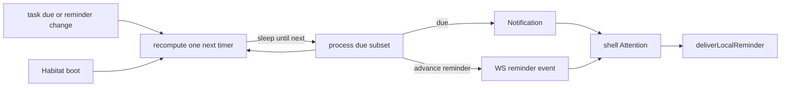

# 通知与提醒

横切切面：覆盖**持久收件箱条目**、**定时提醒**，以及**本机打断**（伴侣气泡 / 系统通知）。与 [Portal 数据面](portal-data-plane.md)（实时通道）和 [页面刷新](page-refresh.md)（注意力不做全局列表轮询）并列。

这**不是**产品模块。功能模块（任务、聊天室、番茄钟、通知 UI）在触发注意力事件时链到本文。

## 三个概念

| 概念                     | 含义                                         | 持久化                         | 客户端投递                                                 |
| ------------------------ | -------------------------------------------- | ------------------------------ | ---------------------------------------------------------- |
| **Notification（通知）** | 收件箱行：可列表、可标已读，归属某个 subject | PG（`notification*`）          | 栖息地 RPC WS `notification.created`（也可能触发本机打断） |
| **Reminder（提醒）**     | 「到点响一次」的意图；一个任务可有**多条**   | 挂在领域实体上（不是收件箱行） | 轻量 WS 事件 → **仅**本机打断                              |
| **本机打断（Alert）**    | 通道：伴侣气泡或系统通知                     | 不进 PG；设备本地              | `deliverLocalReminder`（`portal-sdk`）                     |

### 中文词汇对照

口语易混；对齐规范词：

| 口语常说                       | 规范词                | 一句话                                    |
| ------------------------------ | --------------------- | ----------------------------------------- |
| 收件箱 / 站内通知              | **Notification**      | 可列表、可标已读；落 PG                   |
| 到点提醒 / 闹钟意图            | **Reminder**          | 挂在实体上的「到点响」；**不是** Inbox 行 |
| 手机弹窗 / 系统通知 / 伴侣气泡 | **Alert**（本机打断） | 只在本机；经 `deliverLocalReminder`       |

口诀：**Notification = 收件箱；Reminder = 闹钟意图；Alert = 真响到设备上。**

上游（番茄钟、Inbox 新建、聊天未读、未来任务 Reminder 事件）只**共用** Alert 通道，不各自发明 OS 弹窗。

桌面伴侣可见时，伴侣语音气泡是首选的 **Alert** 通道。点击气泡**不等于**收件箱确认已读。

今日代码命名空间：收件箱 = `notification*`；打断 = `alert*` / `deliverLocalReminder`。产品侧 Reminder 是定时意图；勿与收件箱混为一谈。

### 设备 Alert（Android OS）

入口壳在 Android 上弹出系统通知的约定（与 Reminder / Inbox 调度无关）：

| 项      | 约定                                                                                                                                 |
| ------- | ------------------------------------------------------------------------------------------------------------------------------------ |
| 权限    | Runtime `POST_NOTIFICATIONS`；经 `ShellApi.readNativeAlertPermission` / `requestNativeAlertPermission`；**禁止** stub 为恒 `granted` |
| Channel | `freeanima.reminders`：`Importance::High`（优先横幅 / heads-up）+ `Visibility::Public`（锁屏可见内容）+ vibration                    |
| 展示    | `show_native_alert` 绑定上述 channel；上游一律走 `deliverLocalReminder` → `AlertBackend`                                             |

iOS / 桌面不强制同一 channel API。桌面权限由 OS 会话模型处理（`tauri-plugin-notification` 侧恒 Granted）：桌面 bridge **故意** stub `read/requestNativeAlertPermission → granted`，勿与 Android 一样走真实 invoke（Vite HMR 与旧 Rust 不同步时会整条 Alert 挂掉）。Windows **安装态**须在启动时注册 bundle `identifier` 为 AppUserModelID，否则 Toast 被 WinRT 静默丢弃。伴侣可见时 Inbox 仍优先气泡（产品规则）。

## World 归属

通知投递给**拥有该实体的 World 的 subject**。不要写死「只给用户 / 永不给 agent」。agent World 里的 `task_item` 到期时向 agent subject 发 **Notification**；user World 同理。

## 任务规则（目标态）

| 事件                              | Notification（收件箱）    | Reminder → Alert                           |
| --------------------------------- | ------------------------- | ------------------------------------------ |
| 任务 **到期（due）**              | 是（该 World 的 subject） | 也可经 `notification.created` 打断         |
| 日历事件 **开始** / `remind_at`   | 是（该 World 的 subject） | 与任务同一扫描（`builtin-task-reminders`） |
| 提前提醒（如到期前 7d / 3d / 1d） | **否**                    | **仅是**                                   |
| `notification_send` 工具          | 是（按目标 / subject）    | 需要设备响铃的 subject 打断                |
| 聊天未读上升                      | 否                        | 是                                         |
| 番茄钟阶段结束                    | 否                        | 是                                         |

**不要**把「提醒否则到期」合并成一次 Inbox 写入。到期与提前提醒是不同产品。

## 时间发现（栖息地）：sleep-until-next

**目标：** 用**进程内 sleep-until-next** 循环发现到期 / 提醒开火时间。本路径**不要**用 PG cron 任务表（`builtin-task-reminders`、`cron_jobs` / `cron_log`）。

语义：

```text
loop:
  process all already-due dues and reminders
  query earliest next fire time
  if none → disarm; wake again on task mutation
  else arm a single timer for that delay
  on fire → process → reschedule
```

| 规则         | 细节                                                                                                                                                               |
| ------------ | ------------------------------------------------------------------------------------------------------------------------------------------------------------------ |
| 几个定时器？ | **最多一个**下次开火臂 —— 不是每个定时行一个                                                                                                                       |
| 实现         | 等价于栖息地事件循环上的 `while { work; sleep(next) }`，经**一个**延迟定时器（如 `setTimeout`）；勿用同步 sleep 阻塞进程                                           |
| 变更时       | 创建/修补 `due_at` / reminders **取消并重算**下次唤醒                                                                                                              |
| 空闲         | 不刷 cron_log；睡到下次真实开火或变更                                                                                                                              |
| 循环任务     | 存活 `task_item` 保持 `pending`，完成时滚动 `due_at` / `remind_at`（见 [`docs/modules/task.md`](../modules/task.md)）；扫描器仍只看 pending live，滚期后可再次触发 |

其他内置（睡眠周期、env-health、用户 Agent cron）可继续用现有 cron 表机制。本切面只把**任务到期 / 提醒发现**移出该路径。

入口**不得**轮询 Inbox 或任务列表来实现注意力。见 [页面刷新](page-refresh.md)「有限自动」。

## 投递：WebSocket，非入口轮询

| 阶段           | 机制                                                                                   |
| -------------- | -------------------------------------------------------------------------------------- |
| 时间发现       | 栖息地进程内 sleep-until-next                                                          |
| 推到入口       | 既有栖息地 RPC **WebSocket** 事件                                                      |
| 已知本机截止点 | 可选 `scheduleLocalAlert`（如番茄钟）；伴侣可见时优先即时路径（OS 定时器无法驱动气泡） |



## 监听落点（Attention 枢纽）

| 层                         | 负责                                                                                           | 不负责                    |
| -------------------------- | ---------------------------------------------------------------------------------------------- | ------------------------- |
| 栖息地 sleep-until-next    | 时间发现；到期 → Inbox；提前提醒 → 事件                                                        | 入口 UI                   |
| 栖息地 RPC 会话（一条 WS） | 持久链路；所有 `subscribe*` 泵绑定到**同一**会话 map（断开时 abort）                           | 按功能第二条 socket       |
| **壳 Attention（中枢）**   | 主窗 AppFrame（或单一 portal-sdk 入口）：连接时确保订阅；路由事件；调用 `deliverLocalReminder` | 模块列表 UI               |
| 模块处理器（注册）         | 把聊天室 / 收件箱 / 番茄钟 / 未来任务提醒事件映射为 `LocalReminderInput`                       | 自有 WebSocket 或列表轮询 |
| 伴侣浮层                   | 经壳 IPC 渲染气泡                                                                              | 订阅 Inbox / 提醒总线     |

桌面主窗关闭是 hide-not-destroy；进程存活期间壳订阅应继续运行。

今日 `PomodoroShellWatcher`、`ChatUnreadShellWatcher`、`NotificationReminderShellWatcher`、`AppAttentionShellWatcher` 并排挂在 AppFrame，连接门槛重复 —— 目标是单一 Attention 注册面；重构为后续。

**模块导航角标**（侧栏 / 底栏）：聊天室 = 用户未读对话数；铃铛 = 用户 Inbox 未读数。彼此独立。

**应用图标角标**（桌面 Dock / 任务栏 overlay；可用时用 Web Badging API）= 聊天未读 + 通知未读之和，由 `AppAttentionShellWatcher` 经 `ShellApi.setAppBadgeCount` 驱动。Windows overlay 使用专用红色角标图标（不是应用图标）。未聚焦时未读上升 → `requestAppAttention`（任务栏闪烁 + 托盘图标闪烁）。桌面托盘 tooltip 显示总数。

**Android 启动器角标**：无成熟 Tauri 插件；ShortcutBadger 需树内 Kotlin。文档化缺口 —— 后续。移动端可 best-effort 尝试 WebView `navigator.setAppBadge`。

## 模块映射（目标态）

| 事件                             | Notification        | 本机打断                  |
| -------------------------------- | ------------------- | ------------------------- |
| 任务到期                         | 是（World subject） | 经收件箱创建和/或显式打断 |
| 任务提前提醒                     | 否                  | 是（直接）                |
| Agent / 系统 `notification_send` | 是                  | 按产品（用户行通常打断）  |
| 聊天未读上升                     | 否                  | 是                        |
| 番茄钟阶段结束                   | 否                  | 是                        |

## 当前缺口（代码 vs 本切面）

文档化以免 agent 把今日行为当终态：

1. **任务到期 / 提前提醒（已对齐目标态）**：`task-reminder-scheduler` sleep-until-next；到期 → Inbox；advance `reminders[]` → WS `task.advanceReminder` → `TaskAdvanceReminderShellWatcher` → `deliverLocalReminder`。兼容字段 `remind_at` = 最早提醒项。
2. sleep-cycle / env-health / email-sync-all / temporal-summary-tick 仍用 **进程内 `Bun.cron`**（非 PG `cron_jobs`）。失败时 Inbox 双收件策略不变。
3. 壳 attention 仍是多个独立 watcher（现含 `TaskAdvanceReminderShellWatcher`），尚未收敛为单一 Attention 枢纽。Nav 角标与桌面 app-icon 角标已交付；Android 启动器角标仍是缺口。
4. 本机打断（WS / OS / 气泡）对 Inbox 新建仍主要服务 **user** 行；agent Inbox 以 inject / list 为主。Advance Alert 同样仅对 user world 发本机打断。

Inbox 协议、工具与 agent inject 细节仍在 [`notifications.md`](../cognition/notifications.md)。Alert 通道细节亦在该文 Alert / `deliverLocalReminder` 节。

## 相关文档

- Inbox / SAP / 工具：[`notifications.md`](../cognition/notifications.md)
- 实时通道 / 刷新：[portal-data-plane](portal-data-plane.md)、[page-refresh](page-refresh.md)
- 伴侣气泡 UI：[`companion.md`](../modules/companion.md)
