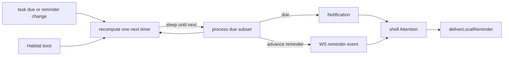

# Notification and reminder

Cross-cutting aspect for **durable inbox items**, **scheduled reminders**, and **local interrupts** (companion bubble / OS alert). Sibling to the [Portal data plane](portal-data-plane.md) (live channels) and [page refresh](page-refresh.md) (no global list polling for attention).

This is **not** a product module. Feature modules (task, chat, pomodoro, notification UI) link here when they fire attention events.

## Three concepts

| Concept                     | Meaning                                                   | Persistence                             | Client delivery                                                            |
| --------------------------- | --------------------------------------------------------- | --------------------------------------- | -------------------------------------------------------------------------- |
| **Notification**            | Inbox row: listable, mark-read, owned by a subject        | PG (`notification*`)                    | Habitat RPC WS `notification.created` (may also trigger a local interrupt) |
| **Reminder**                | “Ring once at this time” intent; a task may have **many** | On the domain entity (not an Inbox row) | Lightweight WS event → **only** local interrupt                            |
| **Local interrupt (Alert)** | Channel: companion bubble or OS notification              | Not in PG; device-local                 | `deliverLocalReminder` (`portal-sdk`)                                      |

### 中文词汇对照

口语易混；对齐规范词：

| 口语常说                       | 规范词                | 一句话                                    |
| ------------------------------ | --------------------- | ----------------------------------------- |
| 收件箱 / 站内通知              | **Notification**      | 可列表、可标已读；落 PG                   |
| 到点提醒 / 闹钟意图            | **Reminder**          | 挂在实体上的「到点响」；**不是** Inbox 行 |
| 手机弹窗 / 系统通知 / 伴侣气泡 | **Alert**（本机打断） | 只在本机；经 `deliverLocalReminder`       |

口诀：**Notification = 收件箱；Reminder = 闹钟意图；Alert = 真响到设备上。**

上游（番茄钟、Inbox 新建、聊天未读、未来任务 Reminder 事件）只**共用** Alert 通道，不各自发明 OS 弹窗。

Companion speech bubble is the preferred **Alert** channel on desktop when the companion window is visible. Bubble click is **not** Inbox ack.

Code namespaces today: Inbox = `notification*`; interrupt = `alert*` / `deliverLocalReminder`. Reminder (product) is the scheduled intent; do not conflate it with Inbox.

### Device Alert（Android OS）

Portal 壳在 Android 上弹出系统通知的约定（与 Reminder / Inbox 调度无关）：

| 项      | 约定                                                                                                                                 |
| ------- | ------------------------------------------------------------------------------------------------------------------------------------ |
| 权限    | Runtime `POST_NOTIFICATIONS`；经 `ShellApi.readNativeAlertPermission` / `requestNativeAlertPermission`；**禁止** stub 为恒 `granted` |
| Channel | `freeanima.reminders`：`Importance::High`（优先横幅 / heads-up）+ `Visibility::Public`（锁屏可见内容）+ vibration                    |
| 展示    | `show_native_alert` 绑定上述 channel；上游一律走 `deliverLocalReminder` → `AlertBackend`                                             |

iOS / 桌面不强制同一 channel API。桌面权限由 OS 会话模型处理（`tauri-plugin-notification` 侧恒 Granted）：桌面 bridge **故意** stub `read/requestNativeAlertPermission → granted`，勿与 Android 一样走真实 invoke（Vite HMR 与旧 Rust 不同步时会整条 Alert 挂掉）。Windows **安装态**须在启动时注册 bundle `identifier` 为 AppUserModelID，否则 Toast 被 WinRT 静默丢弃。伴侣可见时 Inbox 仍优先气泡（产品规则）。

## World ownership

Deliver notifications to the **subject of the World that owns the entity**. Do not hard-code “user only / never agent”. A `task_item` in the agent World fires a due **Notification** to the agent subject; the same rule applies to the user World.

## Task rules (target)

| Event                                            | Notification (Inbox)       | Reminder → Alert                               |
| ------------------------------------------------ | -------------------------- | ---------------------------------------------- |
| Task **due**                                     | Yes (that World’s subject) | May also interrupt via `notification.created`  |
| Calendar event **start** / `remind_at`           | Yes (that World’s subject) | Same scan as task (`builtin-task-reminders`)   |
| Advance reminders (e.g. 7d / 3d / 1d before due) | **No**                     | **Yes** only                                   |
| `notification_send` tool                         | Yes (by target / subject)  | Interrupt for subjects that need a device ring |
| Chat unread rise                                 | No                         | Yes                                            |
| Pomodoro phase end                               | No                         | Yes                                            |

Do **not** merge “remind else due” into a single Inbox write. Due and advance reminders are different products.

## Time discovery (Habitat): sleep-until-next

**Target:** discover due / reminder fire times with an **in-process sleep-until-next** loop. Do **not** use the PG cron job table (`builtin-task-reminders`, `cron_jobs` / `cron_log`) for this path.

Semantics:

```text
loop:
  process all already-due dues and reminders
  query earliest next fire time
  if none → disarm; wake again on task mutation
  else arm a single timer for that delay
  on fire → process → reschedule
```

| Rule             | Detail                                                                                                                                                                        |
| ---------------- | ----------------------------------------------------------------------------------------------------------------------------------------------------------------------------- |
| How many timers? | **At most one** next-fire arm — not one timer per timed row                                                                                                                   |
| Implementation   | Equivalent to `while { work; sleep(next) }` on the Habitat event loop via **one** delayed timer (e.g. `setTimeout`); do not block the process with a synchronous sleep        |
| On mutation      | Creating/patching `due_at` / reminders **cancels and recomputes** the next wake                                                                                               |
| Empty idle       | No cron_log spam; stay asleep until the next real fire or a mutation                                                                                                          |
| Recurring tasks  | Live `task_item` keeps `pending` and rolls `due_at` / `remind_at` on complete（见 [`docs/modules/task.md`](../modules/task.md)）；扫描器仍只看 pending live，滚期后可再次触发 |

Other builtins (sleep cycle, env-health, user Agent cron jobs) may keep the existing cron-table machinery. This aspect only moves **task due / reminder discovery** off that path.

Portal must **not** poll Inbox or task lists to implement attention. See [page refresh](page-refresh.md) “Limited auto”.

## Delivery: WebSocket, not Portal polling

| Stage                | Mechanism                                                                                                                               |
| -------------------- | --------------------------------------------------------------------------------------------------------------------------------------- |
| Time discovery       | Habitat in-process sleep-until-next                                                                                                     |
| Push to Portal       | Existing Habitat RPC **WebSocket** events                                                                                               |
| Known local deadline | Optional `scheduleLocalAlert` (e.g. pomodoro); when companion is visible, prefer the immediate path (OS timers cannot drive the bubble) |



## Where listening lives (Attention hub)

| Layer                         | Owns                                                                                                                            | Does not own                   |
| ----------------------------- | ------------------------------------------------------------------------------------------------------------------------------- | ------------------------------ |
| Habitat sleep-until-next      | Time discovery; due → Inbox; advance reminder → event                                                                           | Portal UI                      |
| Habitat RPC session (one WS)  | Durable link; all `subscribe*` pumps bound to the **same** session map (abort on disconnect)                                    | Per-feature second sockets     |
| **Shell Attention (central)** | Main-window AppFrame (or one portal-sdk entry): ensure subscriptions while connected; route events; call `deliverLocalReminder` | Module list UIs                |
| Module handlers (registered)  | Map chat / inbox / pomodoro / future task-reminder events → `LocalReminderInput`                                                | Own WebSocket or list polling  |
| Companion overlay             | Render bubble via shell IPC                                                                                                     | Inbox / reminder bus subscribe |

Main window close is hide-not-destroy on desktop; shell subscriptions should keep running while the process lives.

Today `PomodoroShellWatcher`, `ChatUnreadShellWatcher`, `NotificationReminderShellWatcher`, and `AppAttentionShellWatcher` sit side by side on AppFrame with duplicated connect gates — target is one Attention registration surface; refactor is follow-up.

**Module nav badges** (side rail / bottom tabs): Chat = user unread conversation count; Bell = user Inbox unread count. Each is independent.

**App icon badge** (desktop Dock / taskbar overlay; Web Badging API when available) = chat unread + notification unread sum, driven by `AppAttentionShellWatcher` via `ShellApi.setAppBadgeCount`. Windows overlay uses a dedicated red badge icon（not the app icon）. Unread rise while unfocused → `requestAppAttention` (taskbar flash + tray icon blink). Tray tooltip shows the total on desktop.

**Android launcher badge**: no mature Tauri plugin; ShortcutBadger would require in-tree Kotlin. Documented gap — follow-up. Mobile may try WebView `navigator.setAppBadge` best-effort only.

## Module map (target)

| Event                              | Notification        | Local interrupt                             |
| ---------------------------------- | ------------------- | ------------------------------------------- |
| Task due                           | Yes (World subject) | Via inbox created and/or explicit interrupt |
| Task advance reminders             | No                  | Yes (direct)                                |
| Agent / system `notification_send` | Yes                 | Per product (user rows typically interrupt) |
| Chat unread rise                   | No                  | Yes                                         |
| Pomodoro phase end                 | No                  | Yes                                         |

## Current gaps (code vs this aspect)

Documented so agents do not treat today’s behavior as the end state:

1. **Task due / advance reminders（已对齐目标态）**：`task-reminder-scheduler` sleep-until-next；due → Inbox；advance `reminders[]` → WS `task.advanceReminder` → `TaskAdvanceReminderShellWatcher` → `deliverLocalReminder`。兼容字段 `remind_at` = 最早提醒项。
2. sleep-cycle / env-health / temporal-summary-tick 仍用 **in-process `Bun.cron`**（非 PG `cron_jobs`）。失败时 Inbox 双收件策略不变。
3. Shell attention 仍是多个独立 watcher（现含 `TaskAdvanceReminderShellWatcher`），尚未收敛为单一 Attention hub。Nav badges 与桌面 app-icon badge 已交付；Android launcher badge 仍是缺口。
4. Local interrupt（WS / OS / bubble）对 Inbox 新建仍主要服务 **user** 行；agent Inbox 以 inject / list 为主。Advance Alert 同样仅对 user world 发本机打断。

Inbox protocol, tools, and agent inject details remain in [`notifications.md`](../cognition/notifications.md). Alert channel details remain there under Alert / `deliverLocalReminder`.

## Related

- Inbox / SAP / tools: [`notifications.md`](../cognition/notifications.md)
- Live channels / refresh: [portal-data-plane](portal-data-plane.md), [page-refresh](page-refresh.md)
- Companion bubble UI: [`companion.md`](../modules/companion.md)
