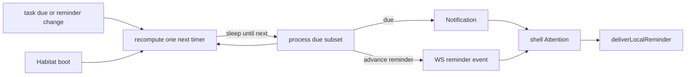

# Notification and reminder

Cross-cutting aspect for **durable inbox items**, **scheduled reminders**, and **local interrupts** (companion bubble / OS alert). Sibling to the [Portal data plane](portal-data-plane.md) (live channels) and [page refresh](page-refresh.md) (no global list polling for attention).

This is **not** a product module. Feature modules (task, chat, pomodoro, notification UI) link here when they fire attention events.

## Three concepts

| Concept                     | Meaning                                                   | Persistence                             | Client delivery                                                            |
| --------------------------- | --------------------------------------------------------- | --------------------------------------- | -------------------------------------------------------------------------- |
| **Notification**            | Inbox row: listable, mark-read, owned by a subject        | PG (`notification*`)                    | Habitat RPC WS `notification.created` (may also trigger a local interrupt) |
| **Reminder**                | “Ring once at this time” intent; a task may have **many** | On the domain entity (not an Inbox row) | Lightweight WS event → **only** local interrupt                            |
| **Local interrupt (Alert)** | Channel: companion bubble or OS notification              | Not in PG; device-local                 | `deliverLocalReminder` (`portal-sdk`)                                      |

Companion speech bubble is the preferred **Alert** channel on desktop when the companion window is visible. Bubble click is **not** Inbox ack.

Code namespaces today: Inbox = `notification*`; interrupt = `alert*` / `deliverLocalReminder`. Reminder (product) is the scheduled intent; do not conflate it with Inbox.

## World ownership

Deliver notifications to the **subject of the World that owns the entity**. Do not hard-code “user only / never agent”. A `task_item` in the agent World fires a due **Notification** to the agent subject; the same rule applies to the user World.

## Task rules (target)

| Event                                            | Notification (Inbox)       | Reminder → Alert                               |
| ------------------------------------------------ | -------------------------- | ---------------------------------------------- |
| Task **due**                                     | Yes (that World’s subject) | May also interrupt via `notification.created`  |
| Advance reminders (e.g. 7d / 3d / 1d before due) | **No**                     | **Yes** only                                   |
| `notification_send` tool                         | Yes (by target / subject)  | Interrupt for subjects that need a device ring |
| Chat unread rise                                 | No                         | Yes                                            |
| Pomodoro phase end                               | No                         | Yes                                            |

Do **not** merge “remind else due” into a single Inbox write. Due and advance reminders are different products.

## Time discovery (Habitat): sleep-until-next

**Target:** discover due / reminder fire times with an **in-process sleep-until-next** loop. Do **not** use the PG cron job table (`builtin-task-reminders`, `cron_jobs` / `cron_log`) for this path.

Semantics:

```text
loop:
  process all already-due dues and reminders
  query earliest next fire time
  if none → disarm; wake again on task mutation
  else arm a single timer for that delay
  on fire → process → reschedule
```

| Rule             | Detail                                                                                                                                                                 |
| ---------------- | ---------------------------------------------------------------------------------------------------------------------------------------------------------------------- |
| How many timers? | **At most one** next-fire arm — not one timer per timed row                                                                                                            |
| Implementation   | Equivalent to `while { work; sleep(next) }` on the Habitat event loop via **one** delayed timer (e.g. `setTimeout`); do not block the process with a synchronous sleep |
| On mutation      | Creating/patching `due_at` / reminders **cancels and recomputes** the next wake                                                                                        |
| Empty idle       | No cron_log spam; stay asleep until the next real fire or a mutation                                                                                                   |

Other builtins (sleep cycle, env-health, user Agent cron jobs) may keep the existing cron-table machinery. This aspect only moves **task due / reminder discovery** off that path.

Portal must **not** poll Inbox or task lists to implement attention. See [page refresh](page-refresh.md) “Limited auto”.

## Delivery: WebSocket, not Portal polling

| Stage                | Mechanism                                                                                                                               |
| -------------------- | --------------------------------------------------------------------------------------------------------------------------------------- |
| Time discovery       | Habitat in-process sleep-until-next                                                                                                     |
| Push to Portal       | Existing Habitat RPC **WebSocket** events                                                                                               |
| Known local deadline | Optional `scheduleLocalAlert` (e.g. pomodoro); when companion is visible, prefer the immediate path (OS timers cannot drive the bubble) |



## Where listening lives (Attention hub)

| Layer                         | Owns                                                                                                                            | Does not own                   |
| ----------------------------- | ------------------------------------------------------------------------------------------------------------------------------- | ------------------------------ |
| Habitat sleep-until-next      | Time discovery; due → Inbox; advance reminder → event                                                                           | Portal UI                      |
| Habitat RPC session (one WS)  | Durable link; all `subscribe*` pumps bound to the **same** session map (abort on disconnect)                                    | Per-feature second sockets     |
| **Shell Attention (central)** | Main-window AppFrame (or one portal-sdk entry): ensure subscriptions while connected; route events; call `deliverLocalReminder` | Module list UIs                |
| Module handlers (registered)  | Map chat / inbox / pomodoro / future task-reminder events → `LocalReminderInput`                                                | Own WebSocket or list polling  |
| Companion overlay             | Render bubble via shell IPC                                                                                                     | Inbox / reminder bus subscribe |

Main window close is hide-not-destroy on desktop; shell subscriptions should keep running while the process lives.

Today `PomodoroShellWatcher`, `ChatUnreadShellWatcher`, and `NotificationReminderShellWatcher` sit side by side on AppFrame with duplicated connect gates — target is one Attention registration surface; refactor is follow-up.

## Module map (target)

| Event                              | Notification        | Local interrupt                             |
| ---------------------------------- | ------------------- | ------------------------------------------- |
| Task due                           | Yes (World subject) | Via inbox created and/or explicit interrupt |
| Task advance reminders             | No                  | Yes (direct)                                |
| Agent / system `notification_send` | Yes                 | Per product (user rows typically interrupt) |
| Chat unread rise                   | No                  | Yes                                         |
| Pomodoro phase end                 | No                  | Yes                                         |

## Current gaps (code vs this aspect)

Documented so agents do not treat today’s behavior as the end state:

1. `builtin-task-reminders` (and sleep-cycle / env-health / temporal-summary-tick) use **in-process `Bun.cron`** — not PG `cron_jobs` / `cron_log`. On **any** failure (throw or `{ ok: false }`), Habitat writes Inbox to **both** user and agent subjects (no run history otherwise). **Sleep-until-next** for sparse task dues is still a follow-up (today still wakes every minute in-process; empty task scans stay quiet).
2. Single `remind_at` field; scan uses **remind-else-due** and writes the **user** Inbox for both — conflates Notification and Reminder, and ignores World ownership.
3. Scan only walks `user_world_id`.
4. Shell attention is three independent watchers, not one hub.
5. No multi-reminder model (7d / 3d / 1d) yet.

Inbox protocol, tools, and agent inject details remain in [`notifications.md`](../cognition/notifications.md). Alert channel details remain there under Alert / `deliverLocalReminder`.

## Related

- Inbox / SAP / tools: [`notifications.md`](../cognition/notifications.md)
- Live channels / refresh: [portal-data-plane](portal-data-plane.md), [page-refresh](page-refresh.md)
- Companion bubble UI: [`companion.md`](../modules/companion.md)
