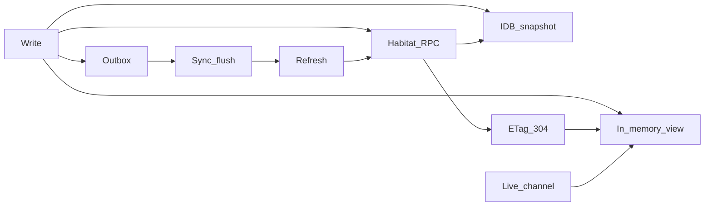

# Portal data plane

Cross-cutting design aspect for how Portal UI and Habitat stay consistent about **data**: requests, in-memory views, durable snapshots, conditional HTTP cache, offline writes, sync, refresh, and live updates.

This is **not** a product feature module (unlike Chat or Diary). Sibling docs under [`docs/aspects/`](./) hold the detailed mechanisms. Feature modules link here when they touch the shared data path.

Related terms: **Portal data plane** (EN) / **Portal 数据面** (zh); also “data-flow aspect”.

Attention (Inbox vs reminder vs local interrupt, Habitat sleep-until-next, shell Attention hub) → [Notification and reminder](notification-and-reminder.md).

## Why this aspect exists

Today the pieces below often evolve feature-by-feature. Without one vocabulary and one set of defaults, DX and UX suffer: full-list reloads after small writes, mixed cache meanings, hand-rolled loading state, and confusion between “offline” and “outbox pending”.

## Map of the plane

| Concern                      | Role                                                          | Primary doc / code                                      |
| ---------------------------- | ------------------------------------------------------------- | ------------------------------------------------------- |
| Habitat fetch gate           | No RPC when offline or Habitat not `connected`                | `isHabitatFetchAvailable`                               |
| In-memory view               | What the React tree shows                                     | Feature state / zustand; future shared hooks            |
| IDB snapshot                 | Durable read cache; offline read; failure fallback            | [Offline platform](offline-platform.md)                 |
| ETag / 304                   | Transport-layer conditional GET; not the business snapshot    | Habitat REST (`If-None-Match`)                          |
| Online write / outbox        | Prefer Habitat; enqueue on transport failure                  | [Offline platform](offline-platform.md)                 |
| sync                         | Reconnect / visibility: flush outbox then module `refreshAll` | [Page refresh](page-refresh.md), `OfflineSyncBootstrap` |
| refresh                      | User re-fetches current view                                  | [Page refresh](page-refresh.md)                         |
| live channels                | Limited auto (chat stream, conversation / pomodoro events)    | [Page refresh](page-refresh.md)                         |
| temp id / `client_op_id`     | Offline create identity and idempotent retry                  | [Offline platform](offline-platform.md)                 |
| connectivity UI vs outbox UI | Link down ≠ pending writes                                    | `connectivity-notice` vs sync toast                     |
| cache scope                  | Isolate by Habitat URL + subject                              | `resolveHabitatCacheScope`                              |
| PWA Service Worker           | Shell static assets only; **not** business RPC                | [Remote access](../ops/remote-access.md)                |

## Unified principles

1. **One vocabulary**: snapshot, outbox, sync, refresh, live, gate. Do not narrate the plane in React Query terms.
2. **Three cache layers stay distinct**: in-memory view ≠ IndexedDB business snapshot ≠ HTTP ETag/304.
3. **Limited auto**: sync + existing live channels. No global list polling. Multi-device pull uses manual refresh unless a stronger protocol exists.
4. **Invalidate with granularity**: prefer local reload or key-level invalidate after writes. Do not treat “reload the whole module list” as the only tool (except agreed sync → `refreshAll`).
5. **One optimistic write source**: offline-store / outbox. Do not add a second optimistic mutation cache beside it.
6. **DX may grow on this plane**: shared hooks are welcome; defaults follow these principles. Do **not** adopt the React Query **library**.
7. **Features must not fork the path**: reads use `withOfflineCache` (or identical semantics); writes follow the outbox / `preferOnlineWrite` contracts.

## Best practices

### Do

- Route list/get reads through `withOfflineCache` (or the same online-Habitat-first / offline-snapshot semantics).
- On writable modules: online writes via `preferOnlineWrite`; offline or transport failure via outbox; honor temp-id and `client_op_id` contracts.
- Bind header Refresh and pull-to-refresh to the **same** page `reload` handler.
- After a local write, reload or patch the **affected** view; reserve full-module `refreshAll` for sync (and explicit product needs).
- Keep connectivity chrome separate from outbox pending / failed toasts.
- When adding a module, register offline adapters and caps per [Offline platform](offline-platform.md).

### Don't

- Hand-roll a second IndexedDB or memory cache that bypasses portal-sdk.
- Conflate browser/PWA “reload” (shell assets) with business **refresh**.
- Treat 304/ETag success as “IDB is fresh” without an explicit protocol that ties them together.
- Default to focus-refetch or background list polling (React Query-style automation).
- Use React Query Persist (or similar) against the same business namespaces as `freeanima-portal-cache`.
- Show “reconnect and retry all” while Habitat is `connected` and the queue is merely working.

## Relation to React Query

|                        | React Query                                                   | This plane                                           |
| ---------------------- | ------------------------------------------------------------- | ---------------------------------------------------- |
| Primary job            | In-memory request lifecycle and UI subscriptions              | Portal↔Habitat consistency including durable offline |
| Persist                | Optional memory rehydrate; no outbox / temp-id / Habitat gate | IndexedDB snapshot + outbox + id-map                 |
| Defaults               | Often focus refetch / broad invalidation                      | Limited auto + manual refresh                        |
| Backend cache protocol | Out of scope                                                  | May grow (ETag tied to snapshots, versions)          |

**Decision:** do not introduce `@tanstack/react-query`. The plane may later grow **RQ-like DX** (hooks, explicit invalidate, controlled retry) **on top of** portal-sdk. That is one coordinate system, not “RQ + offline stacked”.

Automation must follow FreeAnima (this doc + [Page refresh](page-refresh.md)), not React Query defaults.

## DX evolution

Self-owned **PortalQueryClient** (not `@tanstack/react-query`) lives in `src/client/portal-sdk/portal-query/`:

| Capability                                                            | Status                                                     |
| --------------------------------------------------------------------- | ---------------------------------------------------------- |
| Shared read hook (`usePortalRead`)                                    | shipped                                                    |
| Infinite / load-more (`usePortalInfiniteQuery`)                       | shipped                                                    |
| Write invalidate exit (`usePortalMutation` / `invalidatePortalReads`) | shipped                                                    |
| Key helpers + inflight dedupe                                         | shipped                                                    |
| Lint / script: no second IDB read path in feature UI                  | `scripts/check-portal-cache-path.ts`                       |
| Offline / outbox status primitives                                    | direction                                                  |
| Optional devtools                                                     | direction                                                  |
| ETag/304 tied to IDB                                                  | out of scope until bandwidth / multi-device cost justifies |

**Decision remains:** do not introduce the React Query **library**. PortalQueryClient follows FreeAnima automation (no focus refetch / no global list polling).

## Child docs

| Doc                                     | Scope                                             |
| --------------------------------------- | ------------------------------------------------- |
| [Offline platform](offline-platform.md) | Snapshot, outbox shapes, flush, temp-id contracts |
| [Page refresh](page-refresh.md)         | sync vs refresh verbs, page classes, limited auto |

## See also

- [Remote access](../ops/remote-access.md) — PWA vs business offline boundary
- [Habitat RPC](../ops/habitat-rpc.md) — transport
- [UI dimensions](../ui/dimensions.md) (agent API: [ui-dimensions rules](../../.agent/rules/ui-dimensions.md)) — pointer vs touch refresh affordances
