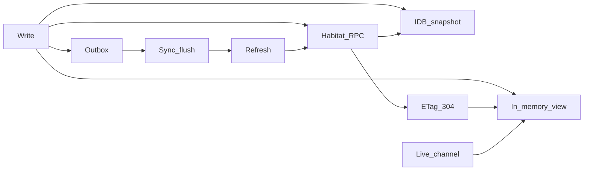

# Portal 数据面

横切设计切面：入口 UI 与栖息地如何在**数据**上保持一致——请求、内存视图、持久快照、条件 HTTP 缓存、离线写、同步、刷新与实时更新。

这**不是**产品功能模块（有别于聊天室或日记）。[`docs/aspects/`](./) 下的兄弟文档承载具体机制。功能模块触及共享数据路径时链到本文。

相关术语：**Portal data plane**（英）/ **Portal 数据面**（中）；亦称「数据流切面」。

注意力（收件箱 vs 提醒 vs 本机打断、栖息地睡到下次、壳注意力中枢）→ [通知与提醒](notification-and-reminder.md)。

## 为何存在本切面

今日下列零件常按功能各自演化。缺少统一词汇与默认约定时，DX 与 UX 受损：小写之后全表重载、缓存含义混用、手写 loading 状态，以及把「离线」与「outbox 待发送」混为一谈。

## 平面地图

| 关切                     | 角色                                                | 主文档 / 代码                                       |
| ------------------------ | --------------------------------------------------- | --------------------------------------------------- |
| 栖息地拉取门禁           | 离线或栖息地非 `connected` 时不发 RPC               | `isHabitatFetchAvailable`                           |
| 内存视图                 | React 树展示内容                                    | 功能 state / zustand；未来共享 hooks                |
| IDB 快照                 | 持久只读缓存；离线读；失败回退                      | [离线平台](offline-platform.md)                     |
| ETag / 304               | 传输层条件 GET；不是业务快照                        | 栖息地 REST（`If-None-Match`）                      |
| 在线写 / outbox          | 优先栖息地；传输失败时入队                          | [离线平台](offline-platform.md)                     |
| sync（同步）             | 重连 / 可见性：先 flush outbox，再模块 `refreshAll` | [页面刷新](page-refresh.md)、`OfflineSyncBootstrap` |
| refresh（刷新）          | 用户重拉当前视图                                    | [页面刷新](page-refresh.md)                         |
| live 通道                | 有限自动（聊天流、对话 / 番茄事件）                 | [页面刷新](page-refresh.md)                         |
| 临时 id / `client_op_id` | 离线创建身份与幂等重试                              | [离线平台](offline-platform.md)                     |
| 连接状态 UI vs outbox UI | 链路断开 ≠ 待发送写                                 | `connectivity-notice` vs 同步 toast                 |
| 缓存作用域               | 按栖息地 URL + subject 隔离                         | `resolveHabitatCacheScope`                          |
| PWA Service Worker       | 仅壳静态资源；**不是**业务 RPC                      | [远程访问](../ops/remote-access.md)                 |

## 统一原则

1. **一套词汇**：snapshot、outbox、sync、refresh、live、gate。不要用 React Query 术语叙述本平面。
2. **三层缓存保持区分**：内存视图 ≠ IndexedDB 业务快照 ≠ HTTP ETag/304。
3. **有限自动**：sync + 既有 live 通道。无全局列表轮询。多设备拉取用手动刷新，除非有更强协议。
4. **按粒度失效**：写后优先局部重载或 key 级 invalidate。勿把「重载整模块列表」当作唯一手段（约定的 sync → `refreshAll` 除外）。
5. **唯一乐观写来源**：offline-store / outbox。勿在其旁再加第二套乐观 mutation 缓存。
6. **DX 可在本平面成长**：欢迎共享 hooks；默认遵循上述原则。**不要**引入 React Query **库**。
7. **功能不得分叉路径**：读用 `withOfflineCache`（或等价语义）；写遵循 outbox / `preferOnlineWrite` 契约。

## 最佳实践

### 要做

- 列表/get 读经 `withOfflineCache`（或相同的「在线栖息地优先 / 离线快照」语义）。
- 可写模块：在线写经 `preferOnlineWrite`；离线或传输失败经 outbox；遵守临时 id 与 `client_op_id` 契约。
- 顶栏刷新与下拉刷新绑定到**同一**页 `reload` 处理器。
- 本地写后，重载或补丁**受影响**的视图；整模块 `refreshAll` 留给 sync（及明确产品需要）。
- 连接状态 chrome 与 outbox 待发送 / 失败 toast 分开。
- 新增模块时，按 [离线平台](offline-platform.md) 注册离线适配器与上限。

### 不要

- 手写第二套绕过 portal-sdk 的 IndexedDB 或内存缓存。
- 把浏览器/PWA「重载」（壳资源）与业务 **refresh** 混为一谈。
- 在未有显式协议把二者绑定时，把 304/ETag 成功当成「IDB 已新鲜」。
- 默认 focus-refetch 或后台列表轮询（React Query 式自动化）。
- 用 React Query Persist（或类似）对准与 `freeanima-portal-cache` 相同的业务命名空间。
- 在栖息地已 `connected`、队列只是在工作时，仍展示「重连并重试全部」。

## 与 React Query 的关系

|              | React Query                                    | 本平面                           |
| ------------ | ---------------------------------------------- | -------------------------------- |
| 主职         | 内存请求生命周期与 UI 订阅                     | 入口↔栖息地一致性，含持久离线    |
| Persist      | 可选内存回填；无 outbox / 临时 id / 栖息地门禁 | IndexedDB 快照 + outbox + id-map |
| 默认         | 常 focus refetch / 宽泛 invalidate             | 有限自动 + 手动刷新              |
| 后端缓存协议 | 范围外                                         | 可成长（ETag 与快照绑定、版本）  |

**决策：** 不引入 `@tanstack/react-query`。本平面日后可在 portal-sdk **之上**长出 **类 RQ 的 DX**（hooks、显式 invalidate、受控重试）。那是同一坐标系，不是「RQ + 离线叠罗汉」。

自动化须遵循逸灵风（本文 + [页面刷新](page-refresh.md)），而非 React Query 默认。

## DX 演进

自有 **PortalQueryClient**（不是 `@tanstack/react-query`）位于 `packages/frontend/client/portal-sdk/portal-query/`：

| 能力                                                          | 状态                                                     |
| ------------------------------------------------------------- | -------------------------------------------------------- |
| 共享读 hook（`usePortalRead`）                                | 已交付                                                   |
| 无限 / 加载更多（`usePortalInfiniteQuery`）                   | 已交付                                                   |
| 写后失效出口（`usePortalMutation` / `invalidatePortalReads`） | 已交付                                                   |
| Key 助手 + inflight 去重                                      | 已交付                                                   |
| Lint：功能 UI 无第二 IDB 读路径                               | oxlint `freeanima/no-direct-offline-cache`               |
| 离线 / outbox 状态基元                                        | 已交付（`subscribeOutboxChanges` / `use*OutboxSummary`） |
| 可选 devtools                                                 | 方向                                                     |
| ETag/304 与 IDB 绑定                                          | 带宽 / 多设备成本证明前范围外                            |

自动拉取仅在 **key 变化**、**`updatedAt === 0`（未拉 / invalidate）**、或 **idle 无 data** 时触发；`fetchQuery` 成功写入的新时间戳**不得**再触发 reload（否则与 subscribe notify 死循环刷屏）。`reload` / `setData` 依赖 **keyHash**（非 key 数组引用），避免内联 `queryKey` 导致父组件 effect 反复 `resetDetail`。

**决策不变：** 不引入 React Query **库**。PortalQueryClient 遵循逸灵风自动化（无 focus refetch / 无全局列表轮询）。

## 子文档

| 文档                            | 范围                                     |
| ------------------------------- | ---------------------------------------- |
| [离线平台](offline-platform.md) | 快照、outbox 形态、flush、临时 id 契约   |
| [页面刷新](page-refresh.md)     | sync vs refresh 动词、页面类别、有限自动 |

## 另见

- [远程访问](../ops/remote-access.md) — PWA 与业务离线边界
- [栖息地 RPC](../ops/habitat-rpc.md) — 传输
- [UI 三维度](../ui/dimensions.md)（Agent API：[frontend-ui 规则](../../.cursor/rules/frontend-ui.mdc)）— pointer vs touch 刷新可及性
