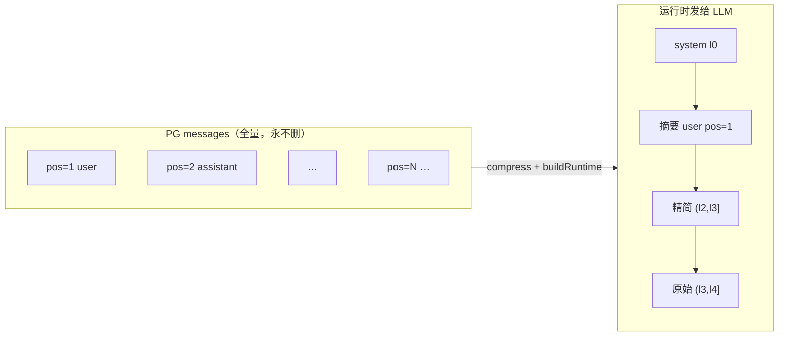
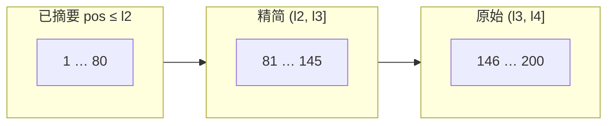
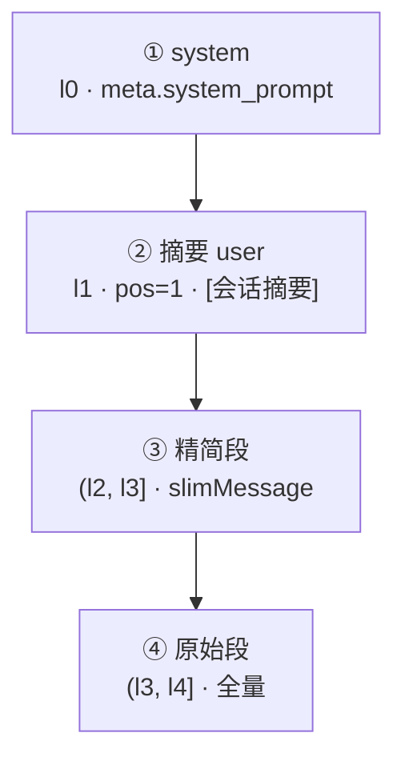
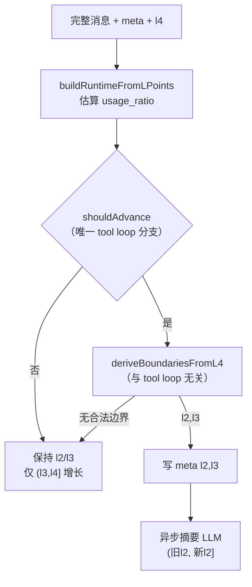
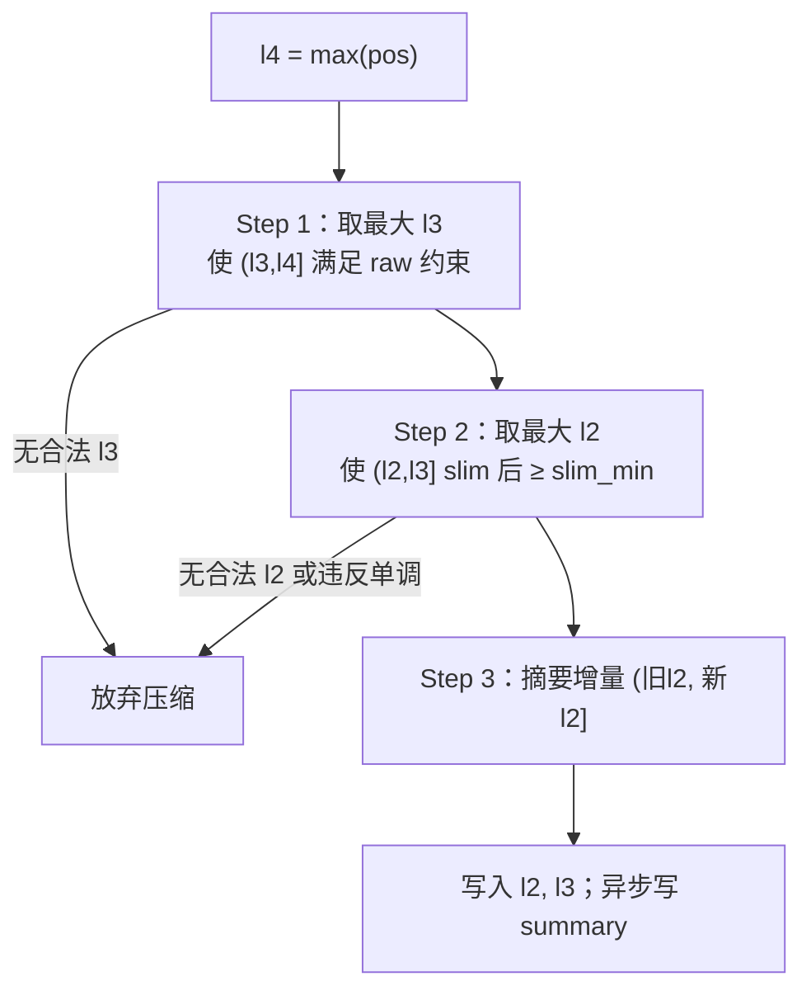
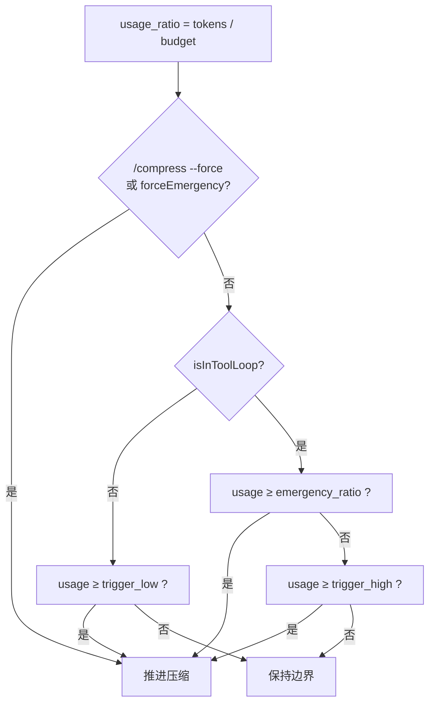
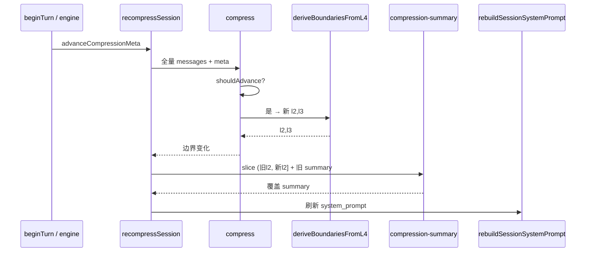
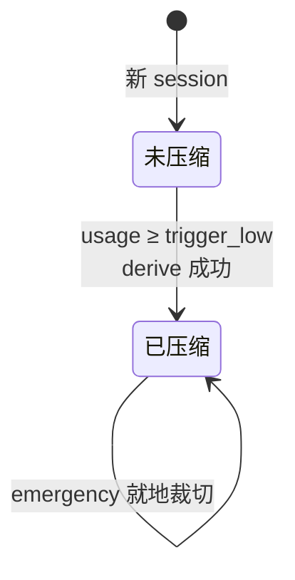
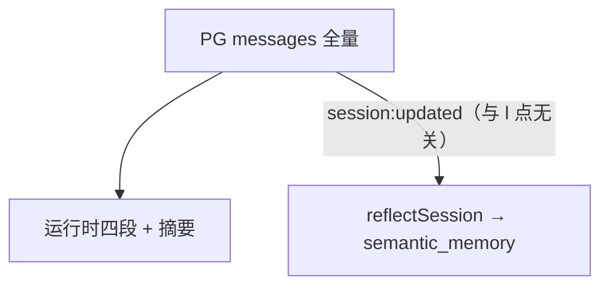

# 压缩优化方案（l 点 v5.1）

> 运行时上下文压缩：PG `messages` **全量只追加**，仅裁切发给 LLM 的**四段视图**。
> **l0–l4 为压缩边界**，与记忆层旧 L1–L4 编号无关（术语见 [`memory.md`](memory.md) §三）。
> 关联：睡眠见 [`sleep.md`](sleep.md)，记忆体系见 [`memory.md`](memory.md)。

---

## 设计原则

| 原则     | 说明                                                                                         |
| -------- | -------------------------------------------------------------------------------------------- |
| PG 不删  | `messages` 永远保留完整对话；压缩只改**运行时视图**与 `session_meta.compression`             |
| l4 实时  | `l4 = max(pos)`，随 append 增长，**不写入 meta**                                             |
| 边界单调 | 压缩成功时 `新 l2 > 旧 l2`、`新 l3 ≥ 旧 l3`；否则放弃本次压缩                                |
| 职责分离 | **定界**（`deriveBoundariesFromL4`）与 **触发**（`shouldAdvance`）解耦；仅触发区分 tool loop |

---

## 两层存储



- **非压缩路径**：只读 meta，`l2/l3/summary` 不变；`(l3, l4]` 随新消息变长。
- **压缩路径**：`shouldAdvance` 通过后 → `deriveBoundariesFromL4` → 写 `l2/l3` → 异步摘要 LLM。

---

## 边界点 l0–l4

| 点     | 含义                                                 | 何时变          | 持久化 |
| ------ | ---------------------------------------------------- | --------------- | ------ |
| **l0** | 系统提示词锚点，恒 **0**                             | 不变            | 否     |
| **l1** | 运行时合成摘要 user 的 **pos**，恒 **1**（**≠ l4**） | 不变            | 否     |
| **l2** | 摘要段右界（`pos ≤ l2` 已进入摘要）                  | **仅压缩成功**  | 是     |
| **l3** | 精简段右界                                           | **仅压缩成功**  | 是     |
| **l4** | 消息列表最右 pos，`max(pos)`                         | **实时** append | 否     |

### 硬性约定

1. **`l1 ≠ l4`**：`l1` 是合成行固定 pos，与 `max(pos)` 无关。
2. **`l4` 无策略**，不写入 meta。
3. **非压缩路径只读 meta**；仅压缩成功时更新 `l2`、`l3`、`summary`。
4. **无 `l2l`**：摘要语义 = **`pos ≤ l2`**（不是「最后 user 之前」的旧 cut 语义）。

未压缩：`l2 = l3 = 0`，无 `summary`，不注入 `pos=1`。

### messages 上的分段示意

以 `l2=80, l3=145, l4=200` 为例（**pos 轴**，非条数轴）：



| pos 区间   | 运行时去向                                              |
| ---------- | ------------------------------------------------------- |
| `pos ≤ l2` | 不进消息列表 → 合成 `pos=1` 摘要 user（`meta.summary`） |
| `(l2, l3]` | 精简段（`slimMessage` 后 UA）                           |
| `(l3, l4]` | 原始段（全量，含 tool）                                 |

两次压缩之间：**l2 / l3 / summary 冻结**，仅 **`(l3, l4]`** 随 append 变长。

---

## 运行时四段（发给 LLM）



| 段     | pos 范围   | 说明                                                 |
| ------ | ---------- | ---------------------------------------------------- |
| system | l0         | `session_meta.system_prompt`，不在 messages 对话行里 |
| 摘要   | `≤ l2`     | 合成 `pos=1` + `summary` 文本；**不写 messages**     |
| 精简   | `(l2, l3]` | slim 后 user/assistant（tool 丢弃）                  |
| 原始   | `(l3, l4]` | 全量消息，**不 slim**                                |

实现：`buildRuntimeFromLPoints` → `buildRuntimeMessages` 前置 `system`。

---

## 配置

`config.yaml` 示例（完整见 [`config.example.yaml`](../config.example.yaml)）：

```yaml
models:
  deepseek-v4-flash:
    context_window: 1000000

compression:
  enabled: true
  reserved_tokens: 8192
  trigger_low: 0.60 # 工具循环外：达到可压
  trigger_high: 0.80 # 工具循环内：达到可压
  emergency_ratio: 0.92 # 工具循环内硬顶
  raw_min_messages: 5 # 原始段 (l3, l4] 最少条数
  slim_min_messages: 50 # 精简段 (l2, l3] slim 后最少条数
  summary_max_tokens: 4000
  max_rounds: 50 # 未配置 context_window 时回退条数模式
```

| 项                  | 默认                                            | 说明                        |
| ------------------- | ----------------------------------------------- | --------------------------- |
| 有效预算            | `context_window - reserved_tokens`（下限 4096） | token 模式占用率分母        |
| `trigger_low`       | 0.60                                            | 循环**外**首次/再次压缩阈   |
| `trigger_high`      | 0.80                                            | 循环**内**压缩阈            |
| `emergency_ratio`   | 0.92                                            | 循环内硬顶 + emergency 路径 |
| `raw_min_messages`  | 5                                               | 定 l3 时原始段下限          |
| `slim_min_messages` | 50                                              | 定 l2 时精简段 slim 后下限  |

**已删除**（v5.1 不再读取）：`tool_loop_suppress_sec`、`slim_user_shift`、`tool_loop_user_shift`、`l2l`。

未配置 `models.*.context_window` 且无 `default_context_window` 时，回退**消息条数**模式：首次 `> max_rounds×2` 条触发，已压后原始段 `> max_rounds×4` 再压。

Token 估算：`engine/compress/src/token-estimate.ts`（与 `conversation-stats` 共用）。

---

## 压缩决策流水线



### 职责分离

| 模块                      | 是否关心 tool loop          |
| ------------------------- | --------------------------- |
| `deriveBoundariesFromL4`  | **否** — 同一套自右向左算法 |
| `shouldAdvance`           | **是** — 内外不同阈值       |
| `buildRuntimeFromLPoints` | **否**                      |

---

## 边界推导：`deriveBoundariesFromL4`

输入：完整消息列表、当前 **`l4`**、旧 `l2/l3`。



### Step 1：定 `l3`

取**最大的** `l3`（右推，原始段尽量窄、靠右），使 **`(l3, l4]`** 满足：

| 约束     | 说明                                                          |
| -------- | ------------------------------------------------------------- |
| 条数     | ≥ `raw_min_messages`（默认 5）                                |
| 含 user  | 至少 1 条 `role=user`                                         |
| 热尾起点 | **`min{ pos \| pos > l3 }`** 必须是 `user`（兼容 pos 不连续） |

> **注意**：L3 保证 raw 热尾以 `user` **起笔**，不保证热尾以完整 tool loop **收笔**；尾部 dangling `tool_calls` 由 engine `tool-loop-integrity` 在出站/落盘前 repair。

无合法 `l3` → 放弃压缩。

### Step 2：定 `l2`

取**最大的** `l2`，使 **`(l2, l3]`** 经 `slimMessage` 后条数 ≥ `slim_min_messages`（默认 50）。

| 检查            | 说明               |
| --------------- | ------------------ |
| `l2 < l3`       | 否则无效           |
| `新 l3 ≥ 旧 l3` | 单调               |
| `新 l2 > 旧 l2` | 严格右移，否则放弃 |

### Step 3：摘要

- 增量 messages 区间：**`(旧 l2, 新 l2]`**（首压 **`(0, 新 l2]`**）
- LLM 合并进 `meta.summary`；运行时注入 **`pos=1`** 摘要 user

定 l3 时已保证原始段以 user 开头，**无需**定界后再因 tool loop 左移 l3/l2。

---

## 触发：`shouldAdvance`

`isInToolLoop(messages)` **仅用于此处**，**不参与** `deriveBoundariesFromL4`。

**工具循环判定**（`compression-tool-loop.ts`）：自最后一条 `user` 之后，若尾部以 `tool` 或带 `tool_calls` 的 `assistant` 结尾，则为循环内。



| 场景                | 是否推进压缩                                                    |
| ------------------- | --------------------------------------------------------------- |
| **工具循环外**      | `usage ≥ trigger_low`（0.60）；`< trigger_low` 不压             |
| **工具循环内**      | 仅 `usage ≥ trigger_high`（0.80）或 `≥ emergency_ratio`（0.92） |
| **工具循环内** 其余 | 不压                                                            |

占用率按当前 **l4** 下四段 runtime 视图（system + 摘要 + 精简 + 原始 + tools）估算，**不用 messages 全量**。

> v5.1 已移除 `tool_loop_suppress_sec` 时间抑制；`markToolLoopActivity` / `clearToolLoopSuppression` 仍由 engine / `beginTurn` 调用，但**不再**参与压缩门控。

---

## 精简段：`slimMessage`

原始段 **不** slim。

| role                       | 行为                                                                              |
| -------------------------- | --------------------------------------------------------------------------------- |
| `tool`                     | **丢弃**                                                                          |
| `user`                     | 保留（去掉 `reasoning` / `tool_calls` 字段）                                      |
| `assistant` + `tool_calls` | `content` 非空用 content，**否则用 `reasoning`**；去掉 `tool_calls` / `reasoning` |
| `assistant` 无 tool_calls  | 保留 `content`，去 `reasoning`                                                    |

---

## 会话摘要

### meta 结构

```json
{
  "l2": 80,
  "l3": 145,
  "summary": "合并后的唯一摘要…",
  "summary_at": "2026-05-28T02:00:00+08:00"
}
```

### 摘要流水线



| 步骤 | 说明                                                                 |
| ---- | -------------------------------------------------------------------- |
| 触发 | `beginTurn` → `advanceCompressionMeta`；或 `/compress`；或 emergency |
| 切片 | `sliceForSummary(messages, prevL2, newL2)`                           |
| LLM  | `system` = 压缩前 `system_prompt` **快照**；不传 tools               |
| 写回 | 覆盖 `summary` + `summary_at`；`rebuildSessionSystemPrompt()`        |

旧 meta **读时迁移**（`parseCompressionState`）：

| 旧字段                   | → 新字段 |
| ------------------------ | -------- |
| `anchor_id`              | `l3`     |
| `cut_id`（无 anchor）    | `l3`     |
| `last_summarized_cut_id` | `l2`     |

---

## Emergency（单轮硬顶）

`maybeApplyEmergencyCompression`（`engine` 工具循环中调用）：


1. `l4` = 当前内存消息 `max(pos)`
2. 阈值走**工具循环内**规则（`trigger_high` / `emergency_ratio`）
3. 边界推导与常规定界相同，**无额外 shift**
4. 写 meta 后异步摘要；内存视图立即变为四段

---

## 消息生命周期



| 时机                   | 行为                                                                                         |
| ---------------------- | -------------------------------------------------------------------------------------------- |
| `beginTurn`            | `clearToolLoopSuppression` → append user → `advanceCompressionMeta` → `buildRuntimeMessages` |
| 每轮 tool/assistant    | engine `markToolLoopActivity`（不影响 v5.1 压缩阈）                                          |
| `buildRuntimeMessages` | `compress` 只读 meta，除非 `shouldAdvance` 为真                                              |
| `/compress --force`    | 忽略滞回，从 `l2=l3=0` 重算边界                                                              |

---

## 实现入口

| 模块                                                | 职责                                                                                      |
| --------------------------------------------------- | ----------------------------------------------------------------------------------------- |
| `engine/compress/src/compressor.ts`                 | l 点、`deriveBoundariesFromL4`、`shouldAdvance`、`buildRuntimeFromLPoints`、`slimMessage` |
| `engine/compress/src/compression-config.ts`         | 配置与 `context_window` / 有效预算                                                        |
| `engine/compress/src/compression-summary.ts`        | 摘要 LLM                                                                                  |
| `engine/compress/src/compression-tool-loop.ts`      | `isInToolLoop`                                                                            |
| `engine/conversation/src/conversation.ts`           | `recompressSession`、`buildRuntimeMessages`、`maybeApplyEmergencyCompression`             |
| `engine/loop/src/engine.ts`                         | emergency 调用点                                                                          |
| `service/service/src/runtime/conversation-stats.ts` | `/stats` 展示 `l2`/`l3`/占用率                                                            |

手动：`/compress`（`--force` 忽略滞回）。

---

## 与记忆管道

压缩**不**触发记忆反思；与 [`memory.md`](memory.md) 中的 `session:updated` → `reflectSession` 管道独立。



PG `messages` **永不删**（只追加）。
