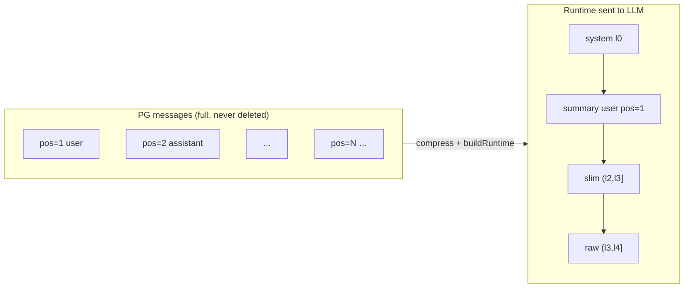
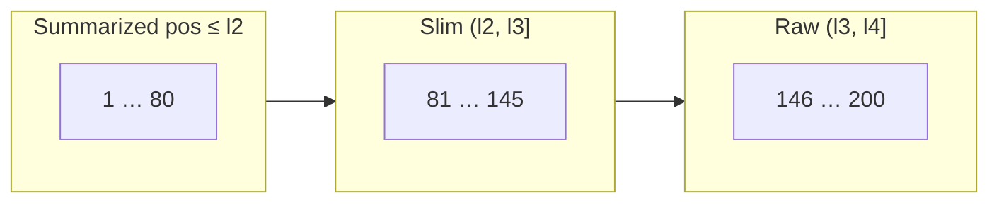
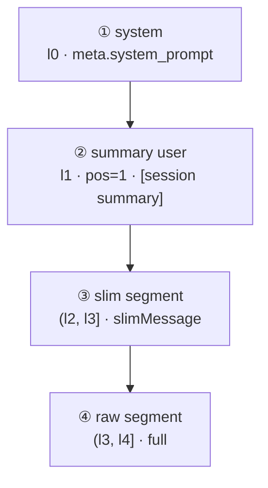
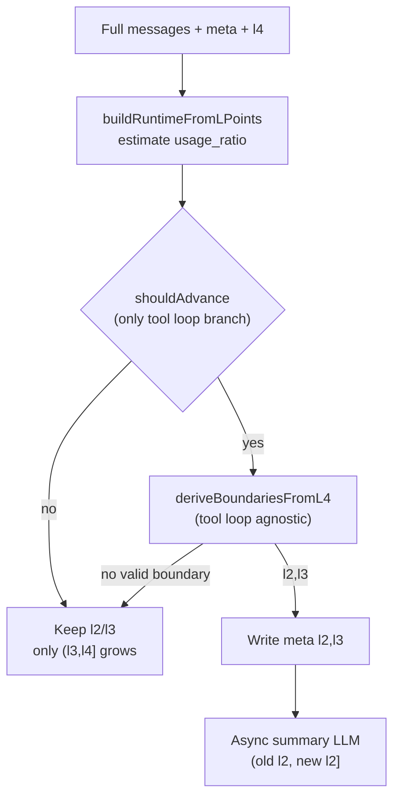
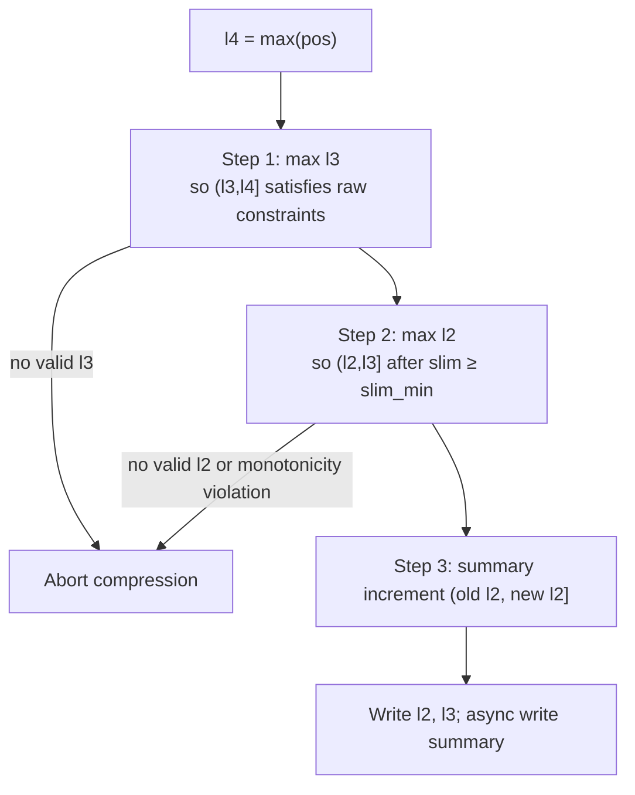
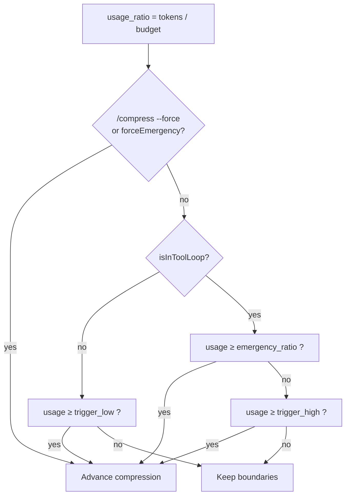
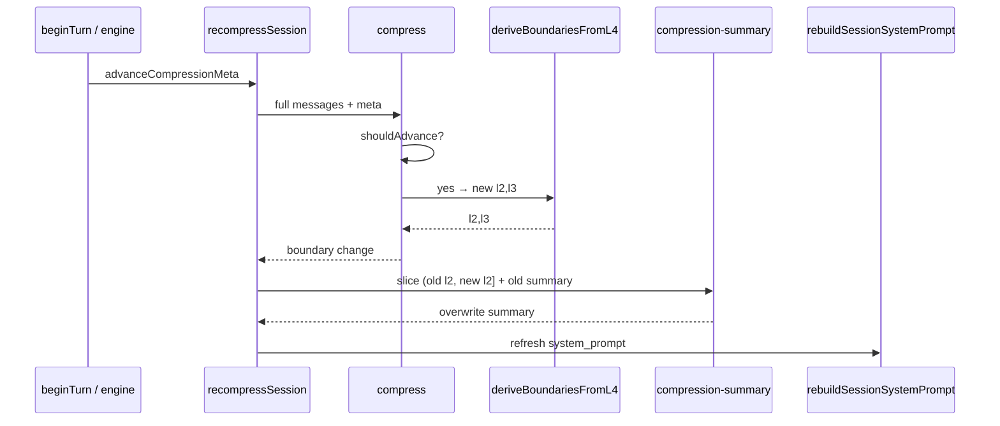
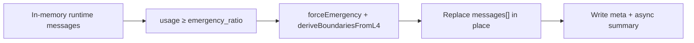
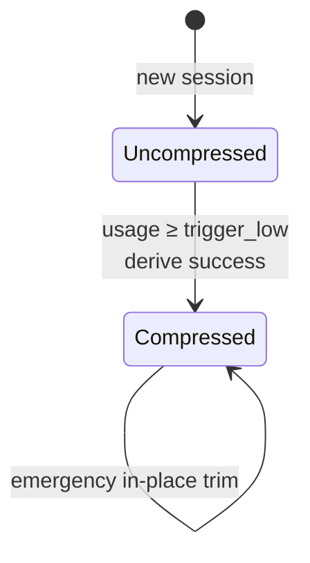
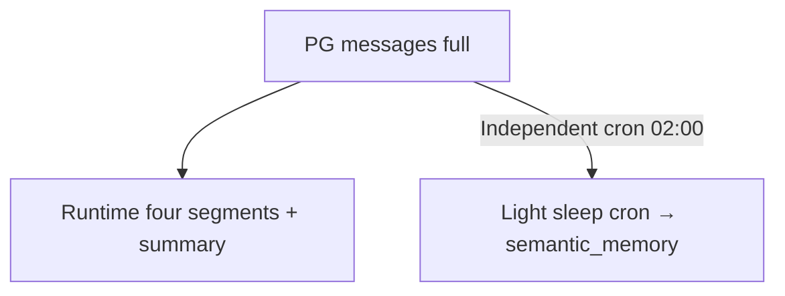

# Compression Design (l-point v5.1)

> Runtime context compression: PG `messages` **fully append-only**; only the **four-segment view** sent to the LLM is trimmed.
> **l0–l4 are compression boundaries** (terminology in [`compression.md`](compression.md)); unrelated to memory layer PG storage.
> Related: sleep [`sleep.md`](sleep.md), memory system [`memory.md`](memory.md).

---

## Design Principles

| Principle              | Description                                                                                                                        |
| ---------------------- | ---------------------------------------------------------------------------------------------------------------------------------- |
| PG never deletes       | `messages` always retains full conversation; compression only changes **runtime view** and `session_meta.compression`              |
| l4 real-time           | `l4 = max(pos)`, grows with append, **not written to meta**                                                                        |
| Monotonic boundaries   | On successful compression: `new l2 > old l2`, `new l3 ≥ old l3`; otherwise abort                                                   |
| Separation of concerns | **Boundary setting** (`deriveBoundariesFromL4`) decoupled from **trigger** (`shouldAdvance`); only trigger distinguishes tool loop |

---

## Two-Layer Storage



- **Non-compression path:** read meta only; `l2/l3/summary` unchanged; `(l3, l4]` grows with new messages.
- **Compression path:** after `shouldAdvance` passes → `deriveBoundariesFromL4` → write `l2/l3` → async summary LLM.

---

## Boundary Points l0–l4

| Point  | Meaning                                                         | When it changes                    | Persisted |
| ------ | --------------------------------------------------------------- | ---------------------------------- | --------- |
| **l0** | System prompt anchor, always **0**                              | Never                              | No        |
| **l1** | Runtime synthetic summary user **pos**, always **1** (**≠ l4**) | Never                              | No        |
| **l2** | Summary segment right boundary (`pos ≤ l2` already summarized)  | **Only on successful compression** | Yes       |
| **l3** | Slim segment right boundary                                     | **Only on successful compression** | Yes       |
| **l4** | Rightmost message pos, `max(pos)`                               | **Real-time** append               | No        |

### Hard Conventions

1. **`l1 ≠ l4`:** `l1` is fixed synthetic row pos, unrelated to `max(pos)`.
2. **`l4` has no policy**, not written to meta.
3. **Non-compression path reads meta only**; only successful compression updates `l2`, `l3`, `summary`.
4. **No `l2l`:** summary semantics = **`pos ≤ l2`** (not legacy "before last user" cut semantics).

Uncompressed: `l2 = l3 = 0`, no `summary`, no `pos=1` injection.

### Segment Sketch on messages

Example `l2=80, l3=145, l4=200` (**pos axis**, not message count):



| pos range  | Runtime destination                                                     |
| ---------- | ----------------------------------------------------------------------- |
| `pos ≤ l2` | Not in message list → synthesized `pos=1` summary user (`meta.summary`) |
| `(l2, l3]` | Slim segment (UA after `slimMessage`)                                   |
| `(l3, l4]` | Raw segment (full, including tools)                                     |

Between two compressions: **l2 / l3 / summary frozen**; only **`(l3, l4]`** grows with append.

---

## Runtime Four Segments (Sent to LLM)



| Segment | pos range  | Description                                                     |
| ------- | ---------- | --------------------------------------------------------------- |
| system  | l0         | `session_meta.system_prompt`, not in messages conversation rows |
| summary | `≤ l2`     | Synthetic `pos=1` + `summary` text; **not written to messages** |
| slim    | `(l2, l3]` | Slimmed user/assistant (tools dropped)                          |
| raw     | `(l3, l4]` | Full messages, **not slimmed**                                  |

Implementation: `buildRuntimeFromLPoints` → `buildRuntimeMessages` prepends `system`.

---

## Configuration

`config.yaml` example (full file: [`config.example.yaml`](../../config.example.yaml)):

```yaml
models:
  deepseek-v4-flash:
    context_window: 1000000

compression:
  enabled: true
  reserved_tokens: 8192
  trigger_low: 0.60 # outside tool loop: eligible to compress
  trigger_high: 0.80 # inside tool loop: eligible to compress
  emergency_ratio: 0.92 # hard cap inside tool loop
  raw_min_messages: 5 # raw segment (l3, l4] minimum count
  slim_min_messages: 50 # slim segment (l2, l3] minimum after slim
  summary_max_tokens: 4000
  max_rounds: 50 # fallback message-count mode when context_window unset
```

| Item                | Default                                         | Description                                   |
| ------------------- | ----------------------------------------------- | --------------------------------------------- |
| Effective budget    | `context_window - reserved_tokens` (floor 4096) | Token mode occupancy denominator              |
| `trigger_low`       | 0.60                                            | **Outside** loop first/re-compress threshold  |
| `trigger_high`      | 0.80                                            | **Inside** loop compress threshold            |
| `emergency_ratio`   | 0.92                                            | Inside loop hard cap + emergency path         |
| `raw_min_messages`  | 5                                               | Raw segment floor when setting l3             |
| `slim_min_messages` | 50                                              | Slim segment floor after slim when setting l2 |

**Removed** (v5.1 no longer reads): `tool_loop_suppress_sec`, `slim_user_shift`, `tool_loop_user_shift`, `l2l`.

When `models.*.context_window` and `default_context_window` are both unset, falls back to **message count** mode: first trigger `> max_rounds×2` messages; after compression, raw segment `> max_rounds×4` triggers again.

Token estimate: `engine/compress/src/token-estimate.ts` (shared with `conversation-stats`).

---

## Compression Decision Pipeline



### Separation of Concerns

| Module                    | Cares about tool loop?                        |
| ------------------------- | --------------------------------------------- |
| `deriveBoundariesFromL4`  | **No** — same right-to-left algorithm         |
| `shouldAdvance`           | **Yes** — different thresholds inside/outside |
| `buildRuntimeFromLPoints` | **No**                                        |

---

## Boundary Derivation: `deriveBoundariesFromL4`

Input: full message list, current **`l4`**, old `l2/l3`.



### Step 1: Set `l3`

Take the **largest** `l3` (push right, raw segment as narrow as possible) so **`(l3, l4]`** satisfies:

| Constraint     | Description                      |
| -------------- | -------------------------------- | --------------------------------------------------------- |
| Count          | ≥ `raw_min_messages` (default 5) |
| Has user       | At least 1 `role=user`           |
| Hot-tail start | \*\*`min{ pos                    | pos > l3 }`** must be `user` (handles non-contiguous pos) |

> **Note:** `l3` ensures raw hot-tail **starts** with `user`, not that hot-tail **ends** with a complete tool loop; trailing dangling `tool_calls` repaired by engine `tool-loop-integrity` before outbound/persist.

No valid `l3` → abort compression.

### Step 2: Set `l2`

Take the **largest** `l2` so **`(l2, l3]`** after `slimMessage` has count ≥ `slim_min_messages` (default 50).

| Check             | Description                    |
| ----------------- | ------------------------------ |
| `l2 < l3`         | Otherwise invalid              |
| `new l3 ≥ old l3` | Monotonic                      |
| `new l2 > old l2` | Strict right shift, else abort |

### Step 3: Summary

- Increment message range: **`(old l2, new l2]`** (first compression **`(0, new l2]`**)
- LLM merges into `meta.summary`; runtime injects **`pos=1`** summary user

Step 1 already ensures raw segment starts with user—**no** post-boundary l3/l2 shift for tool loop.

---

## Trigger: `shouldAdvance`

`isInToolLoop(messages)` **only used here**, **not** in `deriveBoundariesFromL4`.

**Tool loop detection** (`compression-tool-loop.ts`): after last `user`, if tail ends with `tool` or `assistant` with `tool_calls`, inside loop.



| Scenario                       | Advance compression?                                             |
| ------------------------------ | ---------------------------------------------------------------- |
| **Outside tool loop**          | `usage ≥ trigger_low` (0.60); `< trigger_low` do not compress    |
| **Inside tool loop**           | Only `usage ≥ trigger_high` (0.80) or `≥ emergency_ratio` (0.92) |
| **Inside tool loop** otherwise | Do not compress                                                  |

Occupancy estimated from four-segment runtime view at current **l4** (system + summary + slim + raw + tools), **not** full messages.

> v5.1 removed `tool_loop_suppress_sec` time suppression; `markToolLoopActivity` / `clearToolLoopSuppression` still called by engine / `beginTurn`, but **no longer** gate compression.

---

## Slim Segment: `slimMessage`

Raw segment **not** slimmed.

| role                           | Behavior                                                                                 |
| ------------------------------ | ---------------------------------------------------------------------------------------- |
| `tool`                         | **Dropped**                                                                              |
| `user`                         | Kept (strip `reasoning` / `tool_calls` fields)                                           |
| `assistant` + `tool_calls`     | Non-empty `content` uses content, **else `reasoning`**; strip `tool_calls` / `reasoning` |
| `assistant` without tool_calls | Keep `content`, strip `reasoning`                                                        |

---

## Session Summary

### meta Structure

```json
{
  "l2": 80,
  "l3": 145,
  "summary": "Merged single summary…",
  "summary_at": "2026-05-28T02:00:00+08:00"
}
```

### Summary Pipeline



| Step       | Description                                                          |
| ---------- | -------------------------------------------------------------------- |
| Trigger    | `beginTurn` → `advanceCompressionMeta`; or `/compress`; or emergency |
| Slice      | `sliceForSummary(messages, prevL2, newL2)`                           |
| LLM        | `system` = pre-compression `system_prompt` **snapshot**; no tools    |
| Write-back | Overwrite `summary` + `summary_at`; `rebuildSessionSystemPrompt()`   |

Legacy meta **read-time migration** (`parseCompressionState`):

| Old field                | → New field |
| ------------------------ | ----------- |
| `anchor_id`              | `l3`        |
| `cut_id` (no anchor)     | `l3`        |
| `last_summarized_cut_id` | `l2`        |

---

## Emergency (Single-Turn Hard Cap)

`maybeApplyEmergencyCompression` (called from engine tool loop):



1. `l4` = current in-memory message `max(pos)`
2. Thresholds follow **inside tool loop** rules (`trigger_high` / `emergency_ratio`)
3. Boundary derivation same as normal; **no extra shift**
4. After meta write, async summary; in-memory view immediately becomes four segments

---

## Message Lifecycle



| Timing                   | Behavior                                                                                     |
| ------------------------ | -------------------------------------------------------------------------------------------- |
| `beginTurn`              | `clearToolLoopSuppression` → append user → `advanceCompressionMeta` → `buildRuntimeMessages` |
| Each tool/assistant turn | engine `markToolLoopActivity` (does not affect v5.1 compression threshold)                   |
| `buildRuntimeMessages`   | `compress` reads meta only unless `shouldAdvance` true                                       |
| `/compress --force`      | Ignore hysteresis, recompute boundaries from `l2=l3=0`                                       |

---

## Implementation Entry Points

| Module                                              | Responsibility                                                                                |
| --------------------------------------------------- | --------------------------------------------------------------------------------------------- |
| `engine/compress/src/compressor.ts`                 | l-points, `deriveBoundariesFromL4`, `shouldAdvance`, `buildRuntimeFromLPoints`, `slimMessage` |
| `engine/compress/src/compression-config.ts`         | Config and `context_window` / effective budget                                                |
| `engine/compress/src/compression-summary.ts`        | Summary LLM                                                                                   |
| `engine/compress/src/compression-tool-loop.ts`      | `isInToolLoop`                                                                                |
| `engine/conversation/src/conversation.ts`           | `recompressSession`, `buildRuntimeMessages`, `maybeApplyEmergencyCompression`                 |
| `engine/loop/src/engine.ts`                         | Emergency call site                                                                           |
| `service/service/src/runtime/conversation-stats.ts` | `/stats` shows `l2`/`l3`/occupancy                                                            |

Manual: `/compress` (`--force` ignores hysteresis).

---

## Relationship to Memory Pipeline

Compression **does not** trigger semantic memory extraction; light sleep cron runs independently (see [`sleep.md`](sleep.md)).



PG `messages` **never deleted** (append-only).
