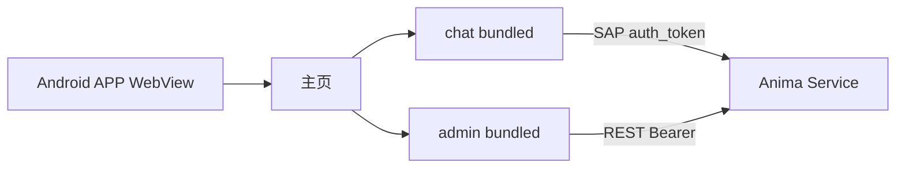

# 移动端 APP（Android）

> Capacitor 壳 + 聊天室 / 管理台 bundled SPA。  
> 实现包：[`app/mobile/`](../../app/mobile/)

## 范围

| 项       | 说明                                                        |
| -------- | ----------------------------------------------------------- |
| 平台     | **仅 Android** sideload（APK）；iOS 后续                    |
| 模块     | 聊天室 chat（`sap-direct`）+ 管理台 admin（`hub-rest`）     |
| Hub 配置 | APP **Hub 设置**：地址 + `remote_auth.token`（Preferences） |
| Hub 职责 | `/api` REST + `/sap/v1` WebSocket                           |

## 拓扑



## Hub 设置

1. 家里 PC：`anima service start`，并在 `~/.anima/config.yaml` 配置 `remote_auth.token`（见 [`remote-access.md`](../guide/remote-access.md)）。
2. （可选）`anima tunnel setup`，手机使用 `https://<your-hostname>`。
3. APP → **Hub 设置**：
   - Hub 地址（Tunnel 域名或 `http://<PC-IP>:2658`）
   - 远程 Token（与 Hub `config.yaml` 中 `remote_auth.token` 相同）
4. **测试连接** → **保存并进入** → 聊天室 / 管理台。

非 loopback Hub 地址必须填写 token；REST 使用 `Authorization: Bearer`，SAP 在 `connect` 帧携带 `auth_token`。

## 构建与 sideload

```bash
bun run app/mobile:build
cd app/mobile && bun run sync
cd android && ./gradlew assembleDebug
```

包内 README：[`app/mobile/README.md`](../../app/mobile/README.md)

## 与桌面壳对比

|             | Electron `app/desktop`                  | Capacitor `app/mobile` |
| ----------- | --------------------------------------- | ---------------------- |
| 注入        | preload → `window.satelliteShell`       | bridge-init → 同形 API |
| Hub 配置    | Hub 设置 → `~/.anima/shell-client.json` | Hub 设置 → Preferences |
| instance_id | 文件 `~/.anima/satellites/chat/`        | Preferences            |
| 内容        | chat + admin + companion                | chat + admin           |
