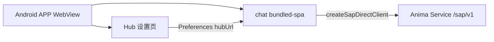

# 移动端 APP（Android · 第一期）

> Capacitor 壳 + 会客厅（[`satellites/chat`](../../satellites/chat/)）SAP 直连。  
> 实现包：[`satellites/app-mobile/`](../../satellites/app-mobile/)

## 范围（第一期）

| 项       | 说明                                             |
| -------- | ------------------------------------------------ |
| 平台     | **仅 Android** sideload（APK）；iOS 后续         |
| 模块     | 会客厅 chat（`sap-direct`）                      |
| Hub 地址 | APP 内 **UI 可配置**，存于 Capacitor Preferences |
| 不含     | 卧室 Chamber、推送、DeviceBridge、应用商店上架   |

## 拓扑



手机 APP 是**第一方终端**，聊天走 SAP 协议直连 Hub，不经过 Discord/WeChat 消息网关（[`platform/connectors/gateway/`](../../platform/connectors/gateway/)）。

## Hub 配置

1. PC 启动服务并监听局域网：

   ```bash
   anima service start --host 0.0.0.0
   ```

2. 手机与 PC 在同一可信局域网。
3. APP → Hub 设置 → 填写 `http://<PC局域网IP>:2658`（或远程 `https://` 域名，需 Hub 可达）。
4. **测试连接** 校验 WebSocket `/sap/v1`；**保存** 后进入会客厅。

`instance_id` 与 Hub 地址均持久化；杀进程重启后保留。

## 安全假设

- SAP WebSocket **当前无应用层鉴权**（见 [`docs/sap/security-model.md`](../sap/security-model.md)）。
- 局域网 HTTP/WS 内测需在 Android 开启 cleartext（工程已配置 `usesCleartextTraffic`）。
- **不要** 在未加固的情况下将 Hub 暴露到公网。远程访问需 Tunnel + 未来 SAP 鉴权设计。

## 构建与 sideload

```bash
bun run app-mobile:build
cd satellites/app-mobile && bun run sync
cd android && ./gradlew assembleDebug
```

APK：`android/app/build/outputs/apk/debug/app-debug.apk`

包内 README：[`satellites/app-mobile/README.md`](../../satellites/app-mobile/README.md)

## 与桌面壳对比

|             | Electron `desktop-shell`          | Capacitor `app-mobile`    |
| ----------- | --------------------------------- | ------------------------- |
| 注入        | preload → `window.satelliteShell` | bridge-init → 同形 API    |
| Hub URL     | CLI `--hub-url=`                  | APP 设置 UI + Preferences |
| instance_id | 文件 `~/.anima/satellites/chat/`  | Preferences               |
| 内容        | chat / chamber / companion        | 第一期仅 chat             |

## 后续

- iOS、Chamber 仪表盘 tab、远程 SAP over Tunnel、DeviceBridge（相机/推送等）、FCM。
