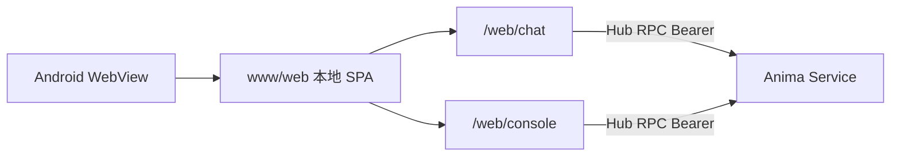

# Mobile app (Android)

> Capacitor 壳 + **安装包内** `web/dist`（与浏览器/PWA 同源产物；本地加载）。  
> Package: [`src/app/shell/mobile/`](../../src/app/shell/mobile/)

## Scope

| Item       | Description                                                 |
| ---------- | ----------------------------------------------------------- |
| Platform   | **Android only** sideload (APK); iOS later                  |
| UI         | APK 内 `www/web`（`build:web` → `sync-mobile-www`）         |
| Modules    | Chat + Console（本地 shell-ui）                             |
| Hub config | APP **设置 → 连接**（Preferences）；无独立 bootstrap Hub 页 |
| Hub duties | Hub RPC REST `/hub/rpc/v1` + WebSocket；**不**托管壳内 SPA  |

## Topology



Mobile REST **connects directly** to Hub (no local REST proxy); requires a **Service API Token** and Hub CORS for Capacitor origin（`http://localhost`；`androidScheme: http`）。

## Hub settings

1. Home PC: `anima service start --host 0.0.0.0`, create a Service API Token (`anima token create --subject-id 1 --name bootstrap`; see [`remote-access.md`](../guide/remote-access.md)).
2. (Optional) `anima tunnel setup`; phone uses `https://<your-hostname>`.
3. 首次启动未配置 Token → 进入 **设置 → 连接**：
   - Hub URL (Tunnel 或 `http://<PC-IP>:2658`；勿用 `127.0.0.1`)
   - Service API Token (`fa_at_...`)
4. **测试连接** → **保存并进入** → 本地 `/web/chat`。

Non-loopback Hub URL requires token; REST uses `Authorization: Bearer`; SAP sends `auth_token` in `connect` frame.

## Troubleshooting

| Symptom                                | Common cause                                                                                                            |
| -------------------------------------- | ----------------------------------------------------------------------------------------------------------------------- |
| Keyboard covers chat input             | WebView not resizing; need `adjustResize` + `@capacitor/keyboard`; `cap sync` after Web changes                         |
| Chat input unresponsive                | No selected conversation (first install should auto-create); or SAP disconnected                                        |
| Console load failed / Failed to fetch  | Hub not `--host 0.0.0.0`, wrong token, firewall; Chrome Remote Debugging for Bearer header                              |
| 测试连接「网络错误」、浏览器同地址正常 | 需 **Capacitor 原生 HTTP**（`CapacitorHttp`）或可信 HTTPS；自签 CA 另需 APK 信任用户 CA                                 |
| ZeroTier / 虚拟网卡 IP                 | 确认手机 ZeroTier 在线；Hub `http.host: 0.0.0.0`；`allowed_hosts` 含该 IP；壳层 Hub URL **勿带尾斜杠**，HTTP 用 `:2658` |
| Not Found                              | Avoid legacy paths; use SPA `/web/console/dashboard`                                                                    |
| TTS / 朗读无声                         | 默认 Edge TTS 需 Hub 出网；Hub 设置 → 语音 → 试听。若用 Web Speech 需 HTTPS 安全上下文                                  |
| UI 与发版不一致                        | UI 随 **APK**；需重装/发新包。浏览器 Hub `/web` 另有独立部署链                                                          |

## Debugging

Settings → **Debug** (desktop and mobile share shell-ui panel):

| Capability | Desktop           | Mobile                                      |
| ---------- | ----------------- | ------------------------------------------- |
| Sentry     | DSN in settings   | Same                                        |
| DevTools   | F12 / dev package | Debug APK + USB → Chrome `chrome://inspect` |
| Console    | Electron DevTools | vConsole (settings toggle)                  |

`bun run debug:android`：`build:mobile:debug` + 安装；inspect 目标为本地 SPA。

## Build and sideload

```bash
bun run build:mobile
cd src/app/shell/mobile && bunx cap sync android
```

`www/` 含完整 `web/` SPA（gitignore）。前端改动需重新 `build:mobile`（或 sync）再出 APK。

Debug full flow: `bun run debug:android`

Package README: [`src/app/shell/mobile/README.md`](../../src/app/shell/mobile/README.md)

## vs desktop shell

|              | Electron `src/app/shell/desktop`      | Capacitor `src/app/shell/mobile`             |
| ------------ | ------------------------------------- | -------------------------------------------- |
| Injection    | preload → `window.satelliteShell`     | Hub SPA `bootstrap-capacitor` → API          |
| Hub config   | 设置 → 连接 → 桌面 prefs              | 设置 → 连接 → Preferences                    |
| Debug/Sentry | Settings → Debug                      | Settings → Debug                             |
| REST         | Direct `hubUrl/hub/rpc/v1/*` (Bearer) | Direct `hubUrl/hub/rpc/v1/*` (CORS + Bearer) |
| instance_id  | File `~/.anima/satellites/chat/`      | Preferences                                  |
| Content      | 安装包内 web/dist + companion         | 安装包内 web/dist                            |
