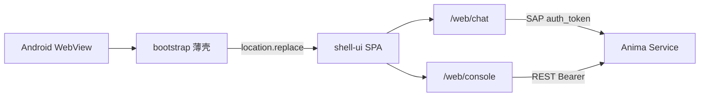

# Mobile app (Android)

> Capacitor **薄壳** + Hub `/web/*` 远程 UI（与浏览器/PWA 同一产物）。  
> Package: [`src/app/shell/mobile/`](../../src/app/shell/mobile/)

## Scope

| Item       | Description                                              |
| ---------- | -------------------------------------------------------- |
| Platform   | **Android only** sideload (APK); iOS later               |
| UI         | bootstrap → Hub `/web/*`（与浏览器/PWA 同一产物）        |
| Modules    | Chat + Console（Hub 托管 shell-ui）                      |
| Hub config | APP **Hub settings**（Preferences）或 bootstrap 首次配置 |
| Hub duties | `/api` REST + `/hub/rpc/v1` WebSocket                    |

## Topology



Mobile REST **connects directly** to Hub (no desktop Electron `/api` proxy); requires a **Service API Token** and Hub CORS for Capacitor origin (`https://localhost`).

## Hub settings

1. Home PC: `anima service start --host 0.0.0.0`, create a Service API Token (`anima token create --subject-id 1 --name bootstrap`; see [`remote-access.md`](../guide/remote-access.md)).
2. (Optional) `anima tunnel setup`; phone uses `https://<your-hostname>`.
3. APP → **Hub settings** (`/settings`):
   - Hub URL (Tunnel domain or `http://<PC-IP>:2658`; not `127.0.0.1`)
   - Service API Token (`fa_at_...`, printed once at creation)
4. **Test connection** → **Save and enter** → 跳转 Hub `/web/chat`。

Non-loopback Hub URL requires token; REST uses `Authorization: Bearer`; SAP sends `auth_token` in `connect` frame.

## Troubleshooting

| Symptom                               | Common cause                                                                                    |
| ------------------------------------- | ----------------------------------------------------------------------------------------------- |
| Keyboard covers chat input            | WebView not resizing; need `adjustResize` + `@capacitor/keyboard`; `cap sync` after Web changes |
| Chat input unresponsive               | No selected conversation (first install should auto-create); or SAP disconnected                |
| Console load failed / Failed to fetch | Hub not `--host 0.0.0.0`, wrong token, firewall; Chrome Remote Debugging for Bearer header      |
| Not Found                             | Avoid legacy paths like `/console`/dashboard/index.html`; use SPA `/web/console/dashboard`      |
| TTS / 朗读无声                        | 默认 Edge TTS 需 Hub 出网；Hub 设置 → 语音 → 试听。若用 Web Speech 需 HTTPS 安全上下文          |
| Mobile UI 与浏览器不一致              | 确认 WebView 地址为 `{hub}/web/*`（非 `https://localhost`）；Hub 需部署最新 `build:web`         |

## Debugging

Settings → **Debug** (desktop and mobile share shell-ui panel):

| Capability | Desktop           | Mobile                                      |
| ---------- | ----------------- | ------------------------------------------- |
| Sentry     | DSN in settings   | Same                                        |
| DevTools   | F12 / dev package | Debug APK + USB → Chrome `chrome://inspect` |
| Console    | Electron DevTools | vConsole (settings toggle)                  |

`bun run debug:android`：bootstrap debug APK（不压缩 + sourcemap），UI 从 Hub `/web/*` 加载；inspect 目标为 Hub 页面。

## Build and sideload

```bash
bun run build:mobile
cd src/app/shell/mobile && bunx cap sync android
```

`www/` 仅含 bootstrap（Hub 配置 + 跳转），APK 体积小。UI 随 Hub `build:web` / `anima upgrade` 更新，无需为前端改动重装 APK（Capacitor 插件变更除外）。

Debug full flow: `bun run debug:android`

Package README: [`src/app/shell/mobile/README.md`](../../src/app/shell/mobile/README.md)

## vs desktop shell

|              | Electron `src/app/shell/desktop`                | Capacitor `src/app/shell/mobile`       |
| ------------ | ----------------------------------------------- | -------------------------------------- |
| Injection    | preload → `window.satelliteShell`               | Hub SPA `bootstrap-capacitor` → API    |
| Hub config   | Hub settings → `~/.anima-desktop/settings.json` | bootstrap / Hub settings → Preferences |
| Debug/Sentry | Settings → Debug → same file `debug`            | Settings → Debug → Preferences         |
| REST         | Local static `/api` proxy (same origin)         | Direct `hubUrl/api/*` (CORS + Bearer)  |
| instance_id  | File `~/.anima/satellites/chat/`                | Preferences                            |
| Content      | chat + admin + companion                        | chat + admin（Hub `/web/*`）           |
