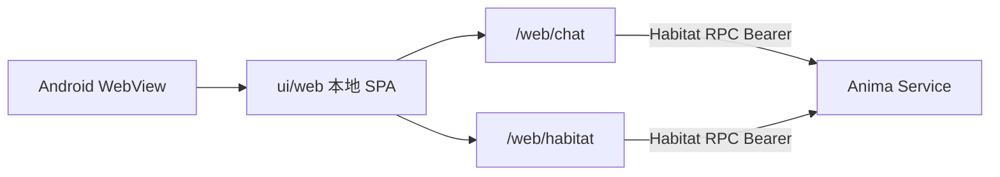

# Mobile app (Android)

> Portal：**Tauri Android**（`src/app/shell/tauri/`）+ 包内 `dist-mobile` / `ui/web`。  
> Shell rules: [`.agent/rules/tauri-shell.md`](../../.agent/rules/tauri-shell.md).

## Scope

| Item           | Description                                                |
| -------------- | ---------------------------------------------------------- |
| Platform       | **Android** sideload (APK); iOS later                      |
| UI             | APK 内 WebView 加载 `prepare-tauri-ui` 拷入的 `ui/web`     |
| Modules        | Chat + Habitat（本地 shell-ui）                            |
| Habitat config | APP **设置 → 连接**（Rust prefs / `app_config_dir`）       |
| Habitat duties | Habitat RPC REST `/rpc/v1` + WebSocket；**不**托管壳内 SPA |

## Topology



Mobile REST **connects directly** to Habitat (no local REST proxy); requires a **Service API Token** and Habitat CORS for the WebView origin.

## Habitat settings

1. Home PC: `anima service start --host 0.0.0.0`, create a Service API Token (`anima token create --subject-id 1 --name bootstrap`; see [`remote-access.md`](../guide/remote-access.md)).
2. First launch without Token → **设置 → 连接**:
   - Habitat URL（`http://<PC-IP>:2658` or HTTPS；avoid `127.0.0.1` on phone）
   - Service API Token (`fa_at_...`)
3. **测试连接** → **保存并进入** → local `/web/chat`.

## Troubleshooting

| Symptom                                       | Common cause                                                                                      |
| --------------------------------------------- | ------------------------------------------------------------------------------------------------- |
| Keyboard covers chat input                    | WebView not resizing; rely on `visualViewport` inset (visualViewport only)                        |
| Chat input unresponsive                       | No selected conversation; or Habitat RPC disconnected                                             |
| Habitat load failed / Failed to fetch         | Habitat not `--host 0.0.0.0`, wrong token, firewall                                               |
| 测试连接「网络错误」、浏览器同地址正常        | 壳内 HTTPS 需信任 mkcert 根 CA（`network_security_config` 已信任用户 CA）；或暂用 `http://…:2658` |
| 测试连接成功，实际「连接已断开」              | 测试含原生 HTTP + WebSocket；仍断连则查 token / WS 代理                                           |
| `Read-only file system` on save               | Fixed: prefs write to app private config dir                                                      |
| ZeroTier / 虚拟网卡 IP                        | Phone ZeroTier online; Habitat `http.host: 0.0.0.0`; shell URL without trailing slash             |
| Install `NO_CERTIFICATES` / version downgrade | Pack signs APK; uninstall old canary build then reinstall                                         |
| 安装失败「签名冲突」                          | Uninstall `org.freeanima.app` then reinstall                                                      |

## Debugging

`bun run debug:android` / `just android`：Tauri Android debug。Chrome `chrome://inspect` 连 WebView。

## Build and sideload

```bash
just install-android
just install-android-tauri -- --init   # 首次
just pack-android                      # → dist/freeanima-mobile-tauri-android.apk（有设备则尝试 adb 安装）
```

Release asset name on GitHub: `freeanima-mobile-android.apk`（same contents, CI copies from Tauri dist）。

## vs desktop shell

|                | Desktop Tauri                        | Android Tauri                       |
| -------------- | ------------------------------------ | ----------------------------------- |
| Injection      | `bootstrap-tauri-desktop` → ShellApi | `bootstrap-tauri-mobile` → ShellApi |
| Habitat config | 设置 → 连接 → `~/.anima` prefs       | 设置 → 连接 → app config dir        |
| Companion      | overlay WebView                      | n/a（番茄钟小组件 MVP）             |
| REST / RPC     | Direct Habitat + Bearer / WS         | Same                                |
