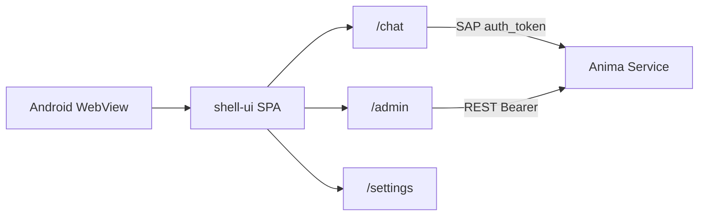

# 移动端 APP（Android）

> Capacitor 壳 + 统一 shell-ui SPA（聊天室 / 管理台 / 设置）。  
> 实现包：[`app/mobile/`](../../app/mobile/)

## 范围

| 项       | 说明                                                        |
| -------- | ----------------------------------------------------------- |
| 平台     | **仅 Android** sideload（APK）；iOS 后续                    |
| 模块     | 聊天室 chat（`sap-direct`）+ 管理台 admin（`hub-rest`）     |
| Hub 配置 | APP **Hub 设置**：地址 + `remote_auth.token`（Preferences） |
| Hub 职责 | `/api` REST + `/sap/v1` WebSocket                           |

## 拓扑



移动端 REST **直连** Hub（无桌面 Electron 的 `/api` 本地代理）；须配置 `remote_auth.token` 且 Hub 允许 Capacitor Origin（`https://localhost`）。路由使用 hash（`#/chat`），便于 WebView 调试。

## Hub 设置

1. 家里 PC：`anima service start --host 0.0.0.0`，并在 `~/.anima/config.yaml` 配置 `remote_auth.token`（见 [`remote-access.md`](../guide/remote-access.md)）。
2. （可选）`anima tunnel setup`，手机使用 `https://<your-hostname>`。
3. APP → **Hub 设置**（`/settings`）：
   - Hub 地址（Tunnel 域名或 `http://<PC-IP>:2658`；勿用 `127.0.0.1`）
   - 远程 Token（与 Hub `config.yaml` 中 `remote_auth.token` 相同，≥16 字符）
4. **测试连接** → **保存并进入** → 顶栏切换 **聊天室** / **管理台**。

非 loopback Hub 地址必须填写 token；REST 使用 `Authorization: Bearer`，SAP 在 `connect` 帧携带 `auth_token`。

## 排障

| 现象                                 | 常见原因                                                                                 |
| ------------------------------------ | ---------------------------------------------------------------------------------------- |
| 键盘遮挡聊天输入框                   | WebView 未随键盘收缩；需 `adjustResize` + `@capacitor/keyboard`；改 Web 后须 `cap sync`  |
| 聊天输入无反应                       | 无选中会话（首装应自动建会话）；或 SAP 未连接                                            |
| 管理台 load failed / Failed to fetch | Hub 未 `--host 0.0.0.0`、Token 错误、防火墙；Chrome Remote Debugging 看请求是否带 Bearer |
| Not Found                            | 勿访问旧路径如 `/admin/dashboard/index.html`；应走 SPA `/admin/dashboard`                |

## 调试

设置 → **调试**（桌面与移动共用 shell-ui 面板）：

| 能力     | 桌面                 | 移动                                        |
| -------- | -------------------- | ------------------------------------------- |
| Sentry   | 设置页填 DSN 并启用  | 同左                                        |
| DevTools | F12 / 开发包自动打开 | Debug APK + USB → Chrome `chrome://inspect` |
| 控制台   | Electron DevTools    | vConsole（设置页开关）                      |

移动 debug 构建：`cd app/mobile && bun run android:debug`（不压缩 + sourcemap，便于 inspect）。

## 构建与 sideload

```bash
bun run --filter @freeanima/app-mobile build
cd app/mobile && bun run sync
cd android && ./gradlew assembleDebug
```

Debug 全流程：`cd app/mobile && bun run android:debug`

**纪律**：修改 shell-ui / chat / admin 前端后须 `bun run build`（或 `build:debug`）再 `cap sync`，否则真机仍是旧 Web 资源。

包内 README：[`app/mobile/README.md`](../../app/mobile/README.md)

## 与桌面壳对比

|             | Electron `app/desktop`                      | Capacitor `app/mobile`               |
| ----------- | ------------------------------------------- | ------------------------------------ |
| 注入        | preload → `window.satelliteShell`           | `shell-bridge.js` → 同形 API         |
| Hub 配置    | Hub 设置 → `~/.anima-desktop/settings.json` | Hub 设置 → Preferences               |
| 调试/Sentry | 设置 → 调试 → 同上文件 `debug` 段           | 设置 → 调试 → Preferences            |
| REST        | 本地静态服代理 `/api`（同源）               | 直连 `hubUrl/api/*`（CORS + Bearer） |
| instance_id | 文件 `~/.anima/satellites/chat/`            | Preferences                          |
| 内容        | chat + admin + companion                    | chat + admin                         |
