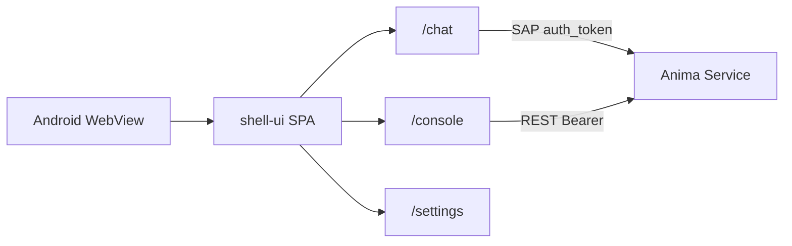

# Mobile app (Android)

> Capacitor **薄壳** + Hub `/web/*` 远程 UI（默认）；`MOBILE_UI_MODE=bundled` 可回退 bundled SPA。  
> Package: [`app/mobile/`](../../app/mobile/)

## Scope

| Item       | Description                                              |
| ---------- | -------------------------------------------------------- |
| Platform   | **Android only** sideload (APK); iOS later               |
| UI         | 默认 bootstrap → Hub `/web/*`（与浏览器/PWA 同一产物）   |
| Modules    | Chat + Console（bundled shell-ui）                       |
| Hub config | APP **Hub settings**（Preferences）或 bootstrap 首次配置 |
| Hub duties | `/api` REST + `/hub/rpc/v1` WebSocket                    |

## Topology



Mobile REST **connects directly** to Hub (no desktop Electron `/api` proxy); requires a **Service API Token** and Hub CORS for Capacitor origin (`https://localhost`). Routes use hash (`#/chat`) for WebView debugging.

## Hub settings

1. Home PC: `anima service start --host 0.0.0.0`, create a Service API Token (`anima token create --subject-id 1 --name bootstrap`; see [`remote-access.md`](../guide/remote-access.md)).
2. (Optional) `anima tunnel setup`; phone uses `https://<your-hostname>`.
3. APP → **Hub settings** (`/settings`):
   - Hub URL (Tunnel domain or `http://<PC-IP>:2658`; not `127.0.0.1`)
   - Service API Token (`fa_at_...`, printed once at creation)
4. **Test connection** → **Save and enter** → top bar switches **Chat** / **Console**.

Non-loopback Hub URL requires token; REST uses `Authorization: Bearer`; SAP sends `auth_token` in `connect` frame.

## Troubleshooting

| Symptom                               | Common cause                                                                                    |
| ------------------------------------- | ----------------------------------------------------------------------------------------------- |
| Keyboard covers chat input            | WebView not resizing; need `adjustResize` + `@capacitor/keyboard`; `cap sync` after Web changes |
| Chat input unresponsive               | No selected conversation (first install should auto-create); or SAP disconnected                |
| Console load failed / Failed to fetch | Hub not `--host 0.0.0.0`, wrong token, firewall; Chrome Remote Debugging for Bearer header      |
| Not Found                             | Avoid legacy paths like `/console`/dashboard/index.html`; use SPA `/console`/dashboard`         |

## Debugging

Settings → **Debug** (desktop and mobile share shell-ui panel):

| Capability | Desktop           | Mobile                                      |
| ---------- | ----------------- | ------------------------------------------- |
| Sentry     | DSN in settings   | Same                                        |
| DevTools   | F12 / dev package | Debug APK + USB → Chrome `chrome://inspect` |
| Console    | Electron DevTools | vConsole (settings toggle)                  |

Mobile debug build: `cd app/mobile && bun run android:debug` (no minify + sourcemap for inspect).

## Build and sideload

```bash
bun run --filter @freeanima/app-mobile build
cd app/mobile && bun run sync
```

默认 **remote UI**（`www/` 仅 bootstrap，APK 体积小）。完整 bundled SPA：`MOBILE_UI_MODE=bundled bun run --filter @freeanima/app-mobile build`

Debug full flow: `cd app/mobile && bun run android:debug`

**Discipline**: after shell-ui / chat / admin frontend changes, run `bun run build` (or `build:debug`) then `cap sync`, or device serves stale Web assets.

Package README: [`app/mobile/README.md`](../../app/mobile/README.md)

## vs desktop shell

|              | Electron `app/desktop`                          | Capacitor `app/mobile`                |
| ------------ | ----------------------------------------------- | ------------------------------------- |
| Injection    | preload → `window.satelliteShell`               | `shell-bridge.js` → same-shaped API   |
| Hub config   | Hub settings → `~/.anima-desktop/settings.json` | Hub settings → Preferences            |
| Debug/Sentry | Settings → Debug → same file `debug`            | Settings → Debug → Preferences        |
| REST         | Local static `/api` proxy (same origin)         | Direct `hubUrl/api/*` (CORS + Bearer) |
| instance_id  | File `~/.anima/satellites/chat/`                | Preferences                           |
| Content      | chat + admin + companion                        | chat + admin                          |
