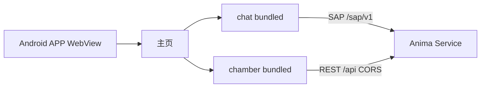

# 移动端 APP（Android）

> Capacitor 壳 + 会客厅 / 卧室 bundled SPA。  
> 实现包：[`satellites/app-mobile/`](../../satellites/app-mobile/)

## 范围

| 项       | 说明                                                    |
| -------- | ------------------------------------------------------- |
| 平台     | **仅 Android** sideload（APK）；iOS 后续                |
| 模块     | 会客厅 chat（`sap-direct`）+ 卧室 chamber（`hub-rest`） |
| Hub 地址 | APP 内 **UI 可配置**，存于 Capacitor Preferences        |
| Hub 职责 | `/api` REST + `/sap/v1` WebSocket                       |

## 拓扑



## Hub 配置

1. PC 启动服务并监听局域网：

   ```bash
   anima service start --host 0.0.0.0
   ```

2. 手机与 PC 在同一可信局域网。
3. APP → Hub 设置 → 填写 `http://<PC局域网IP>:2658`。
4. **测试连接** 校验 WebSocket `/sap/v1`；**保存** 后进入主页，选择会客厅或卧室。

## 构建与 sideload

```bash
bun run app-mobile:build
cd satellites/app-mobile && bun run sync
cd android && ./gradlew assembleDebug
```

包内 README：[`satellites/app-mobile/README.md`](../../satellites/app-mobile/README.md)

## 与桌面壳对比

|             | Electron `desktop-shell`          | Capacitor `app-mobile`    |
| ----------- | --------------------------------- | ------------------------- |
| 注入        | preload → `window.satelliteShell` | bridge-init → 同形 API    |
| Hub URL     | CLI `--hub-url=`                  | APP 设置 UI + Preferences |
| instance_id | 文件 `~/.anima/satellites/chat/`  | Preferences               |
| 内容        | chat + chamber + companion        | chat + chamber            |
