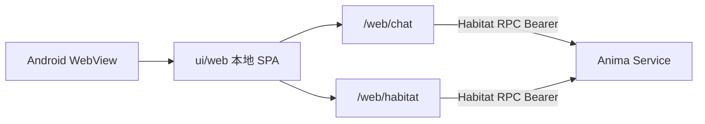

# 移动端 APP（Android）

> 入口：**Tauri Android**（`packages/frontend/portal/app/tauri/`）+ 包内 `dist-mobile` / `ui/web`。  
> 壳规则：[`.cursor/rules/tauri-shell.mdc`](../../.cursor/rules/tauri-shell.mdc)。

## 范围

| 项         | 说明                                                      |
| ---------- | --------------------------------------------------------- |
| 平台       | **Android** 侧载（APK）；iOS 稍后                         |
| UI         | APK 内 WebView 加载 `prepare-tauri-ui` 拷入的 `ui/web`    |
| 模块       | 聊天室 + 栖息地（本地 app-ui）                            |
| 栖息地配置 | APP **设置 → 连接**（Rust prefs / `app_config_dir`）      |
| 栖息地职责 | 栖息地 RPC REST `/rpc/v1` + WebSocket；**不**托管壳内 SPA |

## 拓扑



移动端 REST **直连**栖息地（无本地 REST 代理）；需要 **Service API Token**，以及针对 WebView origin 的栖息地 CORS。

## 栖息地设置

1. 家用 PC：`anima service start --host 0.0.0.0`，创建 Service API Token（`anima token create --subject-id 1 --name bootstrap`；见 [`remote-access.md`](../ops/remote-access.md)）。
2. 无 Token 首次启动 → **设置 → 连接**：
   - 栖息地 URL（`http://<PC-IP>:2658` 或 HTTPS；手机上避免 `127.0.0.1`）
   - Service API Token（`fa_at_...`）
3. **测试连接** → **保存并进入** → 本地 `/web/chat`。

## 故障排查

| 症状                                           | 常见原因                                                                                                    |
| ---------------------------------------------- | ----------------------------------------------------------------------------------------------------------- |
| 键盘挡住聊天输入                               | WebView 未随键盘调整；依赖 `visualViewport` inset（仅 visualViewport）                                      |
| 输入与键盘间透明空隙（约一截底栏高）           | compose `translateY` 未扣除 compact 底栏；键盘打开时应藏底栏或 `composeKeyboardLift` 扣 chrome              |
| 聊天输入无响应                                 | 未选对话；或栖息地 RPC 已断连                                                                               |
| 栖息地加载失败 / Failed to fetch               | 栖息地未 `--host 0.0.0.0`、错误 token、防火墙                                                               |
| 测试连接「网络错误」、浏览器同地址正常         | 壳内 HTTPS 需信任 mkcert 根 CA（`network_security_config` 已信任用户 CA）；或暂用 `http://…:2658`           |
| 对话正常但顶栏「连接已断开」/ 测试失败         | 顶栏已跟 Habitat RPC WS；若仍断则查 token / WS。测试连接：原生 TLS 失败会回退 WebView；DNS/hosts 失败不回退 |
| 测试连接成功，实际「连接已断开」               | 测试含 HTTP health + WebSocket；仍断连则查 token / WS 代理                                                  |
| 保存时 `Read-only file system`                 | 已修：prefs 写入 app 私有 config 目录                                                                       |
| ZeroTier / 虚拟网卡 IP                         | 手机 ZeroTier 在线；栖息地 `http.host: 0.0.0.0`；壳 URL 无尾斜杠                                            |
| 安装 `NO_CERTIFICATES` / 版本降级              | 打包签名 APK；卸载旧 canary 后再装                                                                          |
| 安装失败「签名冲突」                           | 卸载 `com.freeanima.portal`（或旧包 `org.freeanima.app`）再装                                               |
| 关于页 / 系统设置版本像正式版、检测不到更新    | 须带 `FREEANIMA_BUILD_VERSION` 打包；identity overlay 写入 versionName + versionCode（迁 Tauri 后曾漏同步） |
| 更新下载无百分比                               | APK 插件进度须主线程 `trigger`；无 Content-Length 时用 Release `assetSize` 估百分比                         |
| 更新失败 `registerListener not allowed by ACL` | 内联插件须 `InlinedPlugin` + capability `apk-installer:default`；改后需重编 APK（热更前端无效）             |

## 调试

`just dev tauri-android`：Tauri Android debug。Chrome `chrome://inspect` 连 WebView。

## 构建与侧载

```bash
just install android
just install tauri-android -- --init   # 首次
just pack tauri-android                      # → dist/ 双写：版本化名 + freeanima-mobile-android.apk（及 legacy tauri 别名；有设备则尝试 adb 安装）
```

GitHub Release 资源名：`freeanima-mobile-android.apk`（updater 固定名）；同 Release 另附带 `freeanima-mobile-android-{ver}-{channel}.apk`。

## 与桌面壳层对比

|            | 桌面 Tauri                           | Android Tauri                       |
| ---------- | ------------------------------------ | ----------------------------------- |
| 注入       | `bootstrap-tauri-desktop` → ShellApi | `bootstrap-tauri-mobile` → ShellApi |
| 栖息地配置 | 设置 → 连接 → `~/.anima` prefs       | 设置 → 连接 → app config dir        |
| 伴侣       | overlay WebView                      | n/a（番茄钟小组件 MVP）             |
| REST / RPC | 直连栖息地 + Bearer / WS             | 相同                                |
