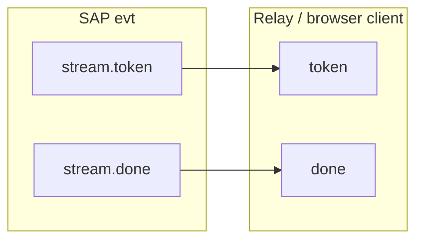

# SAP Events

Async notifications use envelope `kind: "evt"` with a `method` string and `payload`. Either side may send events; most Habitat → Satellite events are pushed after an RPC or subscription.

## Stream events (`message.send`)

After `message.send` returns `stream_id`, Habitat pushes `stream.*` events. Defined in [`src/shared/sap-contract/frames/message.ts`](../../src/shared/sap-contract/frames/message.ts) as `streamEventMethods`.

| Method                    | Typical payload fields              |
| ------------------------- | ----------------------------------- |
| `stream.accepted`         | `stream_id`                         |
| `stream.token`            | `stream_id`, `content`              |
| `stream.content_replace`  | `stream_id`, `content`              |
| `stream.tool_begin`       | `stream_id`, `tool`, `args`         |
| `stream.tool_result`      | `stream_id`, `tool`, `content`      |
| `stream.tool_error`       | `stream_id`, `tool`, `content`      |
| `stream.awaiting_clarify` | `stream_id`, `items`, `timeout_sec` |
| `stream.interrupted`      | `stream_id`, `reason`               |
| `stream.done`             | `stream_id`, optional `reason`      |
| `stream.error`            | `stream_id`, `error`                |
| `stream.ping`             | `stream_id`                         |
| `stream.llm_debug`        | debug snapshot (server-side cache)  |

Mapping helpers: `mapRuntimeStreamEventToSap`, `mapSapStreamMethodToApi` in the same file.

## Weak-network resume (`stream.attach`)

While a generation is in flight, Habitat keeps an in-process **text buffer** keyed by `stream_id` (SAP projection layer; not LLM token DB persistence). After WebSocket reconnect:

1. Client registers `stream.*` event handlers for the same `stream_id`
2. Client calls `req stream.attach { stream_id }`
3. Habitat replies `{ status, replayed: true }` and pushes:
   - `stream.accepted`
   - `stream.content_replace` with the full buffer so far (方案二 buffer dump)
   - live `stream.token` / other events until terminal
4. If the turn already finished within TTL (~10 min), attach still dumps buffer then `stream.done` / `stream.error`

Unknown `stream_id` → RPC error. Concurrent `message.send` with the same in-flight `client_op_id` returns the existing `stream_id` without starting a second turn.

**Page refresh / 刷新按钮：** Chat UI 将 `{ conversationId, streamId }` 写入 `sessionStorage`；加载后若末条仍为 user（等待回复），先 `stream.lookup(conversation_id)`（或读 sessionStorage）再 `stream.attach`。`abortStream`（手动刷新）只拆本地监听，不删 persist。

## SAP stream → Habitat SSE

Satellites that expose HTTP SSE to a browser can reuse the same event names via `mapSapStreamMethodToApi`:

Type B satellites with relay may fan out Habitat `stream.*` events over `/sap/relay/v1` (see [`satellite-relay-server.ts`](../../src/shared/sap-contract/satellite-relay-server.ts)); the browser uses `createSapRelayBrowserClient` and `mapSapStreamMethodToApi`.

## Session events

| Method                    | When                                  | Payload                          |
| ------------------------- | ------------------------------------- | -------------------------------- |
| `conversation.updated`    | After `conversation.subscribe`        | `conversation_id`                |
| `pomodoro.active.changed` | After `pomodoro.active.put` / `clear` | `subject_kind`, `active` \| null |

`conversation.updated` is bridged from the runtime conversation watch in [`src/platform/sap/stream-bridge.ts`](../../src/platform/sap/stream-bridge.ts).

`pomodoro.active.changed` is fan-out by Habitat session registry keyed on `auth.subject_type` ([`src/platform/sap/habitat-session-registry.ts`](../../src/platform/sap/habitat-session-registry.ts)); payload schema: `pomodoroActiveChangedEventSchema` in [`frames/pomodoro.ts`](../../src/shared/sap-contract/frames/pomodoro.ts).

## Terminal events

| Method            | Payload highlights           |
| ----------------- | ---------------------------- |
| `terminal.ready`  | `terminal_id`                |
| `terminal.output` | `terminal_id`, output data   |
| `terminal.exit`   | `terminal_id`, exit code     |
| `terminal.error`  | `terminal_id`, error message |

Constants: `TERMINAL_EVENT_METHODS` in [`frames/terminal.ts`](../../src/shared/sap-contract/frames/terminal.ts).

## Tool events

| Method      | Direction           | Role                            |
| ----------- | ------------------- | ------------------------------- |
| `tool.call` | Habitat → Satellite | Execute a registered local tool |

Payload schema: `toolCallPayloadSchema` in [`frames/tool.ts`](../../src/shared/sap-contract/frames/tool.ts) — includes `call_id`, `tool_name`, `local_name`, `args`, `conversation_id`, optional `workspace_root`.

Satellite must reply with `tool.result` or `tool.error` RPC using the same `call_id`.

## Lifecycle events

| Method      | Direction | Role                                         |
| ----------- | --------- | -------------------------------------------- |
| `heartbeat` | Both      | Keep-alive; see [transport.md](transport.md) |
