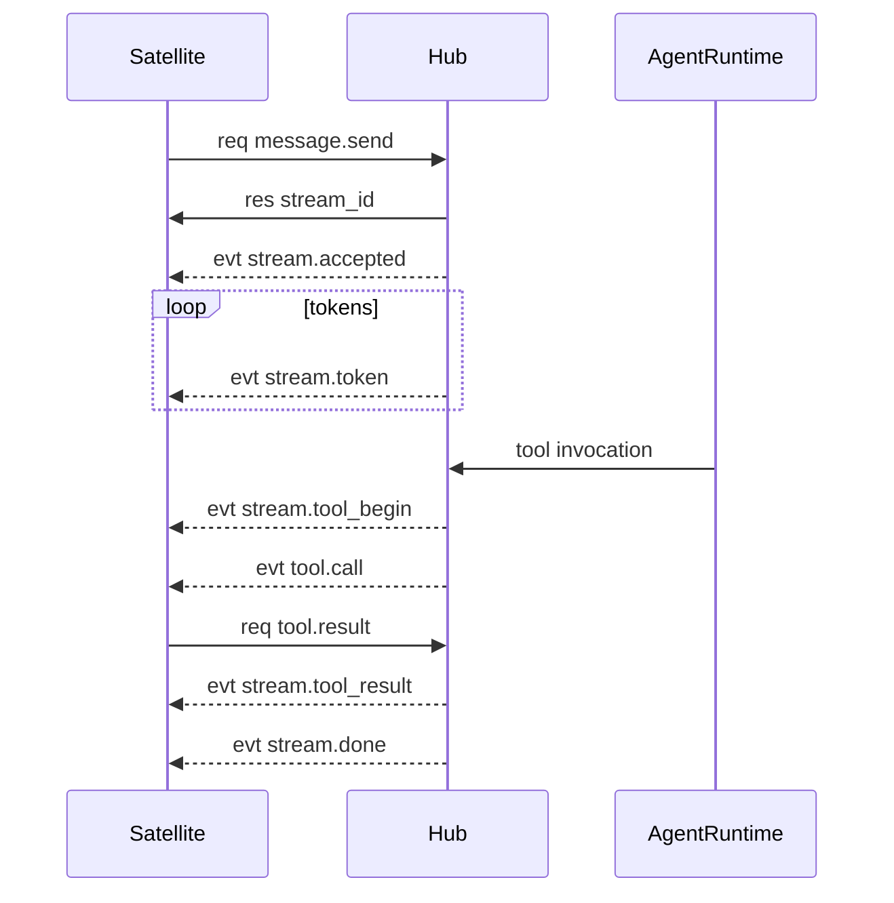
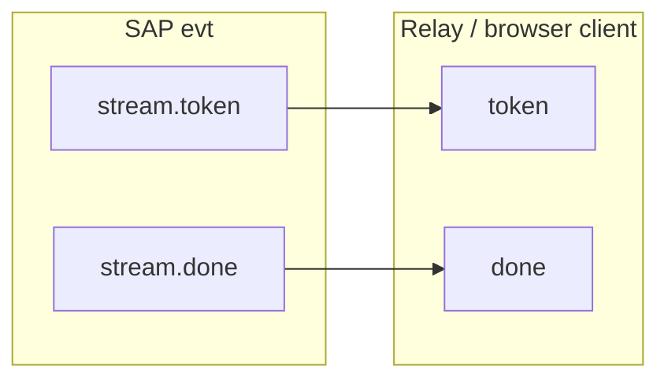

# SAP Events

Async notifications use envelope `kind: "evt"` with a `method` string and `payload`. Either side may send events; most Hub → Satellite events are pushed after an RPC or subscription.

## Stream events (`message.send`)

After `message.send` returns `stream_id`, Hub pushes `stream.*` events. Defined in [`shared/sap-contract/src/frames/message.ts`](../../shared/sap-contract/src/frames/message.ts) as `streamEventMethods`.

| Method                    | Typical payload fields              |
| ------------------------- | ----------------------------------- |
| `stream.accepted`         | `stream_id`                         |
| `stream.token`            | `stream_id`, `content`              |
| `stream.content_replace`  | `stream_id`, `content`              |
| `stream.tool_begin`       | `stream_id`, `tool`, `args`         |
| `stream.tool_result`      | `stream_id`, `tool`, `content`      |
| `stream.tool_error`       | `stream_id`, `tool`, `content`      |
| `stream.awaiting_clarify` | `stream_id`, `items`, `timeout_sec` |
| `stream.interrupted`      | `stream_id`, `reason`               |
| `stream.done`             | `stream_id`, optional `reason`      |
| `stream.error`            | `stream_id`, `error`                |
| `stream.ping`             | `stream_id`                         |

Mapping helpers: `mapRuntimeStreamEventToSap`, `mapSapStreamMethodToApi` in the same file.

## SAP stream → Console SSE

Satellites that expose HTTP SSE to a browser can reuse the same event names via `mapSapStreamMethodToApi`:

Type B satellites fan out Hub `stream.*` events over [`/sap/relay/v1`](../../satellites/pair-programming/server/sap/relay.ts); the browser uses `createSapRelayBrowserClient` and `mapSapStreamMethodToApi`.

## Session events

| Method                 | When                           | Payload           |
| ---------------------- | ------------------------------ | ----------------- |
| `conversation.updated` | After `conversation.subscribe` | `conversation_id` |

Bridged from runtime conversation watch in [`platform/src/sap/stream-bridge.ts`](../../platform/src/sap/stream-bridge.ts).

## Terminal events

| Method            | Payload highlights           |
| ----------------- | ---------------------------- |
| `terminal.ready`  | `terminal_id`                |
| `terminal.output` | `terminal_id`, output data   |
| `terminal.exit`   | `terminal_id`, exit code     |
| `terminal.error`  | `terminal_id`, error message |

Constants: `TERMINAL_EVENT_METHODS` in [`frames/terminal.ts`](../../shared/sap-contract/src/frames/terminal.ts).

## Tool events

| Method      | Direction       | Role                            |
| ----------- | --------------- | ------------------------------- |
| `tool.call` | Hub → Satellite | Execute a registered local tool |

Payload schema: `toolCallPayloadSchema` in [`frames/tool.ts`](../../shared/sap-contract/src/frames/tool.ts) — includes `call_id`, `tool_name`, `local_name`, `args`, `conversation_id`, optional `workspace_root`.

Satellite must reply with `tool.result` or `tool.error` RPC using the same `call_id`.

## Lifecycle events

| Method      | Direction | Role                                         |
| ----------- | --------- | -------------------------------------------- |
| `heartbeat` | Both      | Keep-alive; see [transport.md](transport.md) |
