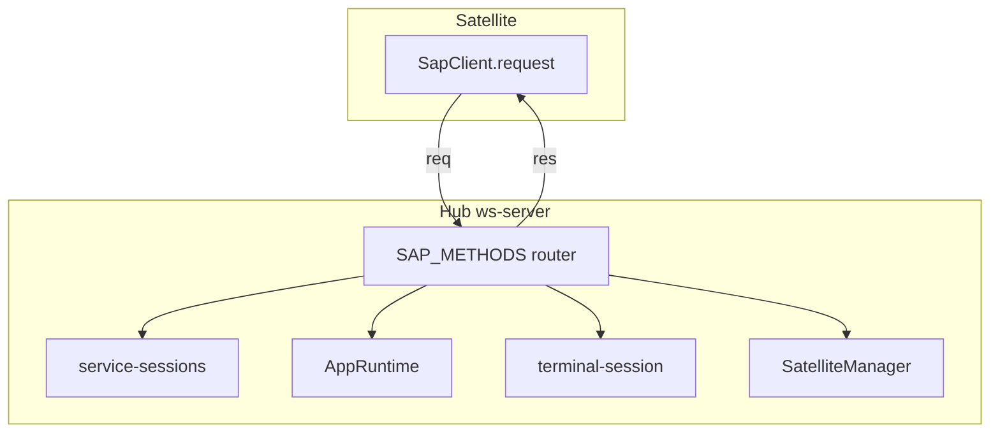

# SAP RPC Methods

RPC calls use envelope `kind: "req"` with a unique `id`. Hub responds with matching `kind: "res"`.

The authoritative method list is `SAP_METHODS` in [`packages/sap-contract/src/router.ts`](../../packages/sap-contract/src/router.ts). Input/output Zod schemas live under [`packages/sap-contract/src/frames/`](../../packages/sap-contract/src/frames/).

## Domain map

## Session

| Method               | Schema                                                            | Hub behavior                                                                                                |
| -------------------- | ----------------------------------------------------------------- | ----------------------------------------------------------------------------------------------------------- |
| `session.create`     | [`session.ts`](../../packages/sap-contract/src/frames/session.ts) | Creates session; sets `platform_extra.satellite_app_id`, `satellite_instance_id`, optional workspace fields |
| `session.list`       | `session.ts`                                                      | Lists sessions, optional `platform` filter                                                                  |
| `session.messages`   | `session.ts`                                                      | Message history with `offset` / `limit`                                                                     |
| `session.patchTitle` | `session.ts`                                                      | Updates session title                                                                                       |
| `session.subscribe`  | `session.ts`                                                      | Subscribes to `session.updated` events for one session                                                      |
| `session.commands`   | `session.ts`                                                      | Lists slash commands for a platform                                                                         |
| `session.acpDock`    | [`acp.ts`](../../packages/sap-contract/src/frames/acp.ts)         | ACP dock operations for a session                                                                           |

### `session.create` platform binding

Hub resolves `platform` from input or `resolvePlatformForApp(app_id)` (e.g. `pair-programming` → `studio-pair-programming`). Writes into session `platform_extra`:

- `satellite_app_id` — normalized app slug
- `satellite_instance_id` — instance id from connect context
- Optional: `workspace_root`, `workspace_gitignore`, `workspace_show_hidden`, `capability_mask`

This binding is required for [strict tool routing](tools.md).

## Message

| Method         | Schema                                                            | Returns                                        |
| -------------- | ----------------------------------------------------------------- | ---------------------------------------------- |
| `message.send` | [`message.ts`](../../packages/sap-contract/src/frames/message.ts) | `{ stream_id }`; stream events follow on `evt` |

Payload: `session_id`, `message` (user text). Hub bridges runtime stream to SAP `stream.*` events — see [events.md](events.md).

## Fridge

| Method        | Schema                                                          | Role                              |
| ------------- | --------------------------------------------------------------- | --------------------------------- |
| `fridge.list` | [`fridge.ts`](../../packages/sap-contract/src/frames/fridge.ts) | List fridge items for the runtime |

## Terminal

Hub-side PTY sessions. Events: `terminal.ready`, `terminal.output`, `terminal.exit`, `terminal.error`.

| Method            | Schema                                                                                                      |
| ----------------- | ----------------------------------------------------------------------------------------------------------- |
| `terminal.attach` | [`terminal.ts`](../../packages/sap-contract/src/frames/terminal.ts) — optional `cwd`; returns `terminal_id` |
| `terminal.write`  | `terminal_id`, `data`                                                                                       |
| `terminal.resize` | `terminal_id`, `cols`, `rows`                                                                               |
| `terminal.close`  | `terminal_id`                                                                                               |

## Tool (Satellite → Hub)

| Method            | Direction       | Role                                          |
| ----------------- | --------------- | --------------------------------------------- |
| `tool.register`   | Satellite → Hub | Register local tools; returns canonical names |
| `tool.unregister` | Satellite → Hub | Remove tools by `local_names`                 |
| `tool.result`     | Satellite → Hub | Complete a `tool.call`                        |
| `tool.error`      | Satellite → Hub | Fail a `tool.call`                            |

`tool.call` is an **event**, not RPC — see [tools.md](tools.md) and [events.md](events.md).

## Request context

Every RPC handler receives `SapRequestContext`:

- `app_id`, `instance_id` from the connect handshake
- `sendEvent(method, payload)` — push async events on the same WebSocket

Implementations: [`platform/src/sap/ws-server.ts`](../../platform/src/sap/ws-server.ts) `createSapServerHandlers`.
