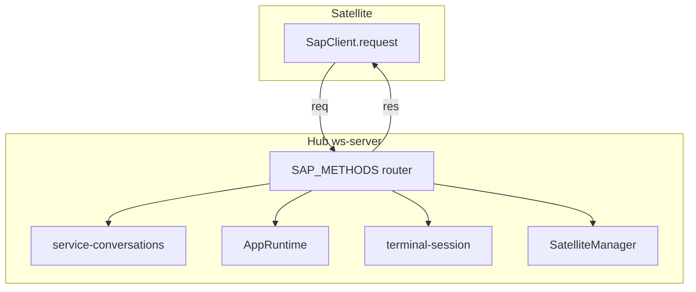

# SAP RPC Methods

RPC calls use envelope `kind: "req"` with a unique `id`. Hub responds with matching `kind: "res"`.

The authoritative method list is `SAP_METHODS` in [`src/shared/sap-contract/router.ts`](../../src/shared/sap-contract/router.ts). Product feature wire schemas are bundled in [`@freeanima/sap-contract/feature-rpc`](../../src/shared/sap-contract/feature-rpc/index.ts); individual frame modules live under [`src/shared/sap-contract/frames/`](../../src/shared/sap-contract/frames/). Each `src/features/*/protocol/` re-exports the subset its Hub handlers need.

## Domain map

## Session

| Method                    | Schema                                                               | Hub behavior                                                                                                |
| ------------------------- | -------------------------------------------------------------------- | ----------------------------------------------------------------------------------------------------------- |
| `conversation.create`     | [`session.ts`](../../src/shared/sap-contract/frames/conversation.ts) | Creates session; sets `platform_extra.satellite_app_id`, `satellite_instance_id`, optional workspace fields |
| `conversation.list`       | `session.ts`                                                         | Lists conversations, optional `platform` filter                                                             |
| `conversation.messages`   | `session.ts`                                                         | Message history with `offset` / `limit`                                                                     |
| `conversation.patchTitle` | `session.ts`                                                         | Updates conversation title                                                                                  |
| `conversation.subscribe`  | `session.ts`                                                         | Subscribes to `conversation.updated` events for one conversation                                            |
| `conversation.commands`   | `session.ts`                                                         | Lists slash commands for a platform (optional `subcommands` for Chat autocomplete)                          |
| `conversation.command`    | `session.ts`                                                         | Run terminal slash (Chat); `{ delivery: "rpc", ux, text }` or `{ delivery: "message" }` for stream turns    |
| `conversation.acpDock`    | [`acp.ts`](../../src/shared/sap-contract/frames/acp.ts)              | ACP dock operations for a conversation                                                                      |

### `conversation.create` platform binding

Hub resolves `platform` from input or `formatSapPlatform(app_id, instance_id)` → `sap:{app_slug}:{instance_id}` (e.g. `sap:pairprogramming:k7m`). Writes into conversation `platform_extra`:

- `satellite_app_id` — normalized app slug
- `satellite_instance_id` — instance id from connect context
- Optional: `workspace_root`, `workspace_gitignore`, `workspace_show_hidden`, `capability_mask`

This binding is required for [strict tool routing](tools.md).

## Message

| Method         | Schema                                                          | Returns                                        |
| -------------- | --------------------------------------------------------------- | ---------------------------------------------- |
| `message.send` | [`message.ts`](../../src/shared/sap-contract/frames/message.ts) | `{ stream_id }`; stream events follow on `evt` |

Payload: `conversation_id`, `message` (user text). Hub bridges runtime stream to SAP `stream.*` events — see [events.md](events.md).

## Terminal

Hub-side PTY sessions. Events: `terminal.ready`, `terminal.output`, `terminal.exit`, `terminal.error`.

| Method            | Schema                                                                                                    |
| ----------------- | --------------------------------------------------------------------------------------------------------- |
| `terminal.attach` | [`terminal.ts`](../../src/shared/sap-contract/frames/terminal.ts) — optional `cwd`; returns `terminal_id` |
| `terminal.write`  | `terminal_id`, `data`                                                                                     |
| `terminal.resize` | `terminal_id`, `cols`, `rows`                                                                             |
| `terminal.close`  | `terminal_id`                                                                                             |

## Tool (Satellite → Hub)

| Method            | Direction       | Role                                          |
| ----------------- | --------------- | --------------------------------------------- |
| `tool.register`   | Satellite → Hub | Register local tools; returns canonical names |
| `tool.unregister` | Satellite → Hub | Remove tools by `local_names`                 |
| `tool.result`     | Satellite → Hub | Complete a `tool.call`                        |
| `tool.error`      | Satellite → Hub | Fail a `tool.call`                            |

`tool.call` is an **event**, not RPC — see [tools.md](tools.md) and [events.md](events.md).

## Request context

Every RPC handler receives `SapRequestContext`:

- `app_id`, `instance_id` from the connect handshake
- `sendEvent(method, payload)` — push async events on the same WebSocket

Implementations: [`src/platform/sap/ws-server.ts`](../../src/platform/sap/ws-server.ts) `createSapServerHandlers`.
