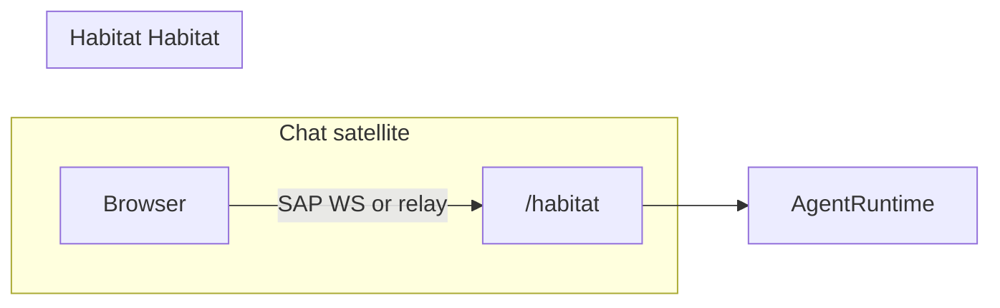
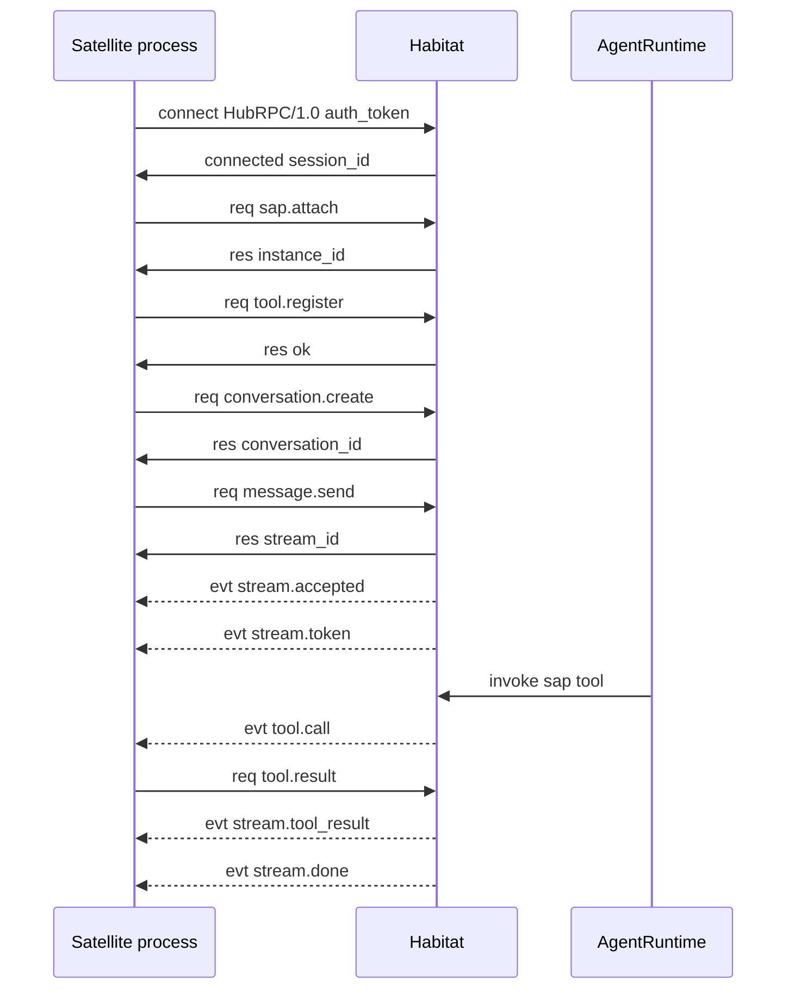

# SAP Overview

**SAP** (Satellite Application Protocol, version `SAP/1.0`) is the WebSocket JSON protocol between the FreeAnima **Habitat** (`anima service`) and **Satellite** processes. Satellites are standalone apps (e.g. Chat) that expose their own HTTP UI while delegating agent runtime to the Habitat.

Schemas and client SDK live in [`src/shared/sap-contract/`](../../src/shared/sap-contract/) (`./satellite` for attach/tool/terminal frames; `./feature-rpc` for bundled product Habitat RPC). Habitat server implementation: [`src/platform/sap/`](../../src/platform/sap/); feature handlers register via [`src/platform/features/`](../../src/platform/features/).

## Design goals

- **One Habitat WS per client**: each browser tab or satellite process opens one `/rpc/v1` connection (bundled SPA shares one transport; satellites multiplex after `sap.attach`).
- **Two layers**: Habitat RPC for transport + auth; SAP attach for true satellite instances only.
- **Shared contract**: `@freeanima/shared/habitat-rpc` for transport; `@freeanima/sap-contract` for SAP RPC types, `createSatelliteHub`, bundled stream helpers.

## Topology

| Role    | Default                  | Responsibility                                                 |
| ------- | ------------------------ | -------------------------------------------------------------- |
| Habitat | `http://127.0.0.1:2658`  | Agent runtime, Habitat RPC WebSocket at `/rpc/v1`              |
| Chat    | bundled `/chat`          | Chat UI; shared Habitat RPC (no `sap.attach`)                  |
| Habitat | bundled shell `/habitat` | Memory, tools, satellite status (Habitat RPC REST `/rpc/v1/*`) |

See also: [architecture Client UI section](../concepts/architecture.md#client-uibundled).

## End-to-end happy path

1. Client opens `ws://{hub}/rpc/v1` and sends Habitat RPC `connect` with `auth_token`.
2. Satellite process sends `sap.attach`; Habitat registers the instance in `SatelliteManager`. Bundled SPA skips this step.
3. Satellite registers local tools via `tool.register` (if any).
4. `message.send` returns a `stream_id`; Habitat pushes `stream.*` events.
5. When the agent calls a Satellite tool, Habitat sends `tool.call`; Satellite replies with `tool.result` or `tool.error`.

## Document map

| Topic                             | File                                                            |
| --------------------------------- | --------------------------------------------------------------- |
| Transport, Habitat RPC, heartbeat | [transport.md](transport.md) · [habitat-rpc.md](habitat-rpc.md) |
| RPC methods                       | [methods.md](methods.md)                                        |
| Async events                      | [events.md](events.md)                                          |
| Tool naming and routing           | [tools.md](tools.md)                                            |
| Config and implementation         | [satellite-guide.md](satellite-guide.md)                        |
| Security model                    | [security-model.md](security-model.md)                          |
