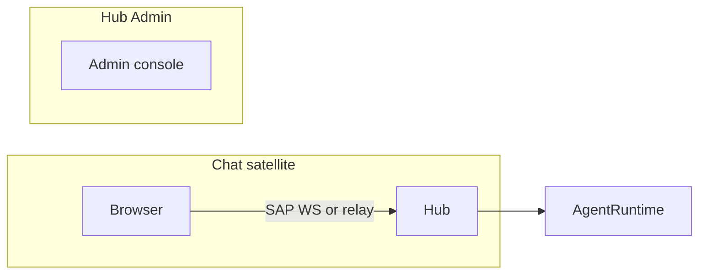
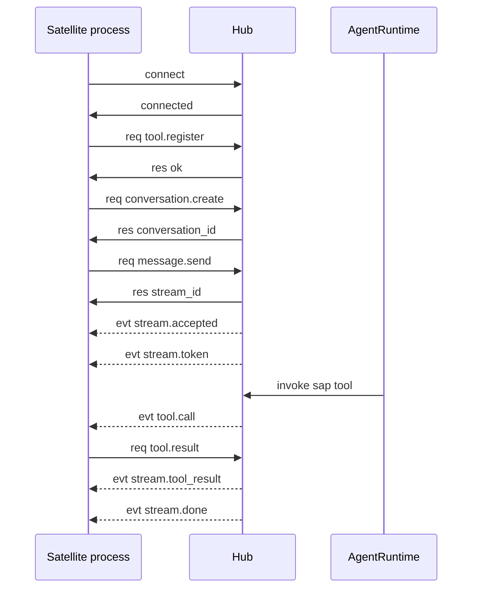

# SAP Overview

**SAP** (Satellite Application Protocol, version `SAP/1.0`) is the WebSocket JSON protocol between the FreeAnima **Hub** (`anima service`) and **Satellite** processes. Satellites are standalone apps (e.g. Chat) that expose their own HTTP UI while delegating agent runtime to the Hub.

Schemas and client SDK live in [`packages/sap-contract/`](../../packages/sap-contract/). Hub server implementation: [`platform/src/sap/`](../../platform/src/sap/).

## Design goals

- **One Hub WS per instance**: each satellite instance opens exactly one `/sap/v1` connection to the Hub (multiplex conversations, streams, tools).
- **Origin isolation**: bundled clients may use browser-direct Hub WS (`sap-direct`) or a local SAP relay (`/sap/relay/v1`) depending on deployment.
- **Shared contract**: both sides import `@freeanima/sap-contract` for envelopes, RPC types, `runSapTransport`, `createSapBrowserClient`, and `createSapRelayBrowserClient`.

## Topology

| Role  | Default                 | Responsibility                                   |
| ----- | ----------------------- | ------------------------------------------------ |
| Hub   | `http://127.0.0.1:2658` | Agent runtime, SAP WebSocket server at `/sap/v1` |
| Chat  | bundled `/chat`         | Chat UI; SAP direct or relay                     |
| Admin | Hub `/admin/*`          | Memory, config, tools, satellite status          |

See also: [architecture Client UI section](../concepts/architecture.md#client-uibundled).

## End-to-end happy path

1. Satellite process opens `ws://{hub}/sap/v1` and sends `connect`.
2. Hub replies `connected` and registers the instance in `SatelliteManager`.
3. Satellite registers local tools via `tool.register` (if any).
4. `message.send` returns a `stream_id`; Hub pushes `stream.*` events.
5. When the agent calls a Satellite tool, Hub sends `tool.call`; Satellite replies with `tool.result` or `tool.error`.

## Document map

| Topic                           | File                                     |
| ------------------------------- | ---------------------------------------- |
| Transport, envelopes, heartbeat | [transport.md](transport.md)             |
| RPC methods                     | [methods.md](methods.md)                 |
| Async events                    | [events.md](events.md)                   |
| Tool naming and routing         | [tools.md](tools.md)                     |
| Config and implementation       | [satellite-guide.md](satellite-guide.md) |
| Security model                  | [security-model.md](security-model.md)   |
