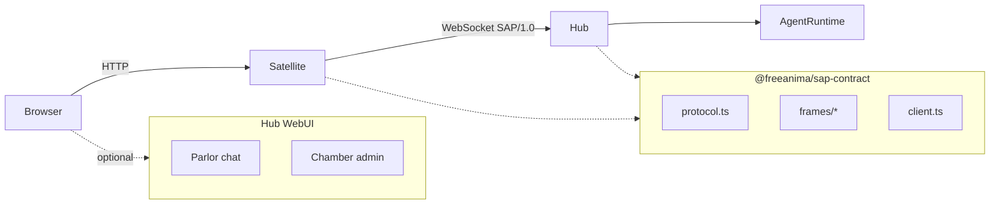
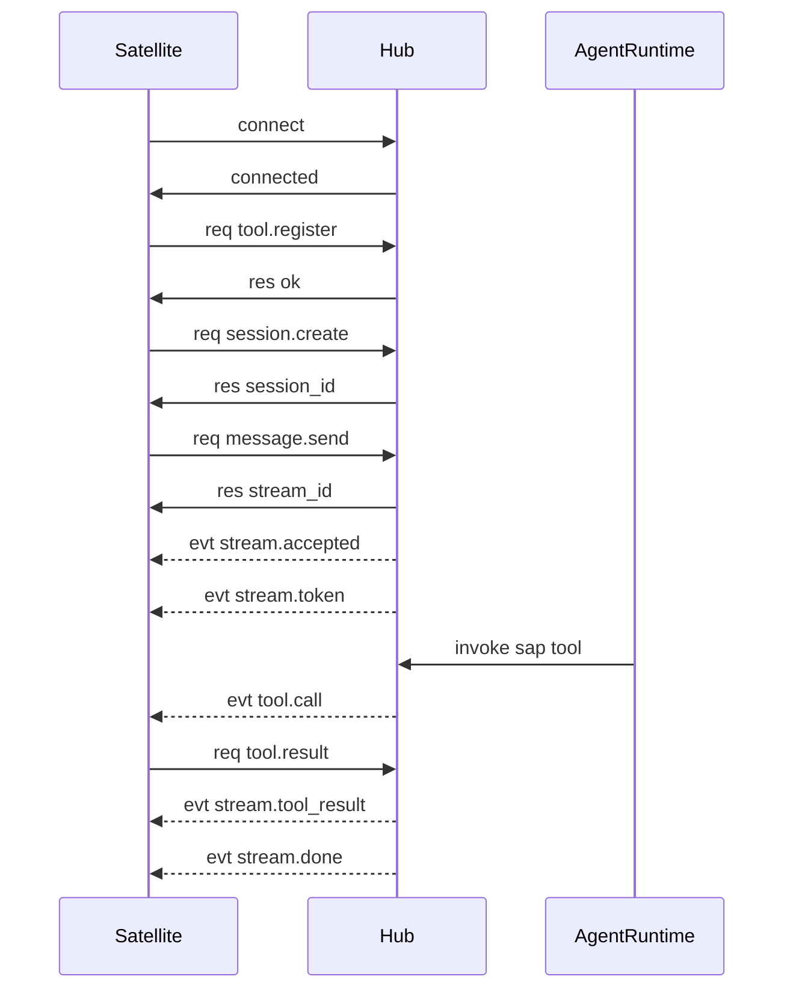

# SAP Overview

**SAP** (Satellite Application Protocol, version `SAP/1.0`) is the WebSocket JSON protocol between the FreeAnima **Hub** (`anima service`) and **Satellite** processes. Satellites are standalone apps (e.g. pair-programming Studio) that expose their own HTTP UI while delegating agent runtime capabilities to the Hub.

Schemas and client SDK live in [`packages/sap-contract/`](../../packages/sap-contract/). Hub server implementation: [`platform/src/sap/`](../../platform/src/sap/).

## Design goals

- **Origin isolation**: the browser talks only to the Satellite HTTP origin; the Hub is reached over a separate WebSocket from the Satellite process.
- **Centralized runtime**: sessions, message streaming, PTY terminals, and LLM tool execution run on the Hub; Satellites proxy UI and local tools.
- **Shared contract**: both sides import `@freeanima/sap-contract` for envelopes, RPC types, and `createSapClient` / `runSapTransport`.

## Topology

| Role      | Default                 | Responsibility                                                           |
| --------- | ----------------------- | ------------------------------------------------------------------------ |
| Hub       | `http://127.0.0.1:2658` | Agent runtime, SAP WebSocket server at `/sap/v1`, Parlor + Chamber WebUI |
| Satellite | e.g. `:4173` / `:4174`  | Own HTTP UI; outbound SAP connection to Hub                              |
| Browser   | Satellite origin        | Loads Satellite UI; may also open Hub Parlor/Chamber                     |

**Parlor** and **Chamber** are Hub-only WebUI modes. **Studio** apps (pair-programming) run as Satellites with a dedicated UI origin.

See also: [architecture WebUI section](../concepts/architecture.md#webui).

## End-to-end happy path

1. Satellite opens `ws://{hub}/sap/v1` and sends `connect`.
2. Hub replies `connected` and registers the instance in `SatelliteManager`.
3. Satellite registers local tools via `tool.register`.
4. Satellite creates a session; Hub writes `platform_extra.satellite_*` for strict tool routing.
5. `message.send` returns a `stream_id`; Hub pushes `stream.*` events.
6. When the agent calls a Satellite tool, Hub sends `tool.call`; Satellite replies with `tool.result` or `tool.error`.

## Document map

| Topic                           | File                                     |
| ------------------------------- | ---------------------------------------- |
| Transport, envelopes, heartbeat | [transport.md](transport.md)             |
| RPC methods                     | [methods.md](methods.md)                 |
| Async events                    | [events.md](events.md)                   |
| Tool naming and routing         | [tools.md](tools.md)                     |
| Config and implementation       | [satellite-guide.md](satellite-guide.md) |
| Security model                  | [security-model.md](security-model.md)   |
