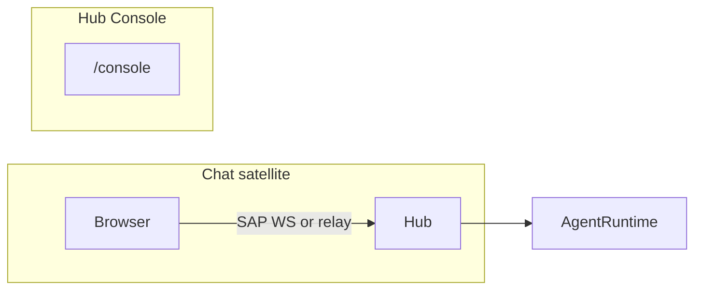
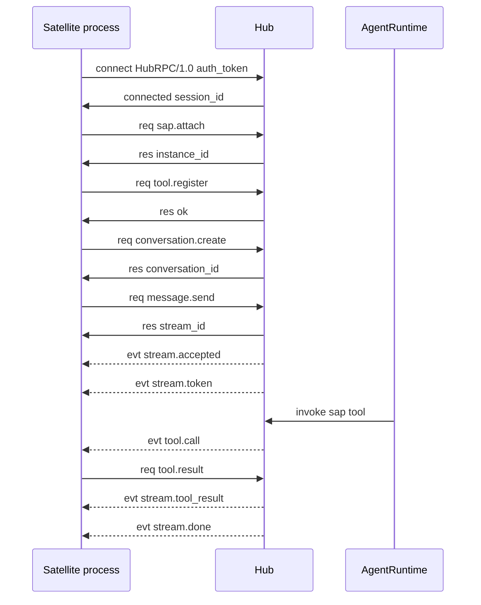

# SAP Overview

**SAP** (Satellite Application Protocol, version `SAP/1.0`) is the WebSocket JSON protocol between the FreeAnima **Hub** (`anima service`) and **Satellite** processes. Satellites are standalone apps (e.g. Chat) that expose their own HTTP UI while delegating agent runtime to the Hub.

Schemas and client SDK live in [`src/shared/sap-contract/`](../../src/shared/sap-contract/) (`./satellite` for attach/tool/terminal frames; `./feature-rpc` for bundled product Hub RPC). Hub server implementation: [`src/platform/sap/`](../../src/platform/sap/); feature handlers register via [`src/platform/features/`](../../src/platform/features/).

## Design goals

- **One Hub WS per client**: each browser tab or satellite process opens one `/hub/rpc/v1` connection (bundled SPA shares one transport; satellites multiplex after `sap.attach`).
- **Two layers**: Hub RPC for transport + auth; SAP attach for true satellite instances only.
- **Shared contract**: `@freeanima/hub-rpc` for transport; `@freeanima/sap-contract` for SAP RPC types, `createSatelliteHub`, bundled stream helpers.

## Topology

| Role    | Default                  | Responsibility                                              |
| ------- | ------------------------ | ----------------------------------------------------------- |
| Hub     | `http://127.0.0.1:2658`  | Agent runtime, Hub RPC WebSocket at `/hub/rpc/v1`           |
| Chat    | bundled `/chat`          | Chat UI; shared Hub RPC (no `sap.attach`)                   |
| Console | bundled shell `/console` | Memory, config, tools, satellite status (Hub REST `/api/*`) |

See also: [architecture Client UI section](../concepts/architecture.md#client-uibundled).

## End-to-end happy path

1. Client opens `ws://{hub}/hub/rpc/v1` and sends Hub RPC `connect` with `auth_token`.
2. Satellite process sends `sap.attach`; Hub registers the instance in `SatelliteManager`. Bundled SPA skips this step.
3. Satellite registers local tools via `tool.register` (if any).
4. `message.send` returns a `stream_id`; Hub pushes `stream.*` events.
5. When the agent calls a Satellite tool, Hub sends `tool.call`; Satellite replies with `tool.result` or `tool.error`.

## Document map

| Topic                         | File                                                    |
| ----------------------------- | ------------------------------------------------------- |
| Transport, Hub RPC, heartbeat | [transport.md](transport.md) · [hub-rpc.md](hub-rpc.md) |
| RPC methods                   | [methods.md](methods.md)                                |
| Async events                  | [events.md](events.md)                                  |
| Tool naming and routing       | [tools.md](tools.md)                                    |
| Config and implementation     | [satellite-guide.md](satellite-guide.md)                |
| Security model                | [security-model.md](security-model.md)                  |
