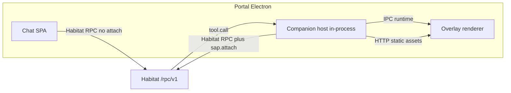
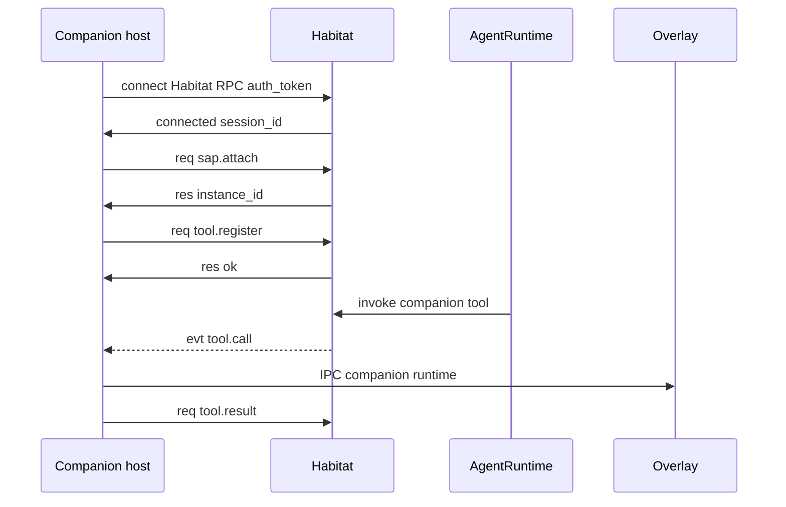

# SAP Overview

**SAP** (Satellite Application Protocol) is the **optional session layer** on Habitat RPC WebSocket: a true satellite calls `sap.attach` after connect, then may register local tools (`tool.*`). Product UI modules (Chat, Task, Settings, …) use **Habitat RPC only** and **never** attach.

Wire transport is **Habitat RPC** (`HABITAT_RPC_VERSION`; historical wire literal `"HubRPC/1.0"` — legacy name, keep for compatibility). Schemas live in [`src/shared/sap-contract/`](../../src/shared/sap-contract/) (`./satellite` for attach/tool frames; `./feature-rpc` for bundled Habitat RPC). Habitat server: [`src/platform/sap/`](../../src/platform/sap/).

Today the **only** in-tree SAP attach consumer is the **desktop companion** host (in-process with Electron main — not a separate sidecar process).

## Design goals

- **One Habitat WS per client**: each browser tab or companion host opens one `/rpc/v1` connection (bundled SPA shares one transport; companion multiplexes after `sap.attach`).
- **Two layers**: Habitat RPC for transport + auth; SAP attach only for local-tool hosts (companion).
- **Fewer processes**: do not add product-facing sidecar processes; companion stays in the Portal shell main process.
- **Shared contract**: `@freeanima/shared/habitat-rpc` for transport; `@freeanima/sap-contract` for attach/tool types and `createSatelliteHub`.

## Topology

| Role       | Default                 | Responsibility                                                              |
| ---------- | ----------------------- | --------------------------------------------------------------------------- |
| Habitat    | `http://127.0.0.1:2658` | Agent runtime, Habitat RPC at `/rpc/v1`                                     |
| Chat       | bundled `/chat`         | Chat UI; shared Habitat RPC (no `sap.attach`)                               |
| Companion  | Electron main + overlay | `sap.attach` + `bubble` / `play_slot`; static HTTP for VRM; runtime via IPC |
| Habitat UI | bundled `/habitat`      | Ops UI; Habitat RPC REST `/rpc/v1/*`                                        |

See also: [architecture Client UI section](../concepts/architecture.md#client-uibundled).

## End-to-end happy path (companion)

1. Companion host opens `ws://{hub}/rpc/v1` and sends Habitat RPC `connect` with `auth_token`.
2. Host sends `sap.attach`; Habitat registers the instance in `SatelliteManager`. Bundled SPA skips this step.
3. Host registers local tools via `tool.register` (`bubble`, `play_slot`).
4. When the agent calls a companion tool, Habitat sends `tool.call`; host executes and pushes runtime to the overlay (Electron IPC; browser-dev may use localhost WebSocket).
5. Host replies with `tool.result` or `tool.error`.

## Document map

| Topic                             | File                                                            |
| --------------------------------- | --------------------------------------------------------------- |
| Transport, Habitat RPC, heartbeat | [transport.md](transport.md) · [habitat-rpc.md](habitat-rpc.md) |
| RPC methods                       | [methods.md](methods.md)                                        |
| Async events                      | [events.md](events.md)                                          |
| Tool naming and routing           | [tools.md](tools.md)                                            |
| Config and implementation         | [satellite-guide.md](satellite-guide.md)                        |
| Frontend embed exports            | [frontend-exports.md](frontend-exports.md)                      |
| Security model                    | [security-model.md](security-model.md)                          |
