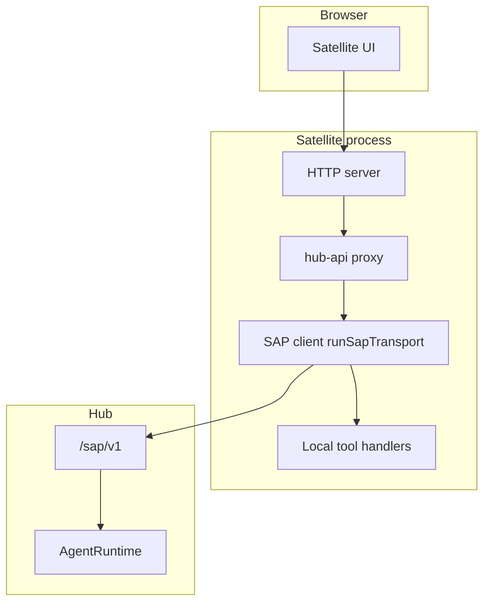
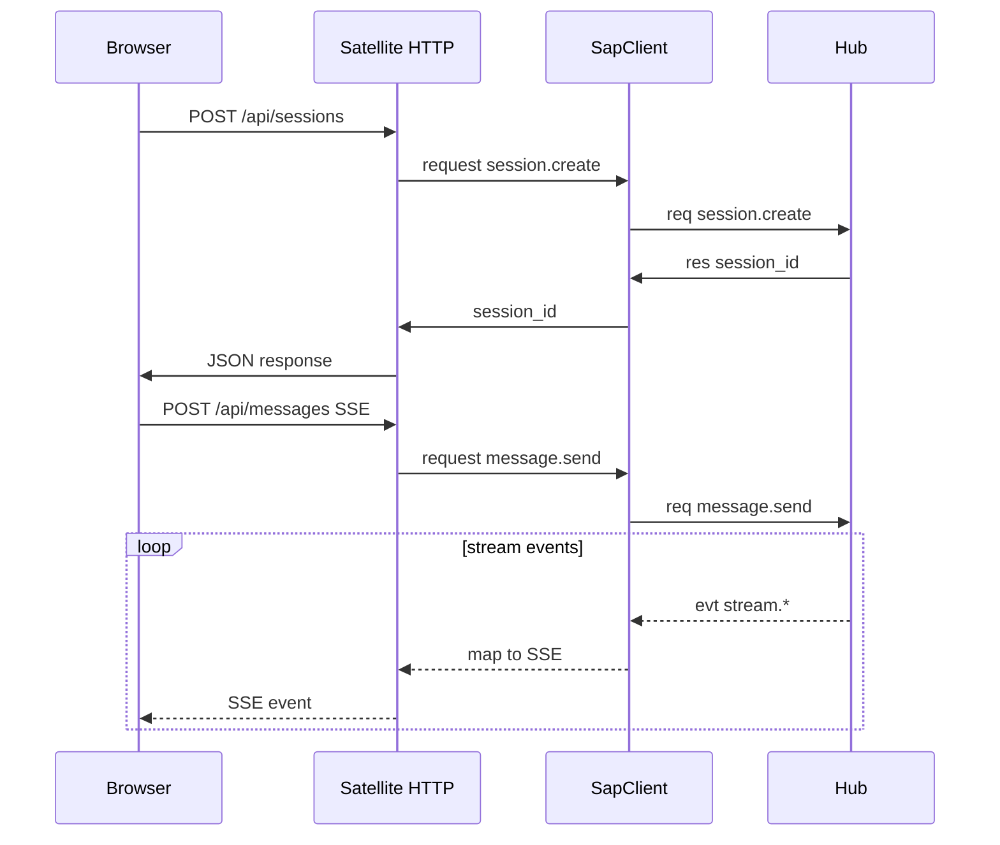

# Satellite Guide

How to run, configure, and implement a Satellite app that speaks SAP.

## Deployment modes

Hub learns about Satellites in two ways:

### Managed (config + systemd)

Declare a process in `~/.anima/config.yaml`. `anima service start/stop/restart` writes `anima-satellite-<name>.service` user units (when systemd is available) and starts/stops them with `anima.service`.

```yaml
satellites:
  parlor:
    enabled: true
    command: bun
    args: ["satellites/parlor/dev.ts"]
    env:
      SATELLITE_PORT: "4174"
  pair-programming:
    enabled: true
    command: bun
    args: ["satellites/pair-programming/dev.ts"]
    env:
      STUDIO_WORKSPACE: /path/to/project
      SATELLITE_PORT: "4173"
```

| Field              | Role                                             |
| ------------------ | ------------------------------------------------ |
| `command` / `args` | Process to run (required for managed satellites) |
| `env`              | Extra environment variables                      |

Working directory is derived by anima from the install layout (monorepo root or CLI package root), not configured here.

**Startup:** managed satellites start only after Hub `GET /api/health` returns `status: ok`.

See [service.md](../guide/service.md) for systemd unit paths and startup order.

### Dynamic (SAP connect)

No `command` in config. Start the satellite yourself; it connects to Hub via SAP WebSocket. Instances appear on Chamber → Satellites after connect.

There is **no** global `studio:` section in `config.yaml`.

Open managed satellite UI at the URL from Chamber (SAP `http_url`), typically:

- Parlor: `http://127.0.0.1:4174`
- Pair-programming: `http://127.0.0.1:4173`

## Architecture patterns



### Parlor satellite

Browser connects to Hub via SAP WebSocket from the client ([`browser-client.ts`](../../packages/sap-contract/src/browser-client.ts)); static server only serves UI + `/config.json`. No server-side hub-api proxy.

### Pair-programming satellite

HTTP API forwards to SAP RPC; SSE streams map from SAP `stream.*` events. Terminal WebSocket bridges to SAP `terminal.*`.



Reference files:

- [`satellites/pair-programming/server/sap/hub.ts`](../../satellites/pair-programming/server/sap/hub.ts)
- [`satellites/pair-programming/server/http/hub-api.ts`](../../satellites/pair-programming/server/http/hub-api.ts)
- [`satellites/pair-programming/server/http/terminal-bridge.ts`](../../satellites/pair-programming/server/http/terminal-bridge.ts)

## Minimal SAP client

Use `runSapTransport` from `@freeanima/sap-contract`:

```typescript
import { runSapTransport } from "@freeanima/sap-contract";

const transport = runSapTransport({
  hubUrl: process.env.FREEANIMA_URL ?? "http://127.0.0.1:2658",
  connect: {
    app_id: "my-app",
    instance_id: process.env.SATELLITE_INSTANCE_ID ?? crypto.randomUUID(),
    features_requested: ["server_info"],
    http_url: `http://127.0.0.1:${process.env.SATELLITE_PORT ?? 4173}`,
  },
  onConnected: async (client) => {
    client.onEvent("tool.call", (payload) => {
      /* handle */
    });
    await client.request("tool.register", {
      tools: [
        /* ... */
      ],
    });
  },
});
```

Transport handles WebSocket open, `connect` handshake, heartbeat, and reconnect with exponential backoff.

## Environment variables

| Variable                                  | Role                                           |
| ----------------------------------------- | ---------------------------------------------- |
| `FREEANIMA_URL`                           | Hub HTTP base URL                              |
| `SATELLITE_PORT`                          | Satellite HTTP listen port                     |
| `SATELLITE_INSTANCE_ID`                   | Stable instance id (optional; random if unset) |
| `STUDIO_WORKSPACE`                        | Pair-programming workspace root                |
| `STUDIO_GITIGNORE` / `STUDIO_SHOW_HIDDEN` | File tree filters                              |

## Layer dependencies

Per [`scripts/check-layer-deps.ts`](../../scripts/check-layer-deps.ts): `satellites/*` may depend only on `@freeanima/sap-contract` and `@freeanima/kernel`. Do not import platform or runtime packages from Satellite code.

## Chamber visibility

`GET /api/satellites/status` (Chamber → Satellites) reads `SatelliteManager.getStatus()`: connected instances, `http_url`, registered tools, heartbeat timestamps.

## Further reading

- [overview.md](overview.md) — protocol goals
- [transport.md](transport.md) — envelopes and handshake
- [tools.md](tools.md) — tool registration and routing
- [pair-programming v1](../features/pair-programming-v1.md) — Studio product docs
