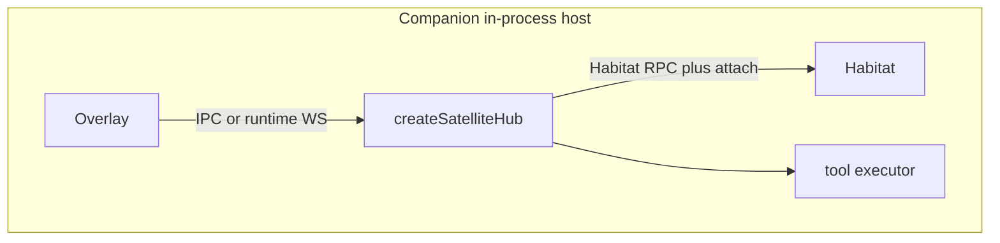

# Satellite Guide

How to run, configure, and implement a **SAP attach** host. Product modules (Chat, Task, …) are **not** satellites — they use Habitat RPC only. Today the only in-tree attach host is **desktop companion**.

## Deployment modes

### Managed (config + systemd) — historical

Declare a process in `~/.anima/config.yaml`. Current Habitat stacks **no longer** spawn managed satellites from `anima service`; companion is started by the desktop Portal (or `dev.ts` for browser debug). See [service.md](../guide/service.md).

```yaml
satellites:
  companion:
    enabled: true
    command: bun
    args: ["src/satellites/companion/dev.ts"]
```

| Field              | Role                                             |
| ------------------ | ------------------------------------------------ |
| `command` / `args` | Process to run (required for managed satellites) |
| `env`              | Extra environment variables                      |

### Dynamic (SAP connect)

Start the companion host yourself (Electron main or `dev.ts`); it connects with Habitat RPC, then `sap.attach`. Instances appear on Habitat → Satellites after connect.

There is **no** global `studio:` section in `config.yaml`.

Shell modules (Chat, Habitat, etc.) open in desktop / mobile / web shell routes; no dedicated SAP port.

## Instance allocation

`instance_id` is a 3-character lowercase alphanumeric id (see [`src/shared/sap-contract/naming.ts`](../../src/shared/sap-contract/naming.ts)). It appears in platform strings (`sap:{app_slug}:{instance_id}`), session `platform_extra`, and SAP tool names.

| Strategy    | Meaning                              | Apps          | Client behavior                                                       |
| ----------- | ------------------------------------ | ------------- | --------------------------------------------------------------------- |
| **machine** | One id per physical device / install | **Companion** | Omit `instance_id` on first connect; Habitat assigns; persist locally |

**Companion:** `~/.anima/companion/instance.json` — one id per computer. Platform `sap:companion:{id}`.

Bundled Chat does **not** use SAP `instance_id` for attach (no `sap.attach`). Conversation identity is ordinary Habitat RPC / subject scope.

Habitat [`SapInstanceRegistry`](../../src/platform/sap/instance-registry.ts): omit `instance_id` → random allocation; send known id → reconnect or **auto-provision** if the id is valid and unused.

## Access modes

**Rule:** each `app_id + instance_id` has **at most one** active entry in `SatelliteManager` (last connect wins).

### Companion host (in-process, no relay)

- Electron main (or browser `dev.ts`) runs `createSatelliteHub({ relay: false, tools: [...] })` — **same process**, not a child sidecar.
- Overlay receives tool runtime via **Electron IPC** (desktop) or localhost `/api/runtime/ws` (browser-dev).
- Static assets still served over loopback HTTP (`/models`, `/motions`, overlay dist).
- Do **not** use `createSapSidecarClient` / `relay: true` for companion.



### Bundled Habitat RPC — shell modules (chat, task, notification, …)

- Modules use shared [`getBundledHabitatRpcClient`](../../src/shared/habitat-rpc/bundled.ts) / [`getBundledSapStreamClient`](../../src/shared/sap-contract/bundled-sap-stream.ts) on `/rpc/v1`.
- **No** `sap.attach`; **no** sidecar.
- See [`habitat-rpc.md`](habitat-rpc.md) and [`frontend-exports.md`](frontend-exports.md).

### Chat (bundled feature)

- Shell / browser: `getBundledSapStreamClient` on shared Habitat RPC; UI from [`src/features/chat/ui/spa/`](../../src/features/chat/ui/spa/) (no attach).
- Habitat RPC handlers: [`src/features/chat/habitat/routes/index.ts`](../../src/features/chat/habitat/routes/index.ts).

### Companion reference files

- [`src/satellites/companion/server/sap/hub.ts`](../../src/satellites/companion/server/sap/hub.ts)
- [`src/shared/sap-contract/satellite-hub.ts`](../../src/shared/sap-contract/satellite-hub.ts)

## Minimal SAP client

Use `createSatelliteHub` from `@freeanima/shared/sap-contract`:

```typescript
import { createSatelliteHub, fileSapInstanceStore } from "@freeanima/shared/sap-contract";

const hub = createSatelliteHub({
  appId: "companion",
  habitatUrl: "http://127.0.0.1:2658",
  remoteAuthToken: process.env.FREEANIMA_REMOTE_AUTH_TOKEN!,
  instanceStore: fileSapInstanceStore("~/.anima/companion/instance.json"),
  relay: false,
  tools: [/* bubble, play_slot */],
  onToolCall: async (localName, args) => {
    /* execute local tool */
    return JSON.stringify({ ok: true });
  },
});
```

See [overview.md](overview.md) for the attach happy path and [security-model.md](security-model.md) for tokens.
