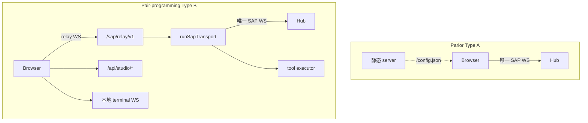

# Satellite Guide

How to run, configure, and implement a Satellite app that speaks SAP.

## Deployment modes

Hub learns about Satellites in two ways:

### Managed (config + systemd)

Declare a process in `~/.anima/config.yaml`. `anima service start/stop/restart` writes `anima-satellite-<name>.service` user units (when systemd is available) and starts/stops them with `anima.service`.

```yaml
satellites:
  parlor:
    enabled: true
    command: bun
    args: ["satellites/parlor/dev.ts"]
    env:
      SATELLITE_PORT: "4174"
  pair-programming:
    enabled: true
    command: bun
    args: ["satellites/pair-programming/dev.ts"]
    env:
      STUDIO_WORKSPACE: /path/to/project
      SATELLITE_PORT: "4173"
```

| Field              | Role                                             |
| ------------------ | ------------------------------------------------ |
| `command` / `args` | Process to run (required for managed satellites) |
| `env`              | Extra environment variables                      |

Working directory is derived by anima from the install layout (monorepo root or CLI package root), not configured here.

**Startup:** managed satellites start only after Hub `GET /api/health` returns `status: ok`.

See [service.md](../guide/service.md) for systemd unit paths and startup order.

### Dynamic (SAP connect)

No `command` in config. Start the satellite yourself; it connects to Hub via SAP WebSocket. Instances appear on Chamber → Satellites after connect.

There is **no** global `studio:` section in `config.yaml`.

Open managed satellite UI at the URL from Chamber (SAP `http_url`), typically:

- Parlor: `http://127.0.0.1:4174`
- Pair-programming: `http://127.0.0.1:4173`

## Satellite access modes

**Rule:** each `app_id + instance_id` has **at most one** Hub WebSocket (`/sap/v1`).

### Type A — Browser-direct (Parlor)

- Browser `createSapDirectClient` → Hub `/sap/v1` (SharedWorker shares one WS + `instance_id` across tabs).
- `SapInstanceStore` persists Hub-assigned `instance_id` in `localStorage` (key: hub origin + `app_id`).
- Satellite HTTP serves static UI + `/config.json` only.
- **Limits:** no `tool.register` in browser; local tools need a sidecar later.

### Type B — Process gateway + local relay (pair-programming)

- Sidecar `createSatelliteHub({ relay: true, tools: [...] })` holds the sole Hub WS.
- Browser uses `createSapSidecarClient` → satellite `/sap/relay/v1`.
- `instance_id` persisted under `~/.anima/satellites/{app}/instance.json`.

### Type B presence (companion, current phase)

- `createSatelliteHub({ relay: false, tools: [] })` — SAP presence only.
- Same factory supports enabling `relay` / `tool.register` later without topology change.
- `instance_id` in `~/.anima/companion/instance.json`; platform `sap:companion:{id}`.



**Deprecated:** HTTP hub-api REST→SAP proxy (removed).

### Parlor satellite

Browser connects via `createSapDirectClient` ([`direct-client.ts`](../../packages/sap-contract/src/direct-client.ts)); optional SharedWorker ([`shared-worker.ts`](../../packages/sap-contract/src/shared-worker.ts)) multiplexes one Hub connection across tabs.

### Pair-programming satellite

Browser connects via `createSapSidecarClient` → [`/sap/relay/v1`](../../satellites/pair-programming/server/index.ts); sidecar uses `createSatelliteHub` ([`satellite-hub.ts`](../../packages/sap-contract/src/satellite-hub.ts)).

Reference files:

- [`satellites/pair-programming/server/sap/hub.ts`](../../satellites/pair-programming/server/sap/hub.ts)
- [`packages/sap-contract/src/sidecar-client.ts`](../../packages/sap-contract/src/sidecar-client.ts)
- [`packages/sap-contract/src/satellite-relay-server.ts`](../../packages/sap-contract/src/satellite-relay-server.ts)
- [`satellites/pair-programming/server/http/terminal-bridge.ts`](../../satellites/pair-programming/server/http/terminal-bridge.ts)

## Minimal SAP client

Use `runSapTransport` or `createSatelliteHub` from `@freeanima/sap-contract`:

```typescript
import { createSatelliteHub, fileSapInstanceStore } from "@freeanima/sap-contract";

const hub = createSatelliteHub({
  appId: "my-app",
  hubUrl: process.env.FREEANIMA_URL ?? "http://127.0.0.1:2658",
  httpUrl: `http://127.0.0.1:${process.env.SATELLITE_PORT ?? 4173}`,
  instanceStore: fileSapInstanceStore("/path/to/instance.json"),
  relay: false,
  tools: [],
  onConnected: async () => {
    /* optional session.create — connect does not auto-create sessions */
  },
});
```

On first connect omit `instance_id`; Hub assigns a 3-char id and returns it in `connected.instance_id`. Persist via `SapInstanceStore.save`.

Browser UI on Type B relay satellites uses `createSapSidecarClient()` instead of talking to Hub directly.

Transport handles WebSocket open, `connect` handshake, heartbeat, and reconnect with exponential backoff.

## Environment variables

| Variable                                  | Role                                         |
| ----------------------------------------- | -------------------------------------------- |
| `FREEANIMA_URL`                           | Hub HTTP base URL                            |
| `SATELLITE_PORT`                          | Satellite HTTP listen port                   |
| `FREEANIMA_HOME`                          | Data root (`~/.anima`); instance store paths |
| `STUDIO_WORKSPACE`                        | Pair-programming workspace root              |
| `STUDIO_GITIGNORE` / `STUDIO_SHOW_HIDDEN` | File tree filters                            |

## Layer dependencies

Per [`scripts/check-layer-deps.ts`](../../scripts/check-layer-deps.ts): `satellites/*` may depend only on `@freeanima/sap-contract` and `@freeanima/kernel`. Do not import platform or runtime packages from Satellite code.

## Chamber visibility

`GET /api/satellites/status` (Chamber → Satellites) reads `SatelliteManager.getStatus()`: connected instances, `http_url`, registered tools, heartbeat timestamps.

## Further reading

- [overview.md](overview.md) — protocol goals
- [transport.md](transport.md) — envelopes and handshake
- [tools.md](tools.md) — tool registration and routing
- [pair-programming v1](../features/pair-programming-v1.md) — Studio product docs
