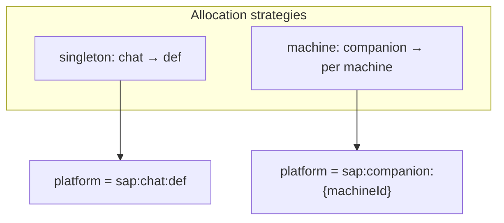
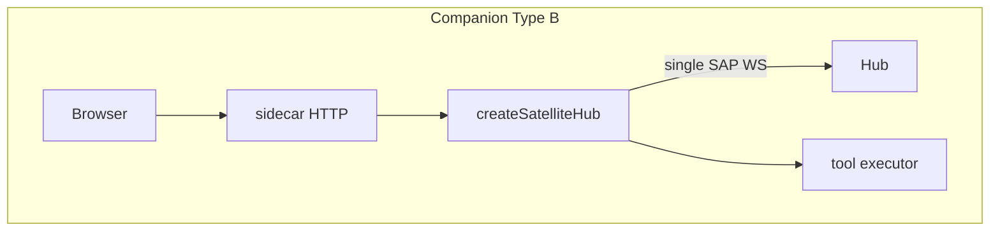

# Satellite Guide

How to run, configure, and implement a Satellite app that speaks SAP.

## Deployment modes

Hub learns about Satellites in two ways:

### Managed (config + systemd)

Declare a process in `~/.anima/config.yaml`. `anima service start/stop/restart` writes `anima-satellite-<name>.service` user units (when systemd is available) and starts/stops them with `anima.service`.

```yaml
satellites:
  companion:
    enabled: true
    command: bun
    args: ["src/satellites/companion/dev.ts"]
```

**Chat / Task / Console** etc. are bundled in shell-ui (desktop / mobile / web); no separate `satellites:` dev process needed; browser local debug: `bun run dev:web`.

| Field              | Role                                             |
| ------------------ | ------------------------------------------------ |
| `command` / `args` | Process to run (required for managed satellites) |
| `env`              | Extra environment variables                      |

Working directory is derived by anima from the install layout (monorepo root or CLI package root), not configured here.

**Startup:** managed satellites start only after Hub `GET /hub/rpc/v1/health/probe` returns `status: ok`.

See [service.md](../guide/service.md) for systemd unit paths and startup order.

### Dynamic (SAP connect)

No `command` in config. Start the satellite yourself; it connects to Hub via SAP WebSocket. Instances appear on Console → Satellites after connect.

There is **no** global `studio:` section in `config.yaml`.

Open managed satellite UI at the URL from Console (SAP `http_url`), typically the companion sidecar HTTP port.

Shell satellites (Chat, Console, etc.) open in desktop / mobile / web shell routes; no dedicated port.

## Instance allocation strategies

`instance_id` is a 3-character lowercase alphanumeric id (see [`src/shared/sap-contract/naming.ts`](../../src/shared/sap-contract/naming.ts)). It appears in platform strings (`sap:{app_slug}:{instance_id}`), session `platform_extra`, and SAP tool names. **Do not remove it from the protocol** — but each satellite app picks an **allocation strategy** suited to its product model:

| Strategy      | Meaning                                | Apps             | Client behavior                                                            |
| ------------- | -------------------------------------- | ---------------- | -------------------------------------------------------------------------- |
| **singleton** | One fixed id per Hub for the whole app | **Chat** (`def`) | Always send `instance_id` on `connect`; Hub auto-provisions if missing     |
| **machine**   | One id per physical device / install   | **Companion**    | Omit `instance_id` on first connect; Hub assigns randomly; persist locally |



**Chat (singleton):** all desktop / mobile clients share `CHAT_INSTANCE_ID` (`def`) so `conversation.list` is unified across devices. Chat registers no satellite tools; multiple devices may connect with the same id (Console shows the last `http_url`).

**Companion (machine):** `~/.anima/companion/instance.json` — one id per computer.

Hub [`SapInstanceRegistry`](../../src/platform/sap/instance-registry.ts): omit `instance_id` → random allocation; send known id → reconnect or **auto-provision** if the id is valid and unused.

## Satellite access modes

**Rule:** each `app_id + instance_id` has **at most one** active entry in `SatelliteManager` (last connect wins). Multiple WebSockets with the same id are not rejected but stream events follow each socket's own context.

### Type B + tools, no relay (companion)

- Sidecar `createSatelliteHub({ relay: false, tools: [...] })` holds the sole Hub WS.
- Browser talks to sidecar HTTP only (no SAP relay); tools execute in sidecar (`bubble`, `play_slot`).
- `instance_id` in `~/.anima/companion/instance.json`; platform `sap:companion:{id}`.



**Deprecated:** HTTP hub-api REST→SAP proxy (removed).

### Bundled Hub RPC — shell modules (chat, task, notification, …)

- Modules use shared [`getBundledHubRpcClient`](../../src/shared/hub-rpc/bundled.ts) / [`getBundledSapStreamClient`](../../src/shared/sap-contract/bundled-sap-stream.ts) on `/hub/rpc/v1`.
- **No** `sap.attach`; **no** relay sidecar for these modules.
- See [`hub-rpc.md`](hub-rpc.md) and [`frontend-exports.md`](frontend-exports.md).

### Chat (bundled feature)

- **Shell / browser dev (recommended)**: `getBundledSapStreamClient` on shared Hub RPC; UI from [`src/features/chat/ui/spa/`](../../src/features/chat/ui/spa/) embedded in shell-ui (no SAP relay, no `sap.attach`).
- Hub RPC handlers: [`src/features/chat/hub/routes/index.ts`](../../src/features/chat/hub/routes/index.ts); wire types: [`src/features/chat/protocol/`](../../src/features/chat/protocol/) → `@freeanima/sap-contract/feature-rpc`.

### Companion satellite

Reference files:

- [`src/satellites/companion/server/sap/hub.ts`](../../src/satellites/companion/server/sap/hub.ts)
- [`src/features/chat/ui/spa/lib/sap-client.ts`](../../src/features/chat/ui/spa/lib/sap-client.ts)
- [`src/shared/sap-contract/sidecar-client.ts`](../../src/shared/sap-contract/sidecar-client.ts)
- [`src/shared/sap-contract/satellite-relay-server.ts`](../../src/shared/sap-contract/satellite-relay-server.ts)

## Minimal SAP client

Use `runSapTransport` or `createSatelliteHub` from `@freeanima/sap-contract`:

```typescript
import { createSatelliteHub, fileSapInstanceStore } from "@freeanima/shared/sap-contract";

const hub = createSatelliteHub({
  appId: "my-app",
  hubUrl: process.env.FREEANIMA_URL ?? "http://127.0.0.1:2658",
  httpUrl: `http://127.0.0.1:${process.env.SATELLITE_PORT ?? 4173}`,
  instanceStore: fileSapInstanceStore("/path/to/instance.json"),
  relay: false,
  tools: [],
  onConnected: async () => {
    /* optional conversation.create — connect does not auto-create conversations */
  },
});
```

**Machine strategy (companion):** omit `instance_id` on first connect; Hub assigns a 3-char id and returns it in `connected.instance_id`. Persist via `SapInstanceStore.save`.

**Singleton strategy (chat):** pass fixed `instance_id` (or `instanceId` option on `getBundledSapStreamClient`); Hub auto-provisions on first sight.

Browser UI on Type B relay satellites uses `createSapRelayBrowserClient()` instead of talking to Hub directly.

Transport handles WebSocket open, `connect` handshake, heartbeat, and reconnect with exponential backoff.

## Environment variables

| Variable         | Role                                         |
| ---------------- | -------------------------------------------- |
| `FREEANIMA_URL`  | Hub HTTP base URL                            |
| `SATELLITE_PORT` | Satellite HTTP listen port                   |
| `FREEANIMA_HOME` | Data root (`~/.anima`); instance store paths |

## Layer dependencies

Per [`.agent/rules/code-layers.md`](../../.agent/rules/code-layers.md) (Dependency allow/deny matrix): `src/satellites/*` may depend only on `@freeanima/sap-contract`, `@freeanima/kernel`, and `kernel-*` packages. Do not import `platform`, `runtime`, `core`, or `capabilities-*` from Satellite code.

## Console visibility

`hub().call("src/satellites.status")` (REST `GET /hub/rpc/v1/src/satellites/status`; Console → Satellites) reads `SatelliteManager.getStatus()`: connected instances, `http_url`, registered tools, heartbeat timestamps.

## Further reading

- Frontend manifest / desktop / mobile exports: [`frontend-exports.md`](frontend-exports.md)
- Desktop shell: [`src/app/shell/desktop/`](../../src/app/shell/desktop/)
- [overview.md](overview.md) — protocol goals
- [transport.md](transport.md) — envelopes and handshake
- [tools.md](tools.md) — tool registration and routing
- [companion](../features/companion.md) — Companion product docs
