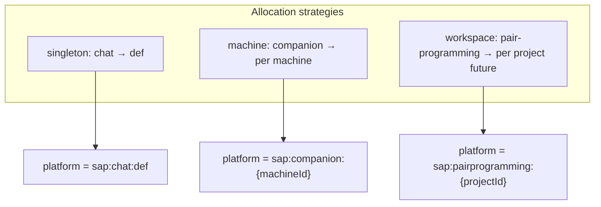
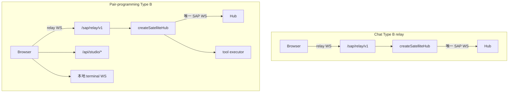

# Satellite Guide

How to run, configure, and implement a Satellite app that speaks SAP.

## Deployment modes

Hub learns about Satellites in two ways:

### Managed (config + systemd)

Declare a process in `~/.anima/config.yaml`. `anima service start/stop/restart` writes `anima-satellite-<name>.service` user units (when systemd is available) and starts/stops them with `anima.service`.

```yaml
satellites:
  chat:
    enabled: true
    command: bun
    args: ["satellites/chat/dev.ts"]
    env:
      SATELLITE_PORT: "4174"
  pair-programming:
    enabled: true
    command: bun
    args: ["satellites/pair-programming/dev.ts"]
    env:
      STUDIO_WORKSPACE: /path/to/project
      SATELLITE_PORT: "4173"
```

| Field              | Role                                             |
| ------------------ | ------------------------------------------------ |
| `command` / `args` | Process to run (required for managed satellites) |
| `env`              | Extra environment variables                      |

Working directory is derived by anima from the install layout (monorepo root or CLI package root), not configured here.

**Startup:** managed satellites start only after Hub `GET /api/health` returns `status: ok`.

See [service.md](../guide/service.md) for systemd unit paths and startup order.

### Dynamic (SAP connect)

No `command` in config. Start the satellite yourself; it connects to Hub via SAP WebSocket. Instances appear on Chamber → Satellites after connect.

There is **no** global `studio:` section in `config.yaml`.

Open managed satellite UI at the URL from Chamber (SAP `http_url`), typically:

- Chat: `http://127.0.0.1:4174`
- Pair-programming: `http://127.0.0.1:4173`

## Instance allocation strategies

`instance_id` is a 3-character lowercase alphanumeric id (see [`packages/sap-contract/src/naming.ts`](../../packages/sap-contract/src/naming.ts)). It appears in platform strings (`sap:{app_slug}:{instance_id}`), session `platform_extra`, and SAP tool names. **Do not remove it from the protocol** — but each satellite app picks an **allocation strategy** suited to its product model:

| Strategy      | Meaning                                | Apps                                        | Client behavior                                                                 |
| ------------- | -------------------------------------- | ------------------------------------------- | ------------------------------------------------------------------------------- |
| **singleton** | One fixed id per Hub for the whole app | **Chat** (`def`)                            | Always send `instance_id` on `connect`; Hub auto-provisions if missing          |
| **machine**   | One id per physical device / install   | **Companion**, **pair-programming** (today) | Omit `instance_id` on first connect; Hub assigns randomly; persist locally      |
| **workspace** | One id per open workspace / project    | **Pair-programming** (future)               | Switch workspace → switch `instance_id` and reconnect — **not implemented yet** |



**Chat (singleton):** all desktop / mobile clients share `CHAT_INSTANCE_ID` (`def`) so `conversation.list` is unified across devices. Chat registers no satellite tools; multiple devices may connect with the same id (Chamber shows the last `http_url`).

**Companion (machine):** `~/.anima/companion/instance.json` — one id per computer.

**Pair-programming (machine today):** single sidecar + `STUDIO_WORKSPACE` at startup → one `~/.anima/satellites/pair-programming/instance.json`. When runtime workspace switching ships, migrate to **workspace** strategy (separate instance per project).

Hub [`SapInstanceRegistry`](../../platform/src/sap/instance-registry.ts): omit `instance_id` → random allocation; send known id → reconnect or **auto-provision** if the id is valid and unused.

## Satellite access modes

**Rule:** each `app_id + instance_id` has **at most one** active entry in `SatelliteManager` (last connect wins). Multiple WebSockets with the same id are not rejected but stream events follow each socket's own context.

### Type B — Process gateway + local relay (pair-programming)

- Sidecar `createSatelliteHub({ relay: true, ... })` holds the sole Hub WS.
- Browser uses `createSapRelayBrowserClient` → satellite `/sap/relay/v1`.
- `instance_id` persisted under `~/.anima/satellites/{app}/instance.json`.
- **Pair-programming:** relay + `tool.register` + local FS/PTY APIs.

### SAP direct — browser/renderer 直连 Hub（chat 嵌入 desktop-shell）

- Renderer 使用 [`createSapDirectClient`](../../packages/sap-contract/src/direct-client.ts) 直连 Hub `/sap/v1`。
- **无需** relay sidecar；Chat 使用 **singleton** 固定 `instance_id`（`CHAT_INSTANCE_ID` = `def`），无需 per-device 持久化。
- 详见 [`frontend-exports.md`](frontend-exports.md)。

### Type B + tools, no relay (companion)

- Sidecar `createSatelliteHub({ relay: false, tools: [...] })` holds the sole Hub WS.
- Browser talks to sidecar HTTP only (no SAP relay); tools execute in sidecar (`bubble`, `play_slot`).
- `instance_id` in `~/.anima/companion/instance.json`; platform `sap:companion:{id}`.



**Deprecated:** HTTP hub-api REST→SAP proxy (removed).

### Chat satellite

- **desktop-shell / 浏览器 dev（推荐）**：`createSapDirectClient` 直连 Hub；静态 UI 由 [`satellites/chat/server/index.ts`](../../satellites/chat/server/index.ts) 仅作静态托管（无 SAP relay）。
- **Managed 遗留**：若仍用旧 relay sidecar，见 pair-programming 模式；新嵌入以 direct 为准。

### Pair-programming satellite

Browser connects via `createSapRelayBrowserClient` → [`/sap/relay/v1`](../../satellites/pair-programming/server/index.ts); sidecar uses `createSatelliteHub` ([`satellite-hub.ts`](../../packages/sap-contract/src/satellite-hub.ts)).

Reference files:

- [`satellites/chat/app/src/lib/sap-client.ts`](../../satellites/chat/app/src/lib/sap-client.ts)
- [`satellites/pair-programming/server/sap/hub.ts`](../../satellites/pair-programming/server/sap/hub.ts)
- [`packages/sap-contract/src/sidecar-client.ts`](../../packages/sap-contract/src/sidecar-client.ts)
- [`packages/sap-contract/src/satellite-relay-server.ts`](../../packages/sap-contract/src/satellite-relay-server.ts)
- [`satellites/pair-programming/server/http/terminal-bridge.ts`](../../satellites/pair-programming/server/http/terminal-bridge.ts)

## Minimal SAP client

Use `runSapTransport` or `createSatelliteHub` from `@freeanima/sap-contract`:

```typescript
import { createSatelliteHub, fileSapInstanceStore } from "@freeanima/sap-contract";

const hub = createSatelliteHub({
  appId: "my-app",
  hubUrl: process.env.FREEANIMA_URL ?? "http://127.0.0.1:2658",
  httpUrl: `http://127.0.0.1:${process.env.SATELLITE_PORT ?? 4173}`,
  instanceStore: fileSapInstanceStore("/path/to/instance.json"),
  relay: false,
  tools: [],
  onConnected: async () => {
    /* optional conversation.create — connect does not auto-create conversations */
  },
});
```

**Machine strategy (companion, pair-programming):** omit `instance_id` on first connect; Hub assigns a 3-char id and returns it in `connected.instance_id`. Persist via `SapInstanceStore.save`.

**Singleton strategy (chat):** pass fixed `instance_id` (or `instanceId` option on `createSapDirectClient`); Hub auto-provisions on first sight.

Browser UI on Type B relay satellites uses `createSapRelayBrowserClient()` instead of talking to Hub directly.

Transport handles WebSocket open, `connect` handshake, heartbeat, and reconnect with exponential backoff.

## Environment variables

| Variable                                  | Role                                         |
| ----------------------------------------- | -------------------------------------------- |
| `FREEANIMA_URL`                           | Hub HTTP base URL                            |
| `SATELLITE_PORT`                          | Satellite HTTP listen port                   |
| `FREEANIMA_HOME`                          | Data root (`~/.anima`); instance store paths |
| `STUDIO_WORKSPACE`                        | Pair-programming workspace root              |
| `STUDIO_GITIGNORE` / `STUDIO_SHOW_HIDDEN` | File tree filters                            |

## Layer dependencies

Per [`.agent/rules/code-layers.md`](../../.agent/rules/code-layers.md) (Dependency allow/deny matrix): `satellites/*` may depend only on `@freeanima/sap-contract`, `@freeanima/kernel`, and `kernel-*` packages. Do not import `platform`, `runtime`, `core`, or `capabilities-*` from Satellite code.

## Chamber visibility

`GET /api/satellites/status` (Chamber → Satellites) reads `SatelliteManager.getStatus()`: connected instances, `http_url`, registered tools, heartbeat timestamps.

## Further reading

- Frontend manifest / desktop / mobile exports: [`frontend-exports.md`](frontend-exports.md)
- Desktop shell: [`satellites/desktop-shell/`](../../satellites/desktop-shell/)

- [overview.md](overview.md) — protocol goals
- [transport.md](transport.md) — envelopes and handshake
- [tools.md](tools.md) — tool registration and routing
- [pair-programming v1](../features/pair-programming-v1.md) — Studio product docs
