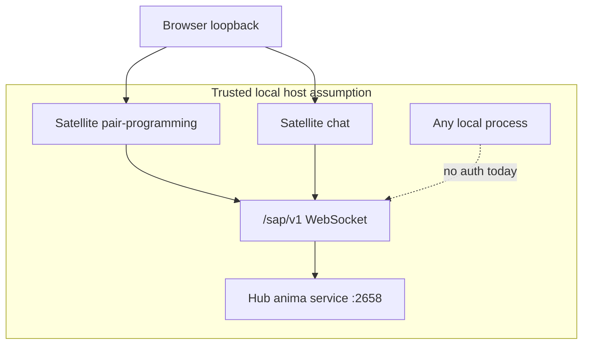

# SAP Security

Current SAP deployment assumes a **trusted local machine**. There is no application-layer authentication on the WebSocket.

## Trust boundary

## Current controls

| Control                         | Status                                                 |
| ------------------------------- | ------------------------------------------------------ |
| TLS on SAP                      | Not required; typical bind is loopback                 |
| Token / API key on connect      | **None**                                               |
| Origin check on WebSocket       | **None**                                               |
| Session-scoped tool routing     | **Yes** — [strict routing](tools.md)                   |
| Credential values in SAP frames | **No** — credentials stay in pass; LLM sees paths only |

Any process on the host that can reach `ws://127.0.0.1:2658/sap/v1` can:

- Register tools as any `app_id` / `instance_id`
- Create sessions and send messages through the Hub runtime
- Receive `tool.call` events for registered tools

Operational guidance: bind Hub to loopback; do not expose port 2658 to untrusted networks without additional controls. See [security guide](../guide/security.md).

## Protocol hardening (transport layer)

Invalid frames close the socket with **1003**. Protocol violations (double connect, RPC before handshake) close with **1008**. These are integrity checks, not authentication.

## Future directions (not implemented)

Possible hardening items — not committed; track via GitHub Issues if prioritized:

- Shared secret or mTLS on `/sap/v1`
- Instance attestation tied to managed satellite systemd units
- Rate limits on connect and `tool.register`
- Explicit disconnect on missed heartbeats

When adding auth, preserve backward compatibility only if explicitly requested; this codebase phase accepts breaking changes.

## Related surfaces

| Surface            | Doc                                                                         |
| ------------------ | --------------------------------------------------------------------------- |
| Hub HTTP / Admin   | [security.md](../guide/security.md)                                         |
| Credentials (pass) | [security.md](../guide/security.md), [identity.md](../concepts/identity.md) |
| Tool execution     | [tools.md](tools.md)                                                        |
