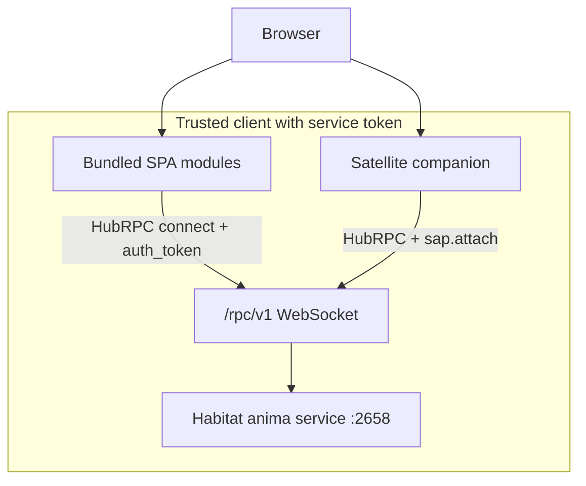

# SAP Security

Habitat RPC requires a **service API token** on every WebSocket `connect`. SAP attach still assumes a trusted client once transport auth succeeds.

## Trust boundary

## Current controls

| Control                        | Status                                                                |
| ------------------------------ | --------------------------------------------------------------------- |
| TLS on Habitat RPC             | Optional; LAN / local HTTPS (`http.tls`) or self-hosted reverse proxy |
| Token on Habitat RPC `connect` | **Yes** — service API token (`verifyServiceApiToken`)                 |
| Origin check on WebSocket      | **None**                                                              |
| SAP attach for instance scope  | **Yes** — `tool.*` requires `sap.attach`                              |
| Session-scoped tool routing    | **Yes** — [strict routing](tools.md)                                  |
| Credential values in frames    | **No** — secrets stay in Vault; LLM sees metadata only                |

Any client that holds a valid service token and can reach `ws://127.0.0.1:2658/rpc/v1` can:

- Call bundled RPC methods (chat, tasks, notifications, …) without `sap.attach`
- After `sap.attach`, register tools as the attached `app_id` / `instance_id`

Operational guidance: bind Habitat to loopback by default; rotate service tokens; do not expose port 2658 to untrusted networks without TLS termination and token-protected clients. See [security guide](../guide/security.md).

## Protocol hardening (transport layer)

Invalid frames close the socket with **1003**. Protocol violations (double connect, RPC before connect, `tool.*` without attach) close with **1008**. Failed auth closes with **1008** (`unauthorized`).

## Future directions (not implemented)

Possible hardening items — track via GitHub Issues if prioritized:

- mTLS on `/rpc/v1`
- Instance attestation tied to managed satellite systemd units
- Rate limits on connect and `tool.register`
- Explicit disconnect on missed heartbeats
