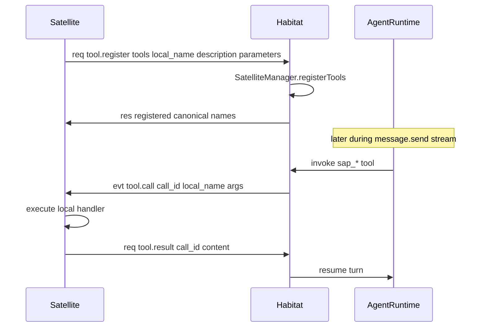
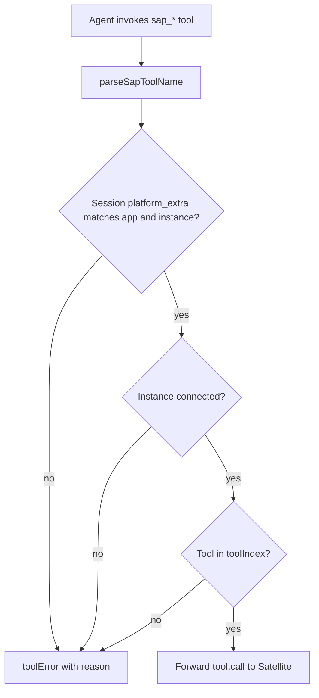

# SAP Tools

Satellites register **local tools** on the Habitat. The agent invokes them during a bound session; Habitat forwards execution to the Satellite via `tool.call` and waits for `tool.result` / `tool.error`.

Implementation: [`src/capabilities/satellite/manager.ts`](../../src/capabilities/satellite/manager.ts).

## Naming

Canonical name format ([`src/shared/sap-contract/naming.ts`](../../src/shared/sap-contract/naming.ts)):

```text
sap_{app_slug}_{instance_id_norm}_{local_name}
```

Alias (also accepted):

```text
sap:{app_slug}:{instance_id_norm}:{local_name}
```

- `app_slug` — lowercased app id without `-` / `_`
- `instance_id_norm` — lowercased instance id without `-`
- `local_name` — tool name as registered by the Satellite

Example: `sap_pairprogramming_k7m_scan_code`

## ToolSet visibility

SAP satellite toolsets default to **`private: true`** via `tool.register`. Private toolsets:

- Do not appear in system prompt ToolSet lists
- Cannot be found via `toolset_search` or loaded by name without capability mask

Set `private: false` on `tool.register` to expose tools like built-in toolsets.

## Registration flow



Register via `tool.register` with `SapToolDefInput`: `local_name`, `description`, `parameters` (JSON Schema object), optional `return_kind` (`json` | `text`), optional `private` (default `true`).

On disconnect, Habitat unregisters all tools for that app/instance.

## Strict routing

SAP-prefixed tool names **never fall back** to Habitat-local tools with the same name. `SatelliteManager.installToolRouting()` wraps `ToolSetRegistry.getTool` to enforce this.



Common rejection reasons:

| Condition                                   | Result                                            |
| ------------------------------------------- | ------------------------------------------------- |
| Session not bound to satellite app/instance | Reject                                            |
| Instance offline                            | Reject                                            |
| Tool not registered on connected instance   | Reject                                            |
| Unregistered `sap_*` name                   | Guard handler returns error (no Habitat fallback) |

Session binding requires `platform_extra.satellite_app_id` and `platform_extra.satellite_instance_id` set at `conversation.create` time.

Integration tests: [`tests/integration/sap/sap-routing.test.ts`](../../tests/integration/sap/sap-routing.test.ts).

## Platform naming

Session platform for SAP satellites uses three segments:

```text
sap:{app_slug}:{instance_id}
```

| `app_id`    | Example platform    |
| ----------- | ------------------- |
| `companion` | `sap:companion:k7m` |
| `chat`      | `sap:chat:k7m`      |

`instance_id` is a Habitat-assigned 3-character `[a-z0-9]` string, globally unique across all SAP apps. Habitat returns the assigned or confirmed id in `connected.instance_id`.

## Completing a call

Satellite receives `tool.call` with `call_id`. Reply with:

- `tool.result` — `{ call_id, content }`
- `tool.error` — `{ call_id, error }`

Habitat resolves the pending promise and continues the agent turn. Timeout or disconnect fails the call.

Reference handler: [`src/satellites/companion/server/sap/hub.ts`](../../src/satellites/companion/server/sap/hub.ts).
