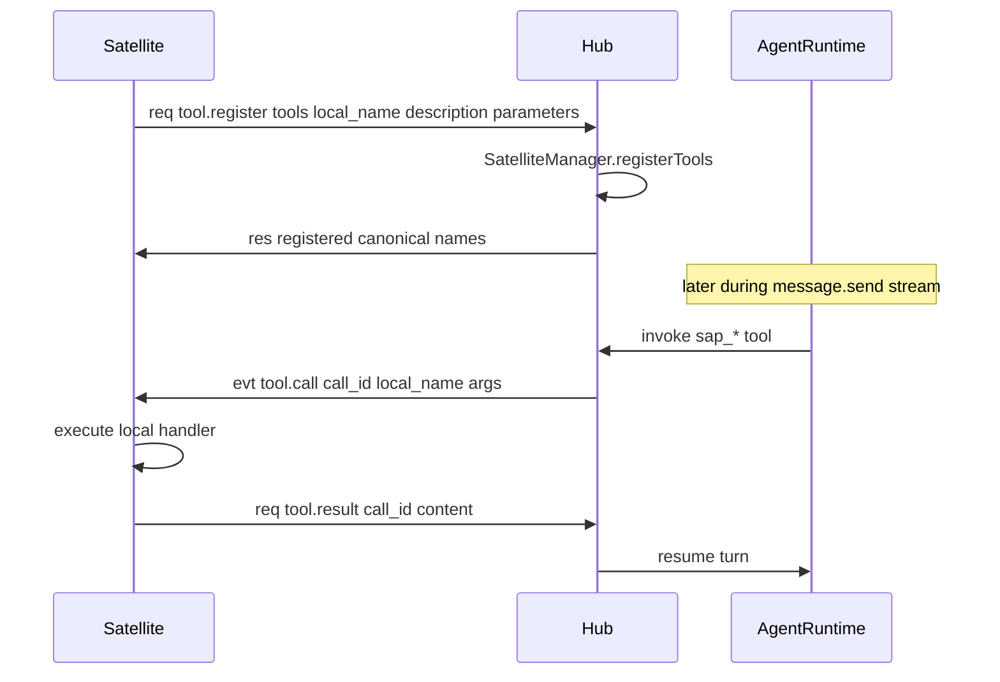
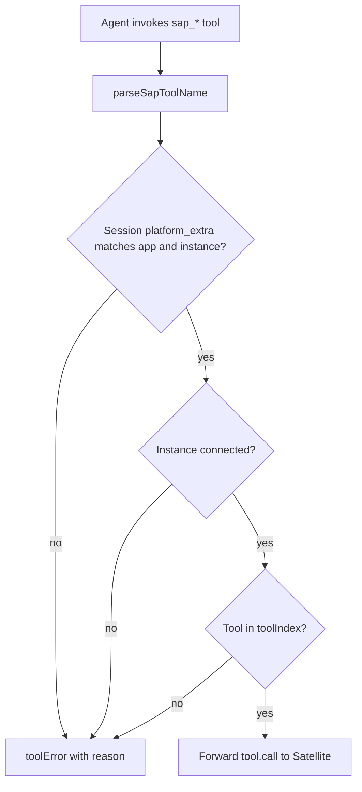

# SAP Tools

Satellites register **local tools** on the Hub. The agent invokes them during a bound session; Hub forwards execution to the Satellite via `tool.call` and waits for `tool.result` / `tool.error`.

Implementation: [`capabilities/satellite/src/manager.ts`](../../capabilities/satellite/src/manager.ts).

## Naming

Canonical name format ([`packages/sap-contract/src/naming.ts`](../../packages/sap-contract/src/naming.ts)):

```
sap_{app_slug}_{instance_id_norm}_{local_name}
```

Alias (also accepted):

```
sap:{app_slug}:{instance_id_norm}:{local_name}
```

- `app_slug` — lowercased app id without `-` / `_`
- `instance_id_norm` — lowercased instance id without `-`
- `local_name` — tool name as registered by the Satellite

Example: `sap_pairprogramming_a1b2c3d4e5f6789012345678abcdef01_scan_code`

## Registration flow



Register via `tool.register` with `SapToolDefInput`: `local_name`, `description`, `parameters` (JSON Schema object), optional `return_kind` (`json` | `text`).

On disconnect, Hub unregisters all tools for that app/instance.

## Strict routing

SAP-prefixed tool names **never fall back** to Hub-local tools with the same name. `SatelliteManager.installToolRouting()` wraps `ToolSetRegistry.getTool` to enforce this.



Common rejection reasons:

| Condition                                   | Result                                        |
| ------------------------------------------- | --------------------------------------------- |
| Session not bound to satellite app/instance | Reject                                        |
| Instance offline                            | Reject                                        |
| Tool not registered on connected instance   | Reject                                        |
| Unregistered `sap_*` name                   | Guard handler returns error (no Hub fallback) |

Session binding requires `platform_extra.satellite_app_id` and `platform_extra.satellite_instance_id` set at `session.create` time.

Integration tests: [`tests/integration/sap/sap-routing.test.ts`](../../tests/integration/sap/sap-routing.test.ts).

## Platform mapping

`resolvePlatformForApp` maps satellite app ids to session platforms:

| `app_id`           | Platform                  |
| ------------------ | ------------------------- |
| `pair-programming` | `studio-pair-programming` |
| `parlor`           | `parlor`                  |

Hub also returns this map in `connected.server_info.platform_for_app`.

## Completing a call

Satellite receives `tool.call` with `call_id`. Reply with:

- `tool.result` — `{ call_id, content }`
- `tool.error` — `{ call_id, error }`

Hub resolves the pending promise and continues the agent turn. Timeout or disconnect fails the call.

Reference handler: [`satellites/pair-programming/server/sap/hub.ts`](../../satellites/pair-programming/server/sap/hub.ts).
