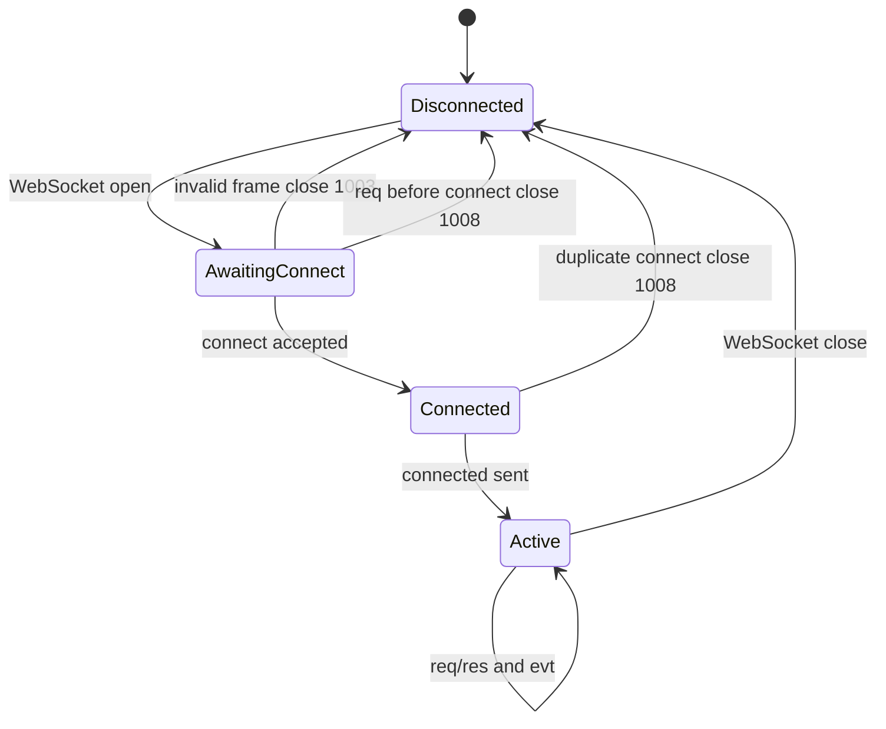
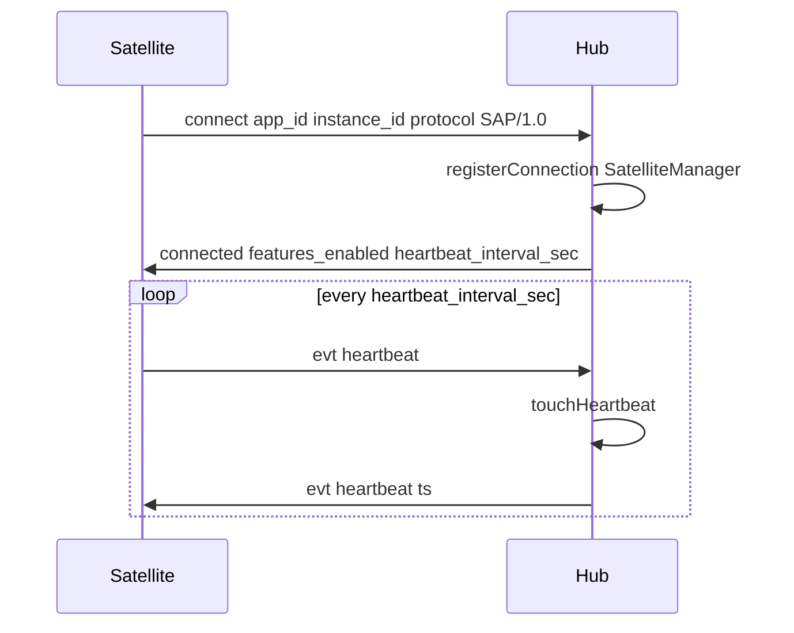

# SAP Transport

SAP runs over a single WebSocket per Satellite instance. Each message is one UTF-8 text frame containing a JSON **envelope**.

## Endpoint

```text
ws://{hub_host}:{port}/sap/v1
```

Derive from Hub HTTP URL: replace `http` with `ws`, strip trailing slash, append `/sap/v1`. Default Hub port: **2658**.

Implemented in [`platform/src/sap/bun-route.ts`](../../platform/src/sap/bun-route.ts) and [`packages/sap-contract/src/transport.ts`](../../packages/sap-contract/src/transport.ts) (`hubWsUrl`).

## Envelope kinds

Defined in [`packages/sap-contract/src/protocol.ts`](../../packages/sap-contract/src/protocol.ts):

| `kind`      | Direction       | Purpose                                         |
| ----------- | --------------- | ----------------------------------------------- |
| `connect`   | Satellite → Hub | First frame; handshake                          |
| `connected` | Hub → Satellite | Handshake reply                                 |
| `req`       | Satellite → Hub | RPC request (`id`, `method`, `payload`)         |
| `res`       | Hub → Satellite | RPC response (`id`, `ok`, `payload` or `error`) |
| `evt`       | Both            | Async event (`method`, `payload`)               |

Parse/serialize with `parseSapEnvelope` / `serializeSapEnvelope`. Invalid JSON or schema → WebSocket close **1003** (`invalid frame`).

## Connection state machine



Rules ([`platform/src/sap/ws-server.ts`](../../platform/src/sap/ws-server.ts) `attachSapWebSocket`):

- First valid frame **must** be `connect`.
- Second `connect` on same socket → close **1008** (`already connected`).
- `req` or non-heartbeat `evt` before handshake → close **1008** (`not connected`).

## Handshake and heartbeat



### `connect` payload

Schema: [`frames/lifecycle.ts`](../../packages/sap-contract/src/frames/lifecycle.ts) `connectPayloadSchema`.

| Field                | Required | Role                                                                                                                                    |
| -------------------- | -------- | --------------------------------------------------------------------------------------------------------------------------------------- |
| `app_id`             | yes      | Satellite app id (e.g. `pair-programming`)                                                                                              |
| `instance_id`        | no       | 3-char id; omit on first **machine** register; include on reconnect; **singleton** apps send a fixed id (Hub auto-provisions if unused) |
| `protocol`           | yes      | Must be `SAP/1.0`                                                                                                                       |
| `features_requested` | no       | Feature flags (Hub echoes as `features_enabled`)                                                                                        |
| `http_url`           | no       | Satellite UI URL for Admin → Satellites                                                                                                 |
| `instance_label`     | no       | Display label                                                                                                                           |

### `connected` payload

| Field                         | Role                                                                                       |
| ----------------------------- | ------------------------------------------------------------------------------------------ |
| `protocol`                    | `SAP/1.0`                                                                                  |
| `instance_id`                 | Hub-assigned or confirmed 3-char instance id (always present)                              |
| `features_enabled`            | Enabled features                                                                           |
| `server_info`                 | `anima_version`, `sap_version`                                                             |
| `server_info.capability_mask` | When `capability_mask` is in `features_requested`: mask preset list (no credential values) |
| `heartbeat_interval_sec`      | Hub default: 30                                                                            |

### Heartbeat

Satellite sends `evt { method: "heartbeat" }` on an interval derived from `heartbeat_interval_sec`. Hub updates `last_heartbeat_at` and replies with `evt { method: "heartbeat", payload: { ts } }`.

`runSapTransport` in sap-contract starts the heartbeat timer automatically after connect. Hub does not actively disconnect idle satellites based on missed heartbeats today.

## Reconnect

Satellites should use `runSapTransport` ([`transport.ts`](../../packages/sap-contract/src/transport.ts)) for connect, heartbeat, and exponential backoff reconnect (default 1s → 30s cap). On disconnect, Hub calls `onDisconnect` and unregisters tools for that instance.

## Local SAP relay (Type B satellites)

Pair-programming exposes `ws://{satellite_host}:{port}/sap/relay/v1` for browser UI. The satellite **process** holds the sole Hub `/sap/v1` connection; relay clients send standard `req`/`res`/`evt` frames without a `connect` handshake.

| Event         | Direction           | Meaning                            |
| ------------- | ------------------- | ---------------------------------- |
| `relay.ready` | Satellite → browser | Relay attached; safe to send `req` |

Use `createSapRelayClient` / `createSapRelayBrowserClient` from `@freeanima/sap-contract`.

## RPC errors

Failed RPCs return `res` with `ok: false` and:

```json
{ "code": "sap_error", "message": "..." }
```

See [methods.md](methods.md) for method-specific behavior.
