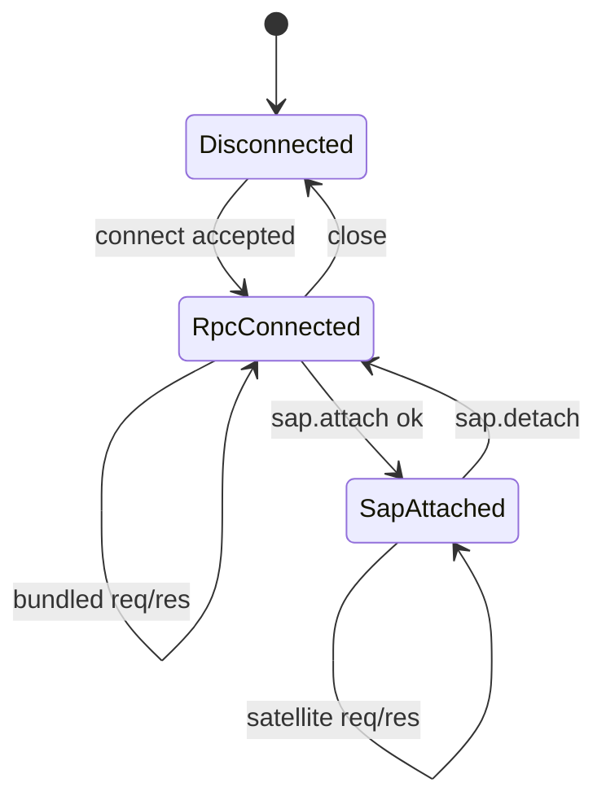

# SAP Transport

FreeAnima uses a **two-layer** wire model on a single WebSocket endpoint:

1. **Habitat RPC** — transport connect, auth, heartbeat, generic `req`/`res`/`evt`. Product name: **Habitat RPC**. Wire connect literal remains historical `"HubRPC/1.0"` (`HABITAT_RPC_VERSION`).
2. **SAP** — optional `sap.attach` / `sap.detach` session for local-tool hosts (companion only in-tree).

Bundled SPA clients use layer 1 only. See [habitat-rpc.md](habitat-rpc.md) for transport details.

## Endpoint

```text
ws://{hub_host}:{port}/rpc/v1
```

Derive from Habitat HTTP URL: replace `http` with `ws`, strip trailing slash, append `/rpc/v1`. Default Habitat port: **2658**.

Implemented in [`src/platform/sap/bun-route.ts`](../../src/platform/sap/bun-route.ts). Client helpers: `@freeanima/shared/habitat-rpc` (`resolveHabitatRpcWsUrl`) and `@freeanima/sap-contract/urls` (re-exports).

## Envelope kinds

Habitat RPC envelopes live in [`src/shared/habitat-rpc/protocol.ts`](../../src/shared/habitat-rpc/protocol.ts). SAP re-exports them from [`src/shared/sap-contract/protocol.ts`](../../src/shared/sap-contract/protocol.ts).

| `kind`      | Layer       | Purpose                                                                   |
| ----------- | ----------- | ------------------------------------------------------------------------- |
| `connect`   | Habitat RPC | `protocol` = `HABITAT_RPC_VERSION` (wire `"HubRPC/1.0"`), `auth_token`    |
| `connected` | Habitat RPC | `session_id`, `heartbeat_interval_sec`                                    |
| `req`       | Both        | RPC (`id`, `method`, `payload`) — incl. `sap.attach`, `conversation.*`, … |
| `res`       | Both        | RPC response                                                              |
| `evt`       | Both        | Async event                                                               |

Invalid JSON or schema → WebSocket close **1003** (`invalid frame`).

## Connection state machine



Rules ([`src/platform/sap/ws-server.ts`](../../src/platform/sap/ws-server.ts) `attachSapWebSocket`):

- First valid frame **must** be Habitat RPC `connect` with verified `auth_token`.
- Second `connect` on same socket → close **1008** (`already connected`).
- `req` or non-heartbeat `evt` before connect → close **1008** (`not connected`).
- `tool.*` and instance-scoped SAP methods require prior `sap.attach`.
- Bundled methods (`conversation.*`, `task.*`, `notification.*`, …) work after Habitat RPC connect **without** `sap.attach`.

## Habitat RPC handshake

Schema: [`src/shared/habitat-rpc/lifecycle.ts`](../../src/shared/habitat-rpc/lifecycle.ts).

| `connect` field | Required | Role              |
| --------------- | -------- | ----------------- |
| `protocol`      | yes      | `HubRPC/1.0`      |
| `auth_token`    | yes      | Service API token |

| `connected` field        | Role                 |
| ------------------------ | -------------------- |
| `protocol`               | `HubRPC/1.0`         |
| `session_id`             | Transport session id |
| `heartbeat_interval_sec` | Default: 30          |

## SAP attach (satellites only)

After Habitat RPC connect, satellite processes send `req sap.attach`:

Schema: [`src/shared/sap-contract/frames/sap-session.ts`](../../src/shared/sap-contract/frames/sap-session.ts).

| Field                | Required | Role                                |
| -------------------- | -------- | ----------------------------------- |
| `app_id`             | yes      | Satellite app id (e.g. `companion`) |
| `instance_id`        | no       | 3-char id; omit on first register   |
| `protocol`           | yes      | `SAP/1.0`                           |
| `features_requested` | no       | Feature flags                       |
| `http_url`           | no       | Satellite UI URL for Habitat        |
| `instance_label`     | no       | Display label                       |

Reply payload includes `instance_id`, `features_enabled`, `server_info` (same semantics as legacy SAP connect).

Use `createSatelliteHub()` ([`src/shared/sap-contract/satellite-hub.ts`](../../src/shared/sap-contract/satellite-hub.ts)) — it runs Habitat RPC transport and performs attach automatically.

## Heartbeat

Client sends `evt { method: "heartbeat" }` on `heartbeat_interval_sec`. Habitat replies with `evt { method: "heartbeat", payload: { ts } }`.

`runHubRpcTransport` starts the heartbeat timer after connect.

## Reconnect

- **Bundled SPA:** `getBundledHabitatRpcClient()` / `runHubRpcTransport` with backoff.
- **Satellites:** `createSatelliteHub()` reconnects transport and re-attaches SAP session.

On detach or disconnect, Habitat calls `onSapDetach` and unregisters tools for that instance.

## Local SAP relay (optional / unused by companion)

Historical path: a host with `relay: true` may expose `ws://{host}:{port}/sap/relay/v1` for a browser UI. The host holds Habitat `/rpc/v1` + `sap.attach`; relay clients send `req`/`res`/`evt` without handshakes.

**Companion does not use relay** (`relay: false`); overlay uses Electron IPC (or browser-dev runtime WS). Prefer not adding new relay consumers.

| Event         | Direction           | Meaning                            |
| ------------- | ------------------- | ---------------------------------- |
| `relay.ready` | Satellite → browser | Relay attached; safe to send `req` |

Use `createSapRelayClient` / `createSapRelayBrowserClient` from `@freeanima/sap-contract`.

## RPC errors

Failed RPCs return `res` with `ok: false` and:

```json
{ "code": "sap_error", "message": "..." }
```

See [methods.md](methods.md) for method-specific behavior.
