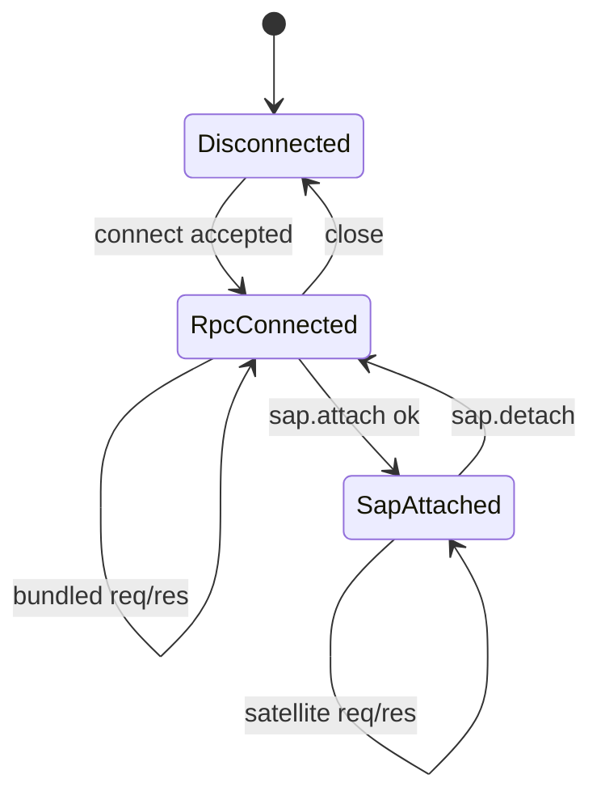

# SAP Transport

FreeAnima uses a **two-layer** wire model on a single WebSocket endpoint:

1. **Hub RPC** (`HubRPC/1.0`) — transport connect, auth, heartbeat, generic `req`/`res`/`evt`.
2. **SAP** (`SAP/1.0`) — optional `sap.attach` / `sap.detach` session for true satellite processes.

Bundled SPA clients use layer 1 only. See [hub-rpc.md](hub-rpc.md) for transport details.

## Endpoint

```text
ws://{hub_host}:{port}/hub/rpc/v1
```

Derive from Hub HTTP URL: replace `http` with `ws`, strip trailing slash, append `/hub/rpc/v1`. Default Hub port: **2658**.

Implemented in [`platform/src/sap/bun-route.ts`](../../platform/src/sap/bun-route.ts). Client helpers: `@freeanima/hub-rpc` (`resolveHubRpcWsUrl`) and `@freeanima/sap-contract/urls` (re-exports).

## Envelope kinds

Hub RPC envelopes live in [`packages/hub-rpc/src/protocol.ts`](../../packages/hub-rpc/src/protocol.ts). SAP re-exports them from [`packages/sap-contract/src/protocol.ts`](../../packages/sap-contract/src/protocol.ts).

| `kind`      | Layer   | Purpose                                                                   |
| ----------- | ------- | ------------------------------------------------------------------------- |
| `connect`   | Hub RPC | `protocol: HubRPC/1.0`, `auth_token`                                      |
| `connected` | Hub RPC | `session_id`, `heartbeat_interval_sec`                                    |
| `req`       | Both    | RPC (`id`, `method`, `payload`) — incl. `sap.attach`, `conversation.*`, … |
| `res`       | Both    | RPC response                                                              |
| `evt`       | Both    | Async event                                                               |

Invalid JSON or schema → WebSocket close **1003** (`invalid frame`).

## Connection state machine



Rules ([`platform/src/sap/ws-server.ts`](../../platform/src/sap/ws-server.ts) `attachSapWebSocket`):

- First valid frame **must** be Hub RPC `connect` with verified `auth_token`.
- Second `connect` on same socket → close **1008** (`already connected`).
- `req` or non-heartbeat `evt` before connect → close **1008** (`not connected`).
- `tool.*` and instance-scoped SAP methods require prior `sap.attach`.
- Bundled methods (`conversation.*`, `task.*`, `notification.*`, …) work after Hub RPC connect **without** `sap.attach`.

## Hub RPC handshake

Schema: [`packages/hub-rpc/src/lifecycle.ts`](../../packages/hub-rpc/src/lifecycle.ts).

| `connect` field | Required | Role              |
| --------------- | -------- | ----------------- |
| `protocol`      | yes      | `HubRPC/1.0`      |
| `auth_token`    | yes      | Service API token |

| `connected` field        | Role                 |
| ------------------------ | -------------------- |
| `protocol`               | `HubRPC/1.0`         |
| `session_id`             | Transport session id |
| `heartbeat_interval_sec` | Default: 30          |

## SAP attach (satellites only)

After Hub RPC connect, satellite processes send `req sap.attach`:

Schema: [`packages/sap-contract/src/frames/sap-session.ts`](../../packages/sap-contract/src/frames/sap-session.ts).

| Field                | Required | Role                                       |
| -------------------- | -------- | ------------------------------------------ |
| `app_id`             | yes      | Satellite app id (e.g. `pair-programming`) |
| `instance_id`        | no       | 3-char id; omit on first register          |
| `protocol`           | yes      | `SAP/1.0`                                  |
| `features_requested` | no       | Feature flags                              |
| `http_url`           | no       | Satellite UI URL for Admin                 |
| `instance_label`     | no       | Display label                              |

Reply payload includes `instance_id`, `features_enabled`, `server_info` (same semantics as legacy SAP connect).

Use `createSatelliteHub()` ([`packages/sap-contract/src/satellite-hub.ts`](../../packages/sap-contract/src/satellite-hub.ts)) — it runs Hub RPC transport and performs attach automatically.

## Heartbeat

Client sends `evt { method: "heartbeat" }` on `heartbeat_interval_sec`. Hub replies with `evt { method: "heartbeat", payload: { ts } }`.

`runHubRpcTransport` starts the heartbeat timer after connect.

## Reconnect

- **Bundled SPA:** `getBundledHubRpcClient()` / `runHubRpcTransport` with backoff.
- **Satellites:** `createSatelliteHub()` reconnects transport and re-attaches SAP session.

On detach or disconnect, Hub calls `onSapDetach` and unregisters tools for that instance.

## Local SAP relay (pair-programming)

Pair-programming exposes `ws://{satellite_host}:{port}/sap/relay/v1` for browser UI. The satellite **process** holds the Hub `/hub/rpc/v1` connection and SAP attach; relay clients send `req`/`res`/`evt` without transport or SAP handshakes.

| Event         | Direction           | Meaning                            |
| ------------- | ------------------- | ---------------------------------- |
| `relay.ready` | Satellite → browser | Relay attached; safe to send `req` |

Use `createSapRelayClient` / `createSapRelayBrowserClient` from `@freeanima/sap-contract`.

## RPC errors

Failed RPCs return `res` with `ok: false` and:

```json
{ "code": "sap_error", "message": "..." }
```

See [methods.md](methods.md) for method-specific behavior.
